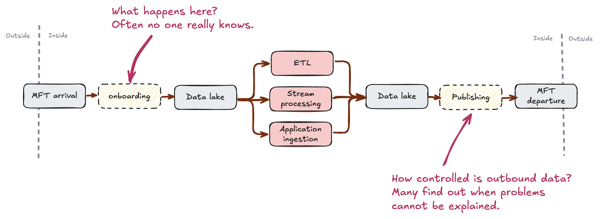

# CsvPath

<figure><figcaption></figcaption></figure>

## **A path to data validation for the files that need it most!**

[CsvPath](https://github.com/csvpath/csvpath) is a framework for **easy and robust data onboarding**. It verifies that CSV, Excel, and other delimited and tabular data files meet expectations and enter the organization in a controlled way. CsvPath's approach to edge governance is opinionated, prescriptive, and super productive. &#x20;

The CsvPath Validation Language is simple, easy to integrate, and flexible enough to handle the unexpected. Inspired by [Schematron](https://schematron.com/), [XPath](https://www.w3.org/TR/xpath-31/), and [the Collect, Store, Validate design pattern](topics/the-collect-store-validate-pattern.md), CsvPath Validation Language brings rules-based data validation to less structured data.

<table data-view="cards"><thead><tr><th></th><th></th><th data-hidden data-card-cover data-type="files"></th><th data-hidden></th><th data-hidden data-type="content-ref"></th><th data-hidden data-card-target data-type="content-ref"></th></tr></thead><tbody><tr><td><a href="broken-reference"><strong>Getting Started</strong></a></td><td>5-minutes to get the idea</td><td><a href=".gitbook/assets/how_to_start3.png">how_to_start3.png</a></td><td></td><td><a href="getting-started/quickstart.md">quickstart.md</a></td><td></td></tr><tr><td><a href="getting-started/integrations/getting-started-with-csvpath-+-openlineage.md"><strong>CsvPath + OpenLineage</strong></a></td><td>Get started with Edge Governance</td><td><a href=".gitbook/assets/ol-close-up (1).png">ol-close-up (1).png</a></td><td></td><td><a href="getting-started/your-first-validation.md">your-first-validation.md</a></td><td><a href="getting-started/integrations/getting-started-with-csvpath-+-openlineage.md">getting-started-with-csvpath-+-openlineage.md</a></td></tr><tr><td><a href="getting-started/getting-started-with-csvpath-+-ckan.md"><strong>Easy dataset publishing to the leading data portal</strong></a></td><td></td><td><a href=".gitbook/assets/csvpath_plus_ckan-v2g (2).png">csvpath_plus_ckan-v2g (2).png</a></td><td></td><td></td><td></td></tr></tbody></table>

The CsvPath Library implements CsvPath Validation Language within a complete [**Collect, Store, Validate Pattern** ](https://static1.squarespace.com/static/66df9d47982d0d40e1574327/t/6771fe6f63bbf5361725ad05/1735523953587/The+Collect+Store+Validate+Pattern+-+Atesta+Analytics.pdf)framework that makes data onboarding and publishing faster, cost-efficient, and more effective. CsvPath fills the blindspot between MFT (managed file transfer) and the data lake with a simple path to provably correct data.

This data onboarding blindspot is a big deal. Think about it. If even 1 in 30 companies depends heavily on CSV or Excel data, the _lack of good delimited file validation is a trillion-dollar problem_. In our experience, 1 in 30 would be a low estimate.&#x20;

<figure><figcaption></figcaption></figure>

CsvPath isn't the silver bullet to reams of messy delimited data, but it can help build confidence that your data governance doesn't turn a blind eye to your most unruly data.&#x20;

Take a look through these pages and cruise over to the [detailed docs](https://github.com/csvpath/csvpath) on the [CsvPath Github](https://github.com/csvpath/csvpath) to see if open source CSV and Excel data validation should be part of your DataOps toolkit.

<figure><figcaption>
CsvPath has a bunch of built-in integrations. Suggest more!
</figcaption></figure>


