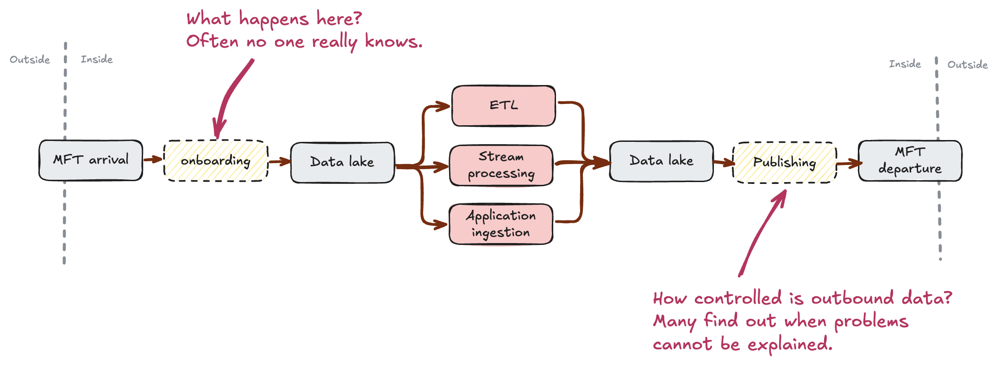

# CSV, Excel and JSONL Ingestion

<figure><figcaption></figcaption></figure>

<h2 align="center">Edge Data Governance For</h2>

<h2 align="center">JSON, CSV, Excel, XML, data frames, and JSONL </h2>

<h3 align="center">End Manual Data Validation With Data Contracts</h3>

#### CsvPath Framework's data preboarding registers, versions, validates, upgrades, and stages CSV, JSON, XML, Excel, JSONL and data frames from data partners _before_ they break your pipelines.&#x20;

If your MFT or REST API pushes external data directly into the data lake or databases the damage is already done.&#x20;

[CsvPath Framework](https://github.com/csvpath/csvpath) is the open source way to shift-left data quality. Enforce data contracts as data enters the organization with **less manual effort, fewer ingestion failures, and more agile development** using consistent data preboarding tools [you can try in minutes](https://app.gitbook.com/s/6wzqgDHj9mZbFxabiEbc/getting-started).  &#x20;

<figure><figcaption>
Your data lake deserves a data publisher it can trust!
</figcaption></figure>

<h2 align="center">Get FlightPath Data, the open frontend</h2>

<figure><figcaption></figcaption></figure>

[**FlightPath Data** is a powerful frontend to CsvPath Framework](https://www.flightpathdata.com/). Go beyond CsvPath Framework's built-in CLI. Get up and running faster with a purpose-built preboarding development and operations console. FlightPath Data gives you all the help and examples you need move quickly.&#x20;

FlightPath Data is bundled with **FlightPath Server**, the no-code/low-code automation REST API connecting your existing infrastructure to data preboarding.&#x20;

Available as a _free_ download from the [Microsoft Store](https://apps.microsoft.com/detail/9p9pbpkz4jdf?hl=en-US\&gl=US) and the [Apple MacOS Store](https://apps.apple.com/us/app/flightpath-data/id6745823097).

<h3 align="center">The Architecture For Efficient Data File Feed Ingestion</h3>

**CsvPath Framework** implements the [**Collect, Store, Validate Publish architectural pattern.** ](https://static1.squarespace.com/static/66df9d47982d0d40e1574327/t/6771fe6f63bbf5361725ad05/1735523953587/The+Collect+Store+Validate+Pattern+-+Atesta+Analytics.pdf) Ingestion goes faster, is more cost-efficient, and more effective with a preboarding stage.&#x20;

CsvPath Framework was built to fill the blindspot between the edge and downstream data systems with a simple path to provably correct data.

This Data Preboarding blindspot is a big deal. Think about it. If even 1 in 30 companies depends existentially on CSV, JSON, XML, or Excel files or JSON streaming data from external data partners, _**the lack of edge data preboarding is a trillion-dollar problem.**_&#x20;

<figure><figcaption></figcaption></figure>

Why roll your own preboarding? CsvPath Framework is a purpose-built off-the-shelf solution you can rollout now.

<h3 align="center">Powerful Tabular Validation</h3>

CSV, Excel, NDJSON, and JSONL validation has never been as sophisticated as JSONQuery and XSD — until now. **CsvPath Validation Language** is simple, easy to integrate, and flexible enough to handle the unexpected. Inspired by Schematron, XPath, and SQL, CsvPath Validation Language brings powerful data validation to tabular and JSON Lines structured data. [Start here](topics/validation/schemas-or-rules.md).

Together CsvPath Framework and FlightPath Data can help you build your organization's confidence that data governance doesn't turn a blind eye to its most unruly data.&#x20;

<h3 align="center">Integrated With Your Existing Tools</h3>

<figure><figcaption>
CsvPath has a bunch of built-in integrations. Suggest more!
</figcaption></figure>

[JSON Schema](https://json-schema.org/) / [Parquet](topics/how-tos/parquet.md) / [Sqlite](topics/how-tos/send-run-events-to-sqlite.md) / [S3](topics/how-tos/storage-backends/aws-s3.md) / [OpenLineage](getting-started/dataops-integrations/openlineage.md) / [OpenTelemetry](getting-started/dataops-integrations/opentelemetry.md) / [Slack](topics/how-tos/setup-notifications-to-slack.md) / [Postgres](topics/how-tos/send-events-to-mysql-or-postgres.md) / [MySQL](topics/how-tos/send-events-to-mysql-or-postgres.md) / [Azure](topics/how-tos/storage-backends/azure.md) / [Pandas](https://pandas.pydata.org/) / [Google Cloud Storage](topics/how-tos/storage-backends/google-cloud-storage.md) / [Webhooks](topics/how-tos/call-a-webhook-at-the-end-of-a-run.md) / [JSONPath](https://github.com/csvpath/csvpath/blob/main/docs/func_gen/jsonpath.md) / [XSD](https://en.wikipedia.org/wiki/XML_Schema_\(W3C\)) / [XPath](https://github.com/csvpath/csvpath/blob/main/docs/func_gen/xpath.md) / [Airflow](topics/how-tos/airflow.md) / [CKAN](https://ckan.org/) and more.

<h3 align="center">Give CsvPath Framework a Try</h3>

* [Getting Started](https://app.gitbook.com/s/6wzqgDHj9mZbFxabiEbc/getting-started)
* [How-tos](topics/how-tos/)
* [DataOps Integrations](getting-started/integrations/)
* [The FlightPath Examples](getting-started/get-the-flightpath-app/preview-the-flightpath-examples/)


For more background on preboarding and the CsvPath and FlightPath architecture [check out the CsvPath blog](https://blog.csvpath.org/).&#x20;





