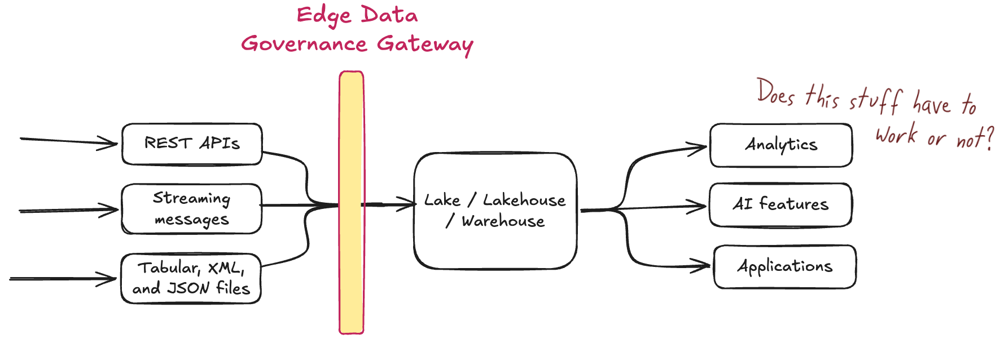

# CSV, Excel and JSONL Ingestion

<figure><figcaption></figcaption></figure>

#### CsvPath Framework registers, versions, validates, upgrades, and stages CSV, JSON, XML, Excel, JSONL and data frames from data partners _before_ your pipelines break.&#x20;

If your MFT or REST API drives external data directly into the data lake or database the damage is already done.&#x20;

[CsvPath Framework](https://github.com/csvpath/csvpath) is the open source way to shift-left data quality. Enforce clear data contracts at the edge with **less manual effort, fewer ingestion failures, and more agile development** using consistent data preboarding tools [you can try in minutes](https://app.gitbook.com/s/6wzqgDHj9mZbFxabiEbc/getting-started).  &#x20;

<figure><figcaption>
Your data lake deserves a data publisher it can trust!
</figcaption></figure>

<h2 align="center">Get FlightPath Data, the open frontend</h2>

<figure><figcaption></figcaption></figure>

[**FlightPath Data** is a powerful frontend to CsvPath Framework](https://www.flightpathdata.com/). Go beyond CsvPath Framework's built-in CLI. Get up and running faster with a purpose-built data contracts, data preboarding development, and data operations console. FlightPath Data gives you all the help and examples you need move quickly.&#x20;

FlightPath Data is bundled with **FlightPath Server**, the no-code/low-code automation REST API connecting your existing infrastructure to robust edge data governance.&#x20;

Available as a _free_ download from the [Microsoft Store](https://apps.microsoft.com/detail/9p9pbpkz4jdf?hl=en-US\&gl=US) and the [Apple MacOS Store](https://apps.apple.com/us/app/flightpath-data/id6745823097).

<h3 align="center">The Architecture For Efficient Edge Data Ingestion</h3>

**CsvPath Framework** implements the [**Collect, Store, Validate Publish architectural pattern.** ](https://static1.squarespace.com/static/66df9d47982d0d40e1574327/t/6771fe6f63bbf5361725ad05/1735523953587/The+Collect+Store+Validate+Pattern+-+Atesta+Analytics.pdf) External data ingestion goes faster, is more cost-efficient, and more effective with a Data Preboarding stage.&#x20;

CsvPath Framework was built to fill the blindspot between the edge and downstream data systems with a simple path to provably correct data.

This Data Preboarding blindspot is a big deal. Think about it. If even 1 in 30 companies depends existentially on CSV, JSON, XML, or Excel files or JSON streaming data from external data partners, _**the lack of edge Data Preboarding is a trillion-dollar problem waiting to happen.**_&#x20;

<figure><figcaption></figcaption></figure>

Why roll your own data preboarding tool chain? CsvPath Framework is a purpose-built off-the-shelf solution you can rollout now.

<h3 align="center">Powerful Validation For Batch Files and Real-time Data</h3>

CSV, Excel, NDJSON, and JSONL validation has never been as sophisticated as JSONQuery and XSD — until now. **CsvPath Validation Language** is simple, easy to integrate, and flexible enough to handle the unexpected. Inspired by Schematron, XPath, and SQL, CsvPath Validation Language brings powerful data validation to tabular and JSON Lines structured data. Together, JSON Schema, XSD, and CsvPath Validation Language are unstoppable. [Start here](topics/validation/schemas-or-rules.md).

Running CsvPath Framework and FlightPath Data can help you build your organization's confidence that your data governance doesn't turn a blind eye to its most unruly data.&#x20;

<h3 align="center">Integrated With Your Existing Tools</h3>

<figure><figcaption>
CsvPath has many built-in integrations. Suggest more!
</figcaption></figure>

[JSON Schema](https://json-schema.org/) / [Parquet](topics/how-tos/parquet.md) / [Sqlite](topics/how-tos/send-run-events-to-sqlite.md) / [S3](topics/how-tos/storage-backends/aws-s3.md) / [OpenLineage](getting-started/dataops-integrations/openlineage.md) / [OpenTelemetry](getting-started/dataops-integrations/opentelemetry.md) / [Slack](topics/how-tos/setup-notifications-to-slack.md) / [Postgres](topics/how-tos/send-events-to-mysql-or-postgres.md) / [MySQL](topics/how-tos/send-events-to-mysql-or-postgres.md) / [Azure](topics/how-tos/storage-backends/azure.md) / [Pandas](https://pandas.pydata.org/) / [Google Cloud Storage](topics/how-tos/storage-backends/google-cloud-storage.md) / [Webhooks](topics/how-tos/call-a-webhook-at-the-end-of-a-run.md) / [JSONPath](https://github.com/csvpath/csvpath/blob/main/docs/func_gen/jsonpath.md) / [XSD](https://en.wikipedia.org/wiki/XML_Schema_\(W3C\)) / [XPath](https://github.com/csvpath/csvpath/blob/main/docs/func_gen/xpath.md) / [Airflow](topics/how-tos/airflow.md) / [CKAN](https://ckan.org/) and more.

<h3 align="center">Give CsvPath Framework a Try</h3>

* [Getting Started](https://app.gitbook.com/s/6wzqgDHj9mZbFxabiEbc/getting-started)
* [How-tos](topics/how-tos/)
* [DataOps Integrations](getting-started/integrations/)
* [The FlightPath Examples](getting-started/get-the-flightpath-app/preview-the-flightpath-examples/)


For more background on preboarding and the CsvPath and FlightPath architecture [check out the CsvPath blog](https://blog.csvpath.org/).&#x20;





