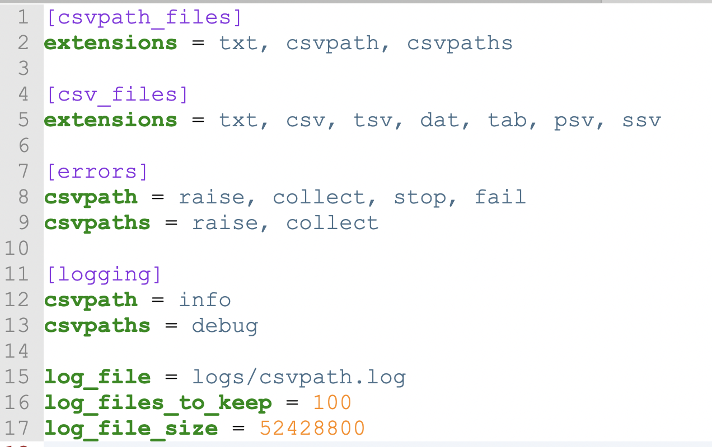

# Debugging Your CsvPaths

CsvPaths is a declarative rules-based path language. As such, creating csvpaths can be drop-dead easy for easy things. For more complex situations you will undoubtedly sooner or later come to a head-scratcher. You can of course run CsvPath in an IDE debugger. But what other options are there for gaining an understanding of what your csvpath is doing?&#x20;

Here are some ideas.

* Logging levels&#x20;
* Error handling policy
  * Check the error collector
* Emit JSON from the matcher
* Scan just 1 line or call stop()
* Create a simple test csvpath&#x20;
  * \- compose your csvpaths to make the parts simpler
* print() is your friend
  * the $.csvpaths.headers field
  * push() line-by-line indicators
  * Counts vs. numbers
  * Were the variables frozen?
* Remember that matches and producing values are different and not transitive
* Access the variables and metadata programmatically
* Parser’s AST in debug logging
* The source code

## Logging Levels

The obvious place to start is with the log. By default CsvPath logs to ./logs. That will probably not be ideal for production. You can easily reset it by changing config.ini. You also have the option to reset the path to config.ini when you create your instance. You could even populate the csvpath.util.config.CsvPathConfig instance programmatically. (You probably shouldn't, but you can!)&#x20;

Here's an example of the config showing all the log-related options.

<figure><figcaption></figcaption></figure>

As you can see you have logging and error options for CsvPath and CsvPaths. If you use CsvPaths you still use the settings for CsvPath for those instances that CsvPaths is managing.

The logging is, today, heavily focused on matching. That's where most of the complexity creeps in. You can see when matching starts, what the match structure is, how the match components behave and what their focus is — meaning are they value producers, match deciders, or side-effects. Lots of information.

<figure><figcaption></figcaption></figure>

Error Policy

CsvPaths and CsvPath have a multi-setting error policy. If you need more information, or more or less run protection, you should have a look. The options are:&#x20;

* `raise` — reraises exception, at the risk of interrupting production processes
* `collect` — collects Error objects with the associated Exception&#x20;
* `stop` — stops the run, as if your csvpath called the `stop()` function. Keep in mind you are only stopping the CsvPath the error occurred in. If you are working in the context of a CsvPaths instance, CsvPaths will either:&#x20;
  * Continue by starting the next CsvPath, if any, if you are processing serially, or
  * If processing breadth-first, continue with the next CsvPath in the list of CsvPaths considering each line until the run completes or all CsvPaths enter the stopped state
* `fail` — indicate that the CSV file is invalid. This does not stop the run.
* `quiet` — handles the error quietly with minimal additional noise in the log, low information availability, and no threat to the continuance of the production runtime

You can activate multiple of these options at once. `quiet` and `raise` obviously don't go together.

