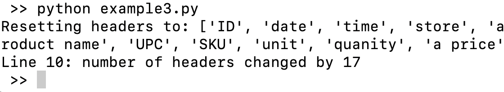
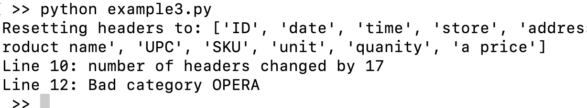
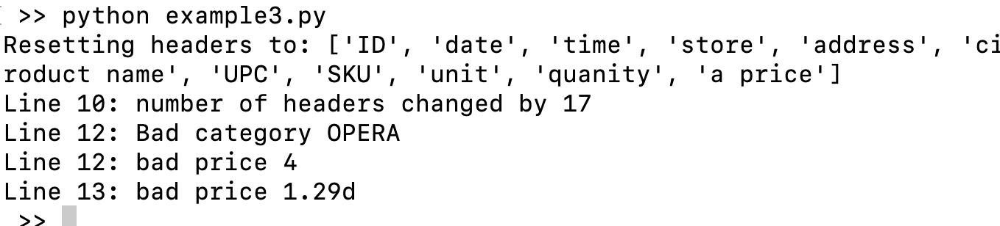
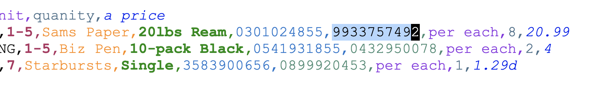

---
layout:
  title:
    visible: true
  description:
    visible: true
  tableOfContents:
    visible: true
  outline:
    visible: true
  pagination:
    visible: true
---

# Another Example, Part 1

In the first example we created validation rules for a straightforward file. In this next example we'll take on a harder format, handle more rules, and set ourselves up for production use. Let's dive in!

## Dealing with top matter

Some CSV files have documentation or ancillary data at the top, above the main data lines. While the additional data is useful, it complicates recognizing and handling headers correctly. Validation becomes more difficult. We're going to validate an example like some we've seen in the wild. 

In this example, you will see more functions, headers, qualifiers, and references. We'll explain them as we go. Afterwards, to learn more about these topics you can take a look at: 

* [Functions](https://github.com/dk107dk/csvpath/blob/main/docs/functions.md), including the list of all built-in functions
* [Qualifiers](https://github.com/dk107dk/csvpath/blob/main/docs/qualifiers.md)
* [Headers](https://github.com/dk107dk/csvpath/blob/main/docs/headers.md)
* [References](https://github.com/dk107dk/csvpath/blob/main/docs/references.md) and [the reference data types](../topics/the\_reference\_data\_types.md)

And, for a general overview of the match components, [start here](https://github.com/dk107dk/csvpath/tree/main?tab=readme-ov-file#components).

## The file

This is a simplified order for goods from retail stores. It is a monthly report delivered automatically.

<figure><figcaption></figcaption></figure>

Here is the file. It is shortened, but it is enough for this example.



There are so many things to possibly validate here. Types of products, IDs, prices. Just sticking with simple checks we could come up with many rules. We'll create a csvpath that applies six rules while dealing with the complicating top-matter.

As far as that top-matter, our csvpath has some requirements. It needs to:

* Recognize that the header line is line 9 (0-based)
* Discard the lines that are comments — unless
* There is information we want to capture in that line, specifically: user and run ID

Doable? Absolutely!

And let's try doing it without just skipping the top 7 lines. Skipping the lines would obviously be trivial. Just create the scanning part of the csvpath like:

```xquery
$[8*][ ... ]
```

But let's say we don't trust that those lines will always be there or a consistent number to skip. And, anyway, we want that user and run ID metadata.

## Validation requirements

We need to pull two fields from the comments:&#x20;

* The username of the person to contact about the file
* The run ID of the process that generated the file

As well, say that the orders files will always:&#x20;

* Be more than 10 headers wide
* Have just 1 header row per file
* Have more than 10 data rows

And of course there will be requirements for the fields:&#x20;

* The product category must be correct
* Lines must have UPCs and SKUs
* Prices must be in the right format

If this were an actual order file in a real-world situation we could imaging collecting average selling prices, checking the vender's name, looking for duplicate lines, and more. All things csvpaths can do.

We'll step through the strategies for each of the bullets. Then see them together in one file with a trivial Python script that runs the csvpath. Then we'll switch to CsvPaths to create a more long-term management friendly version. That will show you the advantages of small modular csvpaths working together.

## Rule 1: capture the metadata

You can capture the metadata using regular expressions. The comment lines are prefixed with a `#` character. We can use that and a regex to grab the values we want and put them in variables.

Variables are new; we haven't seen them in the previous examples. Everytime you run a csvpath your CsvPath instance collects several things:&#x20;

* Metadata
* Runtime stats
* Variables

You can [read about these types of data here](../topics/the\_reference\_data\_types.md). Variables are like session variables in web development. They come in three flavors:&#x20;

* Strings or numbers
* Dictionaries of named "tracking values"
* Stacks of strings or numbers

We'll see each of these types. The variables are available in:

* Your CsvPath instance at `path.variables` (assuming your CsvPath is called "path")
* In your csvpath strings using `@varname`
* Within any csvpath string `print()` statements at `$.variables.varname`

Again, we'll see each of these uses of variables as we go.

So, then, let's capture that metadata! Take your last example and replace the rules with these two lines. You can also remove the validity check at the bottom, update the comment, etc.

```xquery
starts_with(#0, "#") -> @runid.notnone = regex( /Run ID: ([0-9]*)/, #0, 1 )
starts_with(#0, "#") -> @userid.notnone = regex( /User: ([a-zA-Z0-9]*)/, #0, 1 )
```

Your file will look something like:&#x20;

```python
from csvpath import CsvPath

csvpath = """$March-2024.csv[*][
            ~ Capture metadata from comments ~
                starts_with(#0, "#") -> @runid.notnone = regex( /Run ID: ([0-9]*)/, #0, 1 )
                starts_with(#0, "#") -> @userid.notnone = regex( /User: ([a-zA-Z0-9]*)/, #0, 1 )
          ]"""

path = CsvPath()
path.parse(csvpath)
lines = path.collect()
```

These two [match components ](https://github.com/dk107dk/csvpath/tree/main?tab=readme-ov-file#components)look at comment lines and capture data.&#x20;

### Starts\_with()

Notice that the `starts_with()` function looks at the 0th header, `#0`. We used the `#` character to indicate headers in our last example. This is the same thing, except this time we're pointing to the headers using their 0-based index number.  `#0` is the first header. We use `#0` because there is no proper header line at the top of the file so we don't have a name of the 0th header.

\#0 looks a lot like the CSV file's comments. But we know comments in CsvPath use the `~` character. This CSV file just happens to use `#` as its comment character.&#x20;

The `starts_with()` function is much like similarly named functions in Python, SQL, etc. It returns `True` if a variable starts with a certain string.

### When/do and notnone

Next we have a when/do expression. When the left-hand side of `->` is True, we do what is on the right-hand side.

The variable `@runid` will capture the ID of the run if it is found in the comments. It has the `notnone` qualifier. Qualifiers are explained [on this page](https://github.com/dk107dk/csvpath/blob/main/docs/qualifiers.md). The `notnone` qualifier does what it sounds like. It prevents the variable from capturing the `None` value. `None` is the Python way of saying null.&#x20;

Regular expressions

Regular expressions, or regexes, match substrings. They are powerful, inscrutable, incredibly useful in virtually every language and many tools, and even sometimes fun. Regardless, they are a deep topic on their own. We won't dissect these expressions here. You can learn more about regexes from many tutorials, including [this one](https://www.geeksforgeeks.org/write-regular-expressions/). This [regex debugger ](https://www.debuggex.com/)may also be a help. The page on [CsvPath's regex tools is here](https://github.com/dk107dk/csvpath/blob/main/docs/functions/regex.md).

In brief, we're saying capture a value from a line that has the substring `Run ID:` in the 0th header.

```xquery
regex( /Run ID: ([0-9]*)/, #0, 1 )
```

To recap, now that we have our metadata fields captured from the CSV file's comments your script should look like this:&#x20;

```python
from csvpath import CsvPath

csvpath = """$March-2024.csv[*][
            ~ Capture metadata from comments ~
                starts_with(#0, "#") -> @runid.notnone = regex( /Run ID: ([0-9]*)/, #0, 1 )
                starts_with(#0, "#") -> @userid.notnone = regex( /User: ([a-zA-Z0-9]*)/, #0, 1 )
          ]"""

path = CsvPath()
path.parse(csvpath)
lines = path.collect()

print(f"path.variables: {path.variables}")

```

When you run it you will see something like:&#x20;

<figure><figcaption></figcaption></figure>

Notice that because this is the first time I ran this script in a new project CsvPath created a default config file and a logs directory. But more importantly, we got our two metadata values in the CsvPath instance's variables. Perfect!

## Rule 2: Find the Headers

Moving on from the comments at the top of the file, we know there is one header row. Our requirements said there are >= 10 headers. That's easy to spot. One way to do it might be:&#x20;

```xquery
skip( lt(count_headers_in_line(), 9) )
gt(count_headers_in_line(), 9) -> reset_headers()
```

These two [match components](https://github.com/dk107dk/csvpath/tree/main?tab=readme-ov-file#components) handle those requirements.&#x20;

The first one skips a line if the line doesn't have enough headers. At the top of the file, those are probably comment lines and we already took care of the comments. This is an illustration of how order matters in CsvPath.&#x20;

Match components are activated from left to right, top to bottom. What I do in match component A may affect match component B. Or, in this case, we're just skipping B, C, D, etc. altogether.&#x20;

`count_headers_in_line()` explains itself pretty clearly. The `reset_headers()` function updates the CsvPath instance's understanding of what the file's headers are. When we use `reset_headers()` we are saying take the current line as being the header row. That resets the names of the headers to be the values in the current row.

When we see the number of line values jump to 10 or more we can safely assume we hit the header row and act accordingly.&#x20;

Here is a more complete approach that includes a few nice-to-have things:

```xquery
skip( lt(count_headers_in_line(), 10) )

@header_change = mismatch("signed")
gt( @header_change, 9) ->
      reset_headers(
        print("Resetting headers to: $.csvpath.headers"))

print.onchange.once(
    "Line $.csvpath.count_lines: number of headers changed by $.variables.header_change",
     skip())
```

The three parts are:&#x20;

* We skip any line with less than 10 headers
* Then we reset the headers if they jump to 10 or more
* When we see the headers reset the first time we print an alert

### Skipping

The `skip()` function is a way to jump ahead to the next line from anywhere in a csvpath. Again, order is important in csvpaths. When we use `skip()` we are saying skip ahead to the next line without doing anything else. In this case, we use the `lt()`, or less than, function to tell `skip()` if it should act. &#x20;

In the next block, we use the `mismatch()` function. `mismatch()` tells us the difference between how many header values we see in a line versus the number of headers for the file. Imagine if a SQL database table had four columns, but in one row there were only three columns. That could not happen in a SQL database, but in a CSV file, it happens frequently.&#x20;

### Spotting the mismatch

We use the string `"signed"` to tell mismatch() that it should give us a positive or negative number, not just the absolute value.  Without `"signed"` when there are four headers in the file but only three in a row mismatch reports `1`. With "signed" mismatch() reports `-1`. In our case, we only care if we suddenly have many more headers, so we need to see a positive number.&#x20;

### Printing an alert

The last of the three parts has a lot going on. Here's the match component by itself:&#x20;

```xquery
print.onchange.once(
   "Line $.csvpath.count_lines: number of headers changed by $.variables.header_change", 
    skip())
```

This is our first use of the `print()` function. Unlike most general purpose langages, in CsvPath printing is a big deal. The reason is that the act of validating a file means using rules to find unexpected things and communicating that information to the user. Schematron is the schema language most like CsvPath. It points to problems and communicate with the user in plain English. (Or your humans language of choice). XSD, JSON Schema, etc. all have the dual purpose of defining data structures and communicating when data doesn't match.&#x20;

CsvPath has some nice printing tricks up its sleeve. We're using a couple of them.

First, the qualifiers. Qualifiers are awesome. They can do so many neat things to make match components more powerful. In this case we are using both `onchange` and `once`. Both do exactly what they sound like:&#x20;

* `print()` with `onchange` only prints when the print string is different. That is useful when you are printing variables that may not change in some lines. With `onchange` you only see the `print()` when it has something new to say.
* `print()` with `once` simply prints just one time. That's it, one and done.
* `print()` with both `onchange` and `once` is even more interesting. It means that `print()` takes its first chance to print. The first printout is considered a change. But then `once` prevents any more printouts. This is good because `mismatch()` will report `0` as the number of headers that are unexpectedly found or missing. That `0` would be considered a change by `print()`. We don't need to be told that nothing happened.

As you can see, `print()` can take a second argument that is executed only if `print()` itself runs. We use this to nest a `skip()` that jumps us to the next line. As with most things in CsvPath, we could have done this other ways, but this is a good approach.

Your script should now look like:&#x20;

```python
csvpath = """$March-2024.csv[*][

            ~ Capture metadata from comments ~
                starts_with(#0, "#") -> @runid.notnone = regex( /Run ID: ([0-9]*)/, #0, 1 )
                starts_with(#0, "#") -> @userid.notnone = regex( /User: ([a-zA-Z0-9]*)/, #0, 1 )

                skip( lt(count_headers_in_line(), 9) )

                @header_change = mismatch("signed")
                gt( @header_change, 9) ->
                      reset_headers(
                        print("Resetting headers to: $.csvpath.headers"))

                print.onchange.once(
                     "Line $.csvpath.count_lines: number of headers changed by $.variables.header_change",
                        skip())

          ]"""

path = CsvPath()
path.parse(csvpath)
lines = path.collect()
```

Running your script should look like what you would expect:&#x20;

<figure><figcaption></figcaption></figure>

Congrats! You are done with the hard part. The rest of the validations are simple business rules.

## Rule 3: Product Category

Next we'll check if the product category is correct. This is a pretty straightforward rule.

```xquery
not( in( #category, "OFFICE|COMPUTING|FURNITURE|PRINT|FOOD|OTHER" ) ) ->
                    print( "Line $.csvpath.count_lines: Bad category $.headers.category ", fail())
```

Following the same pattern we saw in the last example, we are going to identify a problem row and print a validation message. The `in()` function looks at the value of the `#category` header and checks if it is in a delimited string.&#x20;

We could equally well ask `in()` to check against the values of one or more other match components. Or, we could even use a reference to point `in()` towards a list of values created by a different csvpath. But for now we're keeping it simple with the delimited list.

Notice that we asked `print()` to activate a `fail()` function, as well as printing a message. `fail()` sets the `is_valid` property of a csvpath to `False`. We are saying that the CSV file is invalid. If we needed to, we could use this information programmatically in Python, in CsvPath `print()` messages, or to take action in other match components using the `failed()` or `valid()` functions as triggers.

When you run your script now, you see nothing changed. That's because all our categories are correct. To make sure your rule works change line twelve's category from OFFICE to OPERA.&#x20;

<figure><figcaption></figcaption></figure>

Now you assuming your script looks like this:&#x20;

```python
from csvpath import CsvPath

csvpath = """$March-2024.csv[*][

            ~ Capture metadata from comments ~
                starts_with(#0, "#") -> @runid.notnone = regex( /Run ID: ([0-9]*)/, #0, 1 )
                starts_with(#0, "#") -> @userid.notnone = regex( /User: ([a-zA-Z0-9]*)/, #0, 1 )

                skip( lt(count_headers_in_line(), 9) )

                @header_change = mismatch("signed")
                gt( @header_change, 9) ->
                      reset_headers(
                        print("Resetting headers to: $.csvpath.headers"))


                print.onchange.once(
                    "Number of headers changed by $.variables.header_change",
                        print("See line $.csvpath.line_number", skip()))

                not( in( #category, "OFFICE|COMPUTING|FURNITURE|PRINT|FOOD|OTHER" ) ) ->
                     print( "Line $.csvpath.count_lines: Bad category $.headers.category ", fail())
          ]"""

path = CsvPath()
path.parse(csvpath)
lines = path.collect()
```

When you run it you should see something like this:

<figure><figcaption></figcaption></figure>

## Rule 4: Price Format

Moving right along, the next rule is that prices must exist and be in the correct format.

```xquery
not( exact( end(), /\$?(\d*\.\d{0,2})/ ) ) ->
       print("Line $.csvpath.count_lines: bad price $.headers.'a price' ", fail())
```

Again we use the same rule pattern. In this case, we tap regular expressions again to check that a price:

* Exists in the last header
* Starts with a $, optionally
* Is made of numbers
* Has a decimal point
* Has at most two numbers byond the decimal point

This probably isn't the perfect price field description, but it is pretty good.&#x20;

The new thing here is `end()` function. `end()` is a pointer to the last header. If we're not certain what the last header name or index is we can use `end()` to refer to it. Our options are:&#x20;

* Use a header name, possibly quoted, like `#"a price"`
* Use an index like `#14`
* Use `end()`, possibly with an offset integer like like `end(-2)`

In this case, let's say we know price is always the last column.&#x20;

Drop this rule in your script and run it. If your file follows how we've been creating the example, you will hear some complaints from Python. It is unhappy about invalid escapes. Ah, validity. Easy to fix. Change your line to:&#x20;

```xquery
not( exact( end(), /\\$?(\\d*\\.\\d{0,2})/ ) ) ->
                    print("Bad price $.headers.'a price' at line  $.csvpath.count_lines", fail())
```

The additional `\` chars escape the regular expression escapes for Python. This is normal regular expression fun. We all give up some amount of our sanity for accessing the power of regexes.

Your script should now look like:&#x20;

<pre class="language-python"><code class="lang-python">from csvpath import CsvPath

csvpath = """$March-2024.csv[*][

            ~ Capture metadata from comments ~
                starts_with(#0, "#") -> @runid.notnone = regex( /Run ID: ([0-9]*)/, #0, 1 )
                starts_with(#0, "#") -> @userid.notnone = regex( /User: ([a-zA-Z0-9]*)/, #0, 1 )

                skip( lt(count_headers_in_line(), 9) )

                @header_change = mismatch("signed")
                gt( @header_change, 9) ->
                      reset_headers(
                        print("Resetting headers to: $.csvpath.headers"))


                print.onchange.once(
                    "Number of headers changed by $.variables.header_change",
                        print("See line $.csvpath.line_number", skip()))

                not( in( #category, "OFFICE|COMPUTING|FURNITURE|PRINT|FOOD|OTHER" ) ) ->
                    print( "Bad category $.headers.category at line $.csvpath.count_lines ", fail())


<strong>                not( exact( end(), /\\$?(\\d*\\.\\d{0,2})/ ) ) ->
</strong>                    print("Line $.csvpath.count_lines: bad price $.headers.'a price' ", fail())
          ]"""

path = CsvPath()
path.parse(csvpath)
lines = path.collect()
</code></pre>

It is definitely getting long. But we're getting close to complete. And in Part 2 of this example we'll see how to make the validation csvpath much simpler and more manageable.

Run your script and you should see output like this:&#x20;

<figure><figcaption></figcaption></figure>

## Rule 5: UPCs and SKUs

Retailers, distributors, and manufacturers use Universal Product Codes to identify products. Retailers use Stock Keeping Units to identify and count products in inventory. Both are very important numbers to the business. If they were missing the orders file would be for sure invalid.

For all that, though, checking that they are present is easy. By now you should expect the pattern we are following: when/do. We're checking the #SKU and #UPC headers. Remember that CsvPath is case sensitive.

Paste or type in these two lines at the bottom of the csvpath string in your script.

```xquery
not( #SKU ) -> print("Line $.csvpath.count_lines: No SKU", fail())
not( #UPC ) -> print("Line $.csvpath.count_lines: No UPC", fail())
```

When you run your script you again see no additional issues. So let's make one. In line 11 remove the value in the SKU field, the fourth header from the end: `9933757492`. It should look like this:&#x20;

<figure><figcaption></figcaption></figure>

Run your script again. You should see something close to:&#x20;

<figure><figcaption></figcaption></figure>

If that works correctly your script looks like this:&#x20;

```python
from csvpath import CsvPath

csvpath = """$March-2024.csv[*][

            ~ Capture metadata from comments ~
                starts_with(#0, "#") -> @runid.notnone = regex( /Run ID: ([0-9]*)/, #0, 1 )
                starts_with(#0, "#") -> @userid.notnone = regex( /User: ([a-zA-Z0-9]*)/, #0, 1 )

                skip( lt(count_headers_in_line(), 9) )

                @header_change = mismatch("signed")
                gt( @header_change, 9) ->
                      reset_headers(
                        print("Resetting headers to: $.csvpath.headers"))

                print.onchange.once(
                    "Line $.csvpath.count_lines: number of headers changed by $.variables.header_change",
                        skip())

                not( in( #category, "OFFICE|COMPUTING|FURNITURE|PRINT|FOOD|OTHER" ) ) ->
                    print( "Line $.csvpath.count_lines: Bad category $.headers.category ", fail())

                not( exact( end(), /\\$?(\\d*\\.\\d{0,2})/ ) ) ->
                    print("Line $.csvpath.count_lines: bad price $.headers.'a price' ", fail())

                not( #SKU ) -> print("Line $.csvpath.count_lines: No SKU", fail())
                not( #UPC ) -> print("Line $.csvpath.count_lines: No UPC", fail())

          ]"""

path = CsvPath()
path.parse(csvpath)
lines = path.collect()

```

We're getting there! One more rule to go.

## Rule 6: Total Expected Lines

Our requirements say we are expecting a file that is greater than 10 lines. That gives room for the comments at the top and at least a one or two orders. If we don't see at least 10 lines we fail the file.

Let's use this match component:

```xquery
below(total_lines(), 11) ->
                      print.once("File has too few data lines: $.csvpath.total_lines..
Contact $.variables.userid about this batch:
$.variables.runid at $.csvpath.file_name..", fail())
```

We'll use `print()`'s `once` qualifier to make sure we don't generate a lot of noise.  Also note that we use a double period in two places. Doubling up periods is an escape for when you want to put a period directly at the end of a reference in a `print()`. That is the only place it is needed.

With all our requirements met let's take a moment to clean up a bit. We don't need to display the updated headers, now that we know that is working. And we can put the last total\_lines() check first in the list of concerns. Also, a few more comments wouldn't be a bad idea. Here's how your script will look with those changes:&#x20;

```python
from csvpath import CsvPath

csvpath = """$March-2024.csv[*][

            ~ Capture metadata from comments ~

                starts_with(#0, "#") -> @runid.notnone = regex( /Run ID: ([0-9]*)/, #0, 1 )
                starts_with(#0, "#") -> @userid.notnone = regex( /User: ([a-zA-Z0-9]*)/, #0, 1 )

                skip( lt(count_headers_in_line(), 9) )

            ~ Check the file length ~
                below(total_lines(), 27) ->
                      print.once("File has too few data lines: $.csvpath.total_lines..
Contact $.variables.userid about this batch:
$.variables.runid at $.csvpath.file_name..", fail())

            ~ Reset the headers when we see the full set ~
                @header_change = mismatch("signed")
                gt( @header_change, 9) -> reset_headers()

            ~ Print the line number of the header reset in case we need to check ~
                print.onchange.once(
                    "Line $.csvpath.count_lines: number of headers changed by $.variables.header_change",
                        skip())

            ~ Check the categories ~
                not( in( #category, "OFFICE|COMPUTING|FURNITURE|PRINT|FOOD|OTHER" ) ) ->
                    print( "Line $.csvpath.count_lines: Bad category $.headers.category ", fail())

            ~ Check the chenck the prices ~
                not( exact( end(), /\\$?(\\d*\\.\\d{0,2})/ ) ) ->
                    print("Line $.csvpath.count_lines: bad price $.headers.'a price' ", fail())

            ~ Check for SKUs and UPCs ~
                not( #SKU ) -> print("Line $.csvpath.count_lines: No SKU", fail())
                not( #UPC ) -> print("Line $.csvpath.count_lines: No UPC", fail())

          ]"""

path = CsvPath()
path.parse(csvpath)
lines = path.collect()
```

I bumped up the number of lines requirement so that we could see the rule's effect. When you run this final version of your script you should see something like:&#x20;

<figure><figcaption></figcaption></figure>

Congrats! You have a very functional csvpath to check your CSV files with.&#x20;

## A Simple Python CsvPath Runner

As we saw in the first two examples, the Python side of CsvPath is easy.

```python
import csvpath

path = CsvPath()
path.parse( ORDER_RULES )
path.fast_forward()
print(f"\nThe file is {'valid' if path.is_valid else 'invalid'}")

```

Step-by-step:

* We import CsvPath and create an instance that will run our csvpath
* Assuming we drop our csvpath into the ORDER\_RULES variable, we parse our csvpath to prepare it to run
* Since we aren't actually using the matched lines programmatically let's switch to the `fast_forward()` method. With `path.fast_forward()` we are asking CsvPath to run the CSV file through our csvpath without stopping or returning any data to us. We do that because our validations all print their gotchas report-style.
* Last, we print out our csvpath's verdict: is the CSV file goood, or not

For this simple example that's enough. But in a production setting you might imagine sending an email, updating a database, moving the file to a good or not good directory, or the like.

## And you're done!

That's a lot. But the result is well organized, commented, and self-documenting. Of course, longer validation rulesets are easy to find, but this one isn't trivial.

Still, we have to ask, is there a better way?  Something more manageable over the long term? An approach that might be easier to develop and debug?

Yes, absolutely! We'll take all that on in Part 2 of this example.

