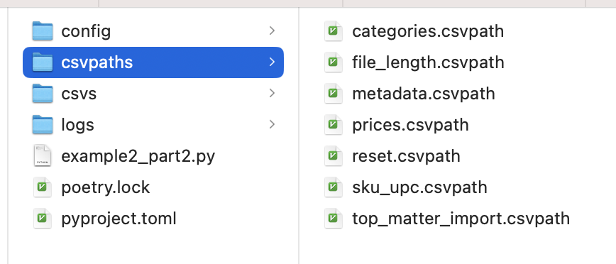

# Another Example, Part 2

In this second part of the orders data file example we are going to modify our csvpath and its Python runner to be more automation and management friendly. &#x20;

## Requirements

First let's call out the requirements. What are we trying to achieve?

* Separate the code from the csvpath
* Break down the validation rules
* Give ourselves more options for reporting and error handling
* Set ourselves up for making references to other data for lookups

Let's say more.

#### Separate the code

Separating the code from the csvpath is straightforward. We don't want to colocate the csvpath in a Python variable. That constrains our formatting choices, complicates updates and the code, and makes the solution single use. We don't want to keep that physical file reference built into the csvpath, either. Our ideal root for our path is this:

```xquery
$[*]
```

#### Componentize the csvpath rules

Secondly, having our six validation concerns in one file makes us work harder in development. With six rules you have to take all of them into account when you test your csvpath. Writing and testing one rule at a time, separately, is simpler. Our solution, ideally, should let us have six csvpaths that we can run and manage as a group.&#x20;

#### Capture print statements and errors

Third, printing validation messages is an excellent way to do data validation. This kind of reporting may seem simple, but simple is good. That said, could we wish for more control over the output? Sure. We might want to craft an email or some other kind of report. It would be nice to be able to do that without scraping the command line.&#x20;

Likewise with error handling. We'll test our csvpath, of course! But at runtime things happen. And keep in mind that the data may change—we don't control that. So we'd like error handling that is robust with outputs that are inspectable.&#x20;

#### References to other data

Finally, our csvpath doesn't currently refer to outside data, but it could. And, given what the data is, there is a strong possibility that in a real scenario we would want to check UPCs or company names, or other things against known-good values. To do that we need our references to be able to find other data sets. The way our script is currently set up, we can't do that.

## The Solution

We're going to use a CsvPaths instance. CsvPaths is a manager class. It organizes CSV files, csvpath strings, and CsvPath instances and their run results.&#x20;

A CsvPaths instance creates an instance of CsvPath for each csvpath it runs. It has managers to find files, sets of csvpaths to run, and capture the results of runs. And it gives you options that let you decide the best way to run multiple csvpaths for your situtation. &#x20;

As you may already know from other pages, the main difference in setting up a CsvPaths instance is that you need to point its managers to your files. Your results live in the results manager. You access them using the same name as you used for the paths that created the results.&#x20;

That's about it. Easy!

## The Python

In this second part of the example, we're going to change our csvpath string more than the Python code. But the Python motivates our changes to the csvpath. So let's start with the Python.

Create a new directory and make a Python file with the contents below. Also create a `cvspaths` directory and a `csvs` directory.

```python
from csvpath import CsvPaths

paths = CsvPaths()
paths.file_manager.add_named_files_from_dir("csvs")
paths.paths_manager.add_named_paths_from_dir(directory="csvpaths")

paths = CsvPaths(print_default=False)
LogUtility.logger(paths, "warn")

name = "metadata"
#name = "reset"
#name = "file_length"
#name = "categories"
#name = "prices"
#name = "sku_upc"
lines = paths.fast_forward_paths(filename="March-2024", pathsname=name)

print(f"lines: {lines}")

valid = paths.results_manager.is_valid(name)
print(f"is valid: {valid}")
```

None of this is complicated stuff. Let's go through it.

### Printing and logging

First we import the CsvPath library and create an instance of `CsvPaths`. We create it with `print_default=False`.

`print_default=False` prevents the `CsvPath` instances that run your csvpaths from printing to the default command line `Printer`. Your print statements will still be captured and available with your results from the `ResultsManager`. By default both things would happen: you would see results on the command line and you would also get print statements with your results.&#x20;

Now that you've seen  `print_default=False`, go ahead and delete it. We'll want to see the output in the terminal, at least at first.

Next, we do another completely optional thing: set the logging level. We're just seeing how to do it, for future reference. Out of the box, CsvPath is already set to `warn` by default. You can [read more about setting up logging and error handling policies here](../topics/debugging.md).

### Named-files, named-paths, named-results

On to more important things. First, we set up the named-files and named-paths. Named-files are just short names that point to full filesystem paths. They are convenient and help you keep your CSV files organized.&#x20;

Named-paths are more interesting. These are sets of csvpaths strings that can be run as a group. You set them up by one of:

* Creating a `dict` in Python or using a JSON file
* Pointing to a directory full of csvpath files
* Pointing to a file that contains multiple csvpaths strings

We'll try each. When we're done with Part 2 of our orders file example, we're going to have the last one—multiple csvpaths in a single file—but this time in a more DataOps-friendly way than in Part 1.&#x20;

For more background, you can [read more about named-paths and named-files here](../topics/named\_files\_and\_paths.md).&#x20;

### The fast\_forward\_paths() method

After we set up the named files and named paths we have CsvPaths do `fast_forward_paths()`. This is similar to the `fast_forward()` method we called on our `CsvPath` instance in the first part of the example. The difference is that CsvPaths runs all the csvpaths in the named-paths you are using. That's CsvPaths's job: running multiple csvpaths against CSV files.

With `fast_forward_paths()` CsvPaths runs your csvpaths serially. That means a few things:&#x20;

* Order is guaranteed&#x20;
* Results of earlier csvpaths are available for later csvpaths to use
* Every row is seen before the next csvpath is run, making side-effects like `print()` simpler
* Every csvpath has to iterate on the same CSV file, which is not the most efficient way

There is an equally simple to use fast forward method that run the csvpaths breadth-first: `fast_forward_by_line()`. That method solves the efficiency problem. But let's leave it as a topic for another time.

At the bottom of the Python we pull the results from the results manager using the same name as our named-paths name. We store them under the same name because the results are the result of running those csvpaths.

## Improving Our Csvpath

The cool part happens over in the csvpath.

We want to achieve a few things.&#x20;

* Easy development of independent rules
* Separated results, printouts, and error handling&#x20;
* Overall better flexibility

We're going to do this by creating six csvpaths, in place of the one we have now. When we're done we'll have the option of putting them all in one file or in multiple files in one directory.&#x20;

There's only one real challenge with breaking down our big csvpath into multiple little ones. It is a challenge that is specific to this example. The challenge is the top-matter that precedes the data in our CSV file.&#x20;

Each csvpath has to handle the top matter. It definitely complicates things. That exactly why we used it as the example! We're talking about this part:&#x20;

```xquery
~ Capture metadata from comments ~
    starts_with(#0, "#") -> @runid.notnone = regex( /Run ID: ([0-9]*)/, #0, 1 )
    starts_with(#0, "#") -> @userid.notnone = regex( /User: ([a-zA-Z0-9]*)/, #0, 1 )

    skip( lt(count_headers_in_line(), 9) )

~ Reset the headers when we see the full set ~
    @header_change = mismatch("signed")
    gt( @header_change, 9) -> reset_headers()

~ Print the line number of the header reset in case we need to check ~
    print.onchange.once(
        "Line $.csvpath.count_lines: number of headers changed by $.variables.header_change", skip())
```

Since this part came first in our csvpath and shielded all the remaining match components below it, we need a way to give that same shielding to our match components in their individual csvpaths. And we don't want to repeat this code six times.&#x20;

### top\_matter\_import.csvpath

The answer is to use the `import()` function. We can import this fragment into our other csvpaths to get the same effect without cut-and-paste. Creating an importable csvpath is simple because its just a  csvpath. Create a file named `top_matter_import.csvpath`. Copy in this csvpath and you're done:&#x20;

```xquery
~ reset headers when they go up and 
  otherwise if there aren't enough headers 
  just skip ~

$[*][
    @header_change = mismatch("signed")
    gt( @header_change, 9) -> reset_headers(skip())
    lt(count_headers(), 9) -> skip()
]
```



We're going to create six more csvpaths files. Most will import this one. No reason to go slow since you've already created these once in a single file, so here we go.

### metadata.csvpath

```xquery
---- CSVPATH ----

~ collect metadata fields from comments ~
$[*][

    starts_with(#0, "#") -> @runid.notnone = regex( /Run ID: ([0-9]*)/, #0, 1 )
    starts_with(#0, "#") -> @userid.notnone = regex( /User: ([a-zA-Z0-9]*)/, #0, 1 )

    skip( lt(count_headers_in_line(), 9) )

    and( @runid, @userid ) ->
        print(" Contact: $.variables.userid for batch ID: $.variables.runid", stop())
]
```

&#x20;



Wait, what's that `---- CSVPATH ----` block? I'm glad you asked. It is a separator between csvpaths that live in the same file.  It is of course completely optional at this stage because we're using multiple files with one csvpath in each. Doesn't hurt to have it there, though.

### reset.csvpath

In this file you'll see our `top_matter_import` for the first time.

```xquery
---- CSVPATH ----

~ print the line number when we reset headers ~
$[*][
    import("top_matter_import")

    print.onchange.once(
        "Line $.csvpath.count_lines: number of headers changed by $.variables.header_change", stop())
]
```



You may have noticed that these csvpath files have comments outside the csvpath itself. These comments are important. While we're not doing anything with them at the moment, we could add metadata fields that describe the csvpath. If you add an `ID` or a `name` metadata field to a comment, you can use it to reference the individual csvpath, even when it is bundled with others under the same named-paths name. Important, for sure, but we'll look at how to do that another time.

Also notice that we call `stop()`. This ends processing for this csvpath. It does not affect the other csvpaths that our `CsvPaths` instance is also running as part of this batch. CsvPaths will count the number of `stops()` and if all csvpaths in the batch are stopped it will stop the run early. Since we're running our csvpaths serially, when CsvPaths gets the `stop()` it just skips on to the next csvpath.

### file\_length.csvpath

```xquery
---- CSVPATH ----

~ Check the file length ~
$[*][
    import("top_matter_import")

    below(total_lines(), 27) ->
      print.once("File has too few data lines: $.csvpath.total_lines", fail_and_stop())
]
```




### categories.csvpath

```xquery
---- CSVPATH ----

~ Check the categories ~
$[*][
    import("top_matter_import")

    not( in( #category, "OFFICE|COMPUTING|FURNITURE|PRINT|FOOD|OTHER" ) ) ->
        print( "Line $.csvpath.count_lines: Bad category $.headers.category ", fail())
]
```



Two more csvpaths to go!

### prices.csvpath

```xquery
---- CSVPATH ----

~ Check the prices ~
$[*][
    import("top_matter_import")

    not( exact( end(), /\$?(\d*\.\d{0,2})/ ) ) ->
        print("Line $.csvpath.count_lines: bad price $.headers.'a price' ", fail())
]
```



### sku\_upc.csvpath

```xquery
---- CSVPATH ----

~ Check for SKUs and UPCs ~
$[*][
    import("top_matter_import")

    not( #SKU ) -> print("Line $.csvpath.count_lines: No SKU", fail())
    not( #UPC ) -> print("Line $.csvpath.count_lines: No UPC", fail())
]
```



There, that's all of them.&#x20;

You should now have seven .csvpath files in your csvpaths dir. It's worth pointing out, you don't have to use the .csvpath extension. We use it because it makes it clear what is contained in the file. But whatever works for you is fine. If you choose to use another file extension take a quick look in `config/config.ini` to make sure to let CsvPath know what your extension of choice is.

<figure><figcaption></figcaption></figure>

Back to your modified script. Here's where we left it. From this you can run any of the csvpath files you just created. Each file will be named in the named-paths manager by its name (minus the extension). Or you could iterate over your csvpaths by name. Ultimately, this isn't the way we want to run them, but it is a good test.

```python
from csvpath import CsvPaths

paths = CsvPaths()
paths.file_manager.add_named_files_from_dir("csvs")
paths.paths_manager.add_named_paths_from_dir(directory="csvpaths")

names = [ "metadata", "reset", "file_length", "categories", "prices", "sku_upc" ]
for name in names:
    paths.fast_forward_paths(filename="March-2024", pathsname=name)
    valid = paths.results_manager.is_valid(name)
    print(f"is valid: {valid}")

valid = paths.results_manager.is_valid(name)
print(f"is valid: {valid}")
```

The results should be completely unsurprising. These are just the same csvpath steps we created in Part 1. They are just pulled apart for easier development and management. But take a look back at the results of Part 1. That script is far more complex than these small, mostly independent csvpaths. The change is a win for both rapid development and long term maintainability.

## Deployment Choices

We're not quite done, though. We want to run all of the csvpaths as a single unit. Sure, we can loop over them, as we just did. But we can do better! Let's take one more step: bringing them all together in a neat package.

This need raises the big question: do we want all the working csvpaths in one file or one directory, or do we want to create a JSON file that identifies the groups of csvpaths that are used together? So many options! Luckily all are easy to do.


| Approach           | As one | Run apart | Run in order | Reuse parts | Easy            | Locations             |
| ------------------ | ------ | --------- | ------------ | ----------- | --------------- | --------------------- |
| Named by directory | Yes    | Yes       | No           | Yes         | Super easy!     | Single dir            |
| Multi-csvpath file | Yes    | No        | Yes          | No          | Most work       | Single file           |
| JSON file          | Yes    | Yes       | Yes          | Yes         | Not hard at all | Files can be anywhere |

All are good approaches. But the JSON option sure has a lot going for it. Let's look at that option first.&#x20;

### The JSON option

Using a JSON file to define the group of csvpaths is not hard. Create a JSON file that looks like this:&#x20;

```json
{
    "orders": [
        "csvpaths/metadata.csvpath",
        "csvpaths/file_length.csvpath",
        "csvpaths/reset.csvpath",
        "csvpaths/categories.csvpath",
        "csvpaths/prices.csvpath",
        "csvpaths/sku_upc.csvpath"
    ],
    "top_matter_import": [
        "csvpaths/top_matter_import.csvpath"
    ]
}
```

This creates a "named-paths" group named `orders`. We need a second named-paths group for the top matter csvpath. It has to be separate so that it can be imported.&#x20;

You would run orders csvpaths using Python like this:&#x20;

```python
from csvpath import CsvPaths

paths = CsvPaths()
paths.file_manager.add_named_files_from_dir("csvs")
paths.paths_manager.add_named_paths_from_json("orders.json")

paths.fast_forward_paths(filename="March-2024", pathsname="orders")

valid = paths.results_manager.is_valid("orders")
print(f"is valid: {valid}")
```

That's easy. At the cost of creating one more file, you get all the benefits with very little work.

### The directory option

Now the directory option. Oh, wait, we already did that. Just make two minor changes in the Python:&#x20;

```python
from csvpath import CsvPaths

paths = CsvPaths()
paths.file_manager.add_named_files_from_dir("csvs")
paths.paths_manager.add_named_paths_from_dir(directory="csvpaths/orders", name="orders")
paths.paths_manager.add_named_paths_from_dir(directory="csvpaths/top_matter", name="top_matter_import")

paths.fast_forward_paths(filename="March-2024", pathsname="orders")

valid = paths.results_manager.is_valid("orders")
print(f"is valid: {valid}")
```

We still need two named-paths groups, so we have to create a directory for each. Call the directories orders and top\_matter\_import, though the names don't matter. Copy the csvpaths files into their directory.&#x20;

Then we just import the directories, giving each a name. Last time we used `add_named_paths_from_dir` we did not specify a name, resulting in each file being its own named-paths group.

### The one file option

The last option, putting all your csvpaths in one file, takes the most work. It's not hard, but it takes a minute, unlike the other two options.&#x20;

Create a file called `csvpaths/orders.csvpath`. Open the file. We're going to fill it with the six csvpaths we created in the six files. They will be separated by the `---- CSVPATH ----` separator. That's four dashes, a space, the word `CSVPATH` in uppercase, another space, and four more dashes.

Paste in the paths between the separators. Use the order we named them in our Python script:&#x20;

* metadata
* reset
* file\_length
* categories
* prices
* sku\_upc

The order is not super important to this example. But order is important in CsvPaths in general, so it's good to get used to being aware of it.

We're leaving aside our top matter csvpath. It needs to be imported so it needs to be its own named-paths group.

Now `orders.csvpath` should look like this:&#x20;

```xquery
---- CSVPATH ----

~ collect metadata fields from comments ~
$[*][
    starts_with(#0, "#") -> @runid.notnone = regex( /Run ID: ([0-9]*)/, #0, 1 )
    starts_with(#0, "#") -> @userid.notnone = regex( /User: ([a-zA-Z0-9]*)/, #0, 1 )

    and( @runid, @userid ) ->
        print(" Contact: $.variables.userid for batch ID: $.variables.runid", stop())
]

---- CSVPATH ----

~ print the line number when we reset headers ~
$[*][
    import("top_matter_import")

    print.onchange.once(
        "Line $.csvpath.count_lines: number of headers changed by $.variables.header_change", stop())
]

---- CSVPATH ----

~ check the file length ~
$[*][
    import("top_matter_import")

    below(total_lines(), 27) ->
      print.once("File has too few data lines: $.csvpath.total_lines", fail_and_stop())
]

---- CSVPATH ----

~ check the categories ~
$[*][
    import("top_matter_import")

    not( in( #category, "OFFICE|COMPUTING|FURNITURE|PRINT|FOOD|OTHER" ) ) ->
        print( "Line $.csvpath.count_lines: Bad category $.headers.category ", fail())
]

---- CSVPATH ----

~ check the prices ~
$[*][
    import("top_matter_import")

    not( exact( end(), /\$?(\d*\.\d{0,2})/ ) ) ->
        print("Line $.csvpath.count_lines: bad price $.headers.'a price' ", fail())
]

---- CSVPATH ----

~ check for SKUs and UPCs ~
$[*][
    import("top_matter_import")

    not( #SKU ) -> print("Line $.csvpath.count_lines: No SKU", fail())
    not( #UPC ) -> print("Line $.csvpath.count_lines: No UPC", fail())
]

```

And `top_matter_import.csvpath` should look like this:&#x20;

```xquery
---- CSVPATH ----

~ reset headers when they go up and otherwise, if there 
  aren't enough headers, just skip ~

$[*][
    @header_change = mismatch("signed")
    gt( @header_change, 9) -> reset_headers()
    lt(count_headers(), 9) -> skip()
]
```

Now, with our orders file still in the csvs directory, those same two lines of Python provide the lightning. Your script should look like: &#x20;

```python
from csvpath import CsvPaths

paths = CsvPaths()
paths.file_manager.add_named_files_from_dir("csvs")
paths.paths_manager.add_named_paths_from_file(name="top_matter_import", file_path="csvpaths/top_matter_import.csvpath")
paths.paths_manager.add_named_paths_from_file(name="orders", file_path="csvpaths/orders.csvpath")

paths.fast_forward_paths(filename="March-2024", pathsname="orders")

valid = paths.results_manager.is_valid("orders")
print(f"is valid: {valid}")
```

As you can see, this approach has the fewest files. It is definitely a bit less flexible than the other options. But its conciseness allows you to manage few assets, version control and view all the csvpaths together, and run them in the most obviously deterministic way. (Emphasis on the word _"obviously"_; the JSON option is also completely deterministic).

Options are good! You can pick whichever deployment option is best for your requirements and work style. Regardless of the choice, you know you are getting the same result.

And that's it. Congrats on a job well done! You now have an automation-friendly rule set using a pattern that will scale to any size DataOps operation. And you have three options for how to package and deploy your CsvPath files. Way to go!
