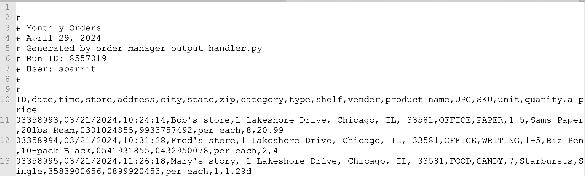

# Another Example

Some CSV files have documentation or ancillary data at the top, above the main data lines. When that happens, it complicates recognizing and handling headers correctly and validation difficult in other ways. Let's take a look at an example.&#x20;

<figure><figcaption></figcaption></figure>

There are so many things to validate here. Types of products, IDs, prices. Just sticking with simple checks we could come up with many rules. We'll create a csvpath that applies six rules while dealing with the complicating top-matter.

When our csvpath sees this prolog it has some challenges. It needs to:

* Recognize that the header line is line 9 (0-based)
* Discard the lines that are comments, unless
* We want to capture some of that information

Doable? Absolutely!

Let's try doing it without just skipping the top 7 lines. Skipping the lines would obviously be trivial. Just create the scanning part of the csvpath like:

```
$[8*][ ... ]
```

But let's say we don't trust that those lines will always be there and/or there always be a consistent number to skip. Or maybe we want to grab the info in those lines. Let's capture the date and run ID from the comment.

As well as the comments, say that the orders files will always:&#x20;

* Be more than 10 headers wide
* Have just 1 header row per file
* Have more than 10 data rows

And of course there will be requirements for the fields:&#x20;

* The product category must be correct
* Lines must have UPCs and SKUs
* Prices must be in the right format

If this were an actual order file in a real-world situation we could imaging collecting average selling prices, checking the vender's name, looking for duplicate lines, and more. All things csvpaths can do.

We'll step through the strategies for each of the bullets. Then see them together in one file with a trivial Python script that runs the csvpath. Then we'll switch to CsvPaths to create a more long-term management friendly version. That will show you the advantages of small modular csvpaths working together.

## Rule 1: Capture the Metadata

You can capture the metadata using regular expressions. Our comment lines are prefixed with a `#` character. We can use that and a regex to grab the values we want and put them in variables.

```
starts_with(#0, "#") -> @runid.notnone = regex( /Run ID: ([0-9]*)/, #0, 1 )
starts_with(#0, "#") -> @userid.notnone = regex( /User: ([a-zA-Z0-9]*)/, #0, 1 )
```

These two [match components ](https://github.com/dk107dk/csvpath/tree/main?tab=readme-ov-file#components)look at comment lines and capture data. The variable `@runid.notnone` will take the value of the regular expression only when the value is not `None`. None is the Python way of saying null. Because we have the `notnone` [qualifier](https://github.com/dk107dk/csvpath/blob/main/docs/qualifiers.md), it doesn't matter if this match component is activated for every line in the file. Regardless, we only pick up run IDs from comment lines and we never overwrite a good run ID with a None. The same is true for the `@userid` variable.&#x20;

## Rule 2: Find the Headers

We know there is one header row. It comes after the top-matter. And we know we have >= 10 headers. That's easy to spot.

```
skip( lt(count_headers_in_line(), 9) )
gt(count_headers_in_line(), 9) -> reset_headers()
```

These two match components handle those requirements. The first one skips a line if it doesn't have enough headers. Those are probably comment lines and we already took care of the comments. This is an illustration of how order matters in csvpath. Match components are activated from left to right, top to bottom. What I do in match component A may affect match component B. Or, in this case, we're just skipping B.&#x20;

When we see the number of line values jump to 10 or more we can safely assume we hit the header row and act accordingly.

```
@header_change = mismatch("signed")
gt( @header_change, 9) ->
      reset_headers(
        print("Resetting headers to: $.csvpath.headers."))

print.onchange(
    "Number of headers changed by $.variables.header_change..",
        print("See line $.csvpath.line_number.", skip())) ]
```

The three match components here:&#x20;

* Create a header\_change variable with the difference in the number of line values vs. headers expected. The mismatch function gets this count. We pass it "signed" so that it will give us a negative or positive number, not just the absolute difference.&#x20;
* If @header\_change is more than 9, we do reset\_headers(). Resetting headers changes the header row to the current row and sets the expectation for the values that will be found in subsiquent lines. We have reset\_headers() activate print() to give a visual output of what the csvpath is doing.&#x20;
* We then do another print() to provide more information. In both print()s we use references to include metadata about the headers and the line number where we made the change.


