# CsvPath + OpenLineage

<figure>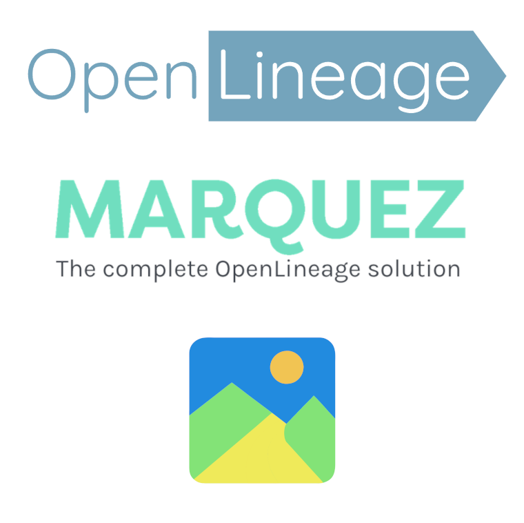<figcaption></figcaption></figure>

Lineage is about tracking the changes to data sets and their usage over time with the goal of explaining how every state in the data lifecycle happened. Clear lineage data makes finding, explaining, and fixing problems easier. To get a clear view of the lineage of a data set you need metadata — lots of it — and a way to analyze the information to tell the story of how things happened. &#x20;

[OpenLineage](https://openlineage.io/) is an open standard for event-based lineage capture. [Marquez](https://peppy-sprite-186812.netlify.app/) is the server and webapp providing the reference API to collect and display OpenLineage events. CsvPath is an OpenLineage event source that provides copious metadata describing how your data moves through the onboarding lifecycle.&#x20;

Together these three open source tools provide a level of visibility into your data onboarding operation that is unprecedented. With workflow, transformation, and processing tools like dbt, Airflow, and Spark also throwing off OpenLineage events, you now have a straightforward way to collect end-to-end lineage. From data partner, to data lake, to analytics and applications, and back out to the World as a data product or service.

<figure>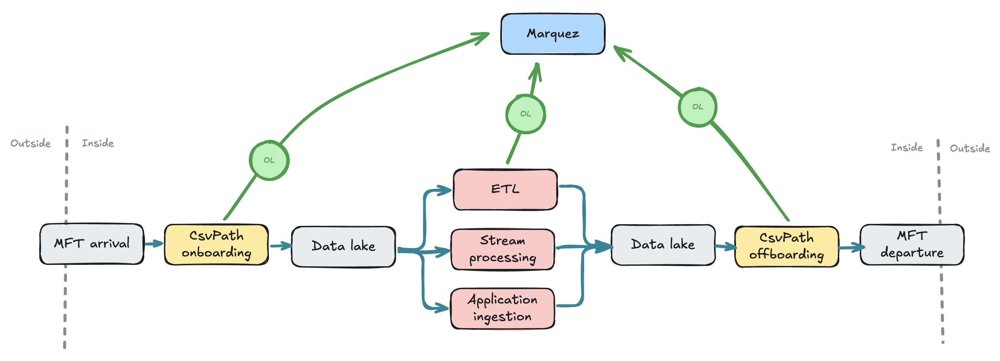<figcaption><p>An end-to-end lineage schematic</p></figcaption></figure>

## How to start

To start, create a new CsvPath project. As usual we'll use Poetry, but you're welcome to use Pip or any Python project tool.

<figure>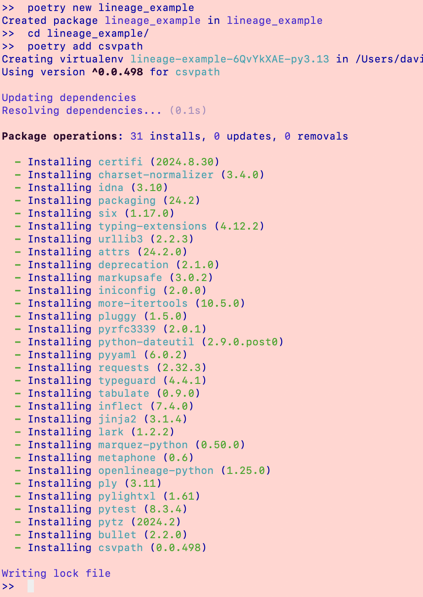<figcaption></figcaption></figure>

That sets up your CsvPath library. For this example we only need the CLI so we're almost done. We'll create a dummy CsvPath language file to run and some dummy data in a moment.&#x20;

Install [Docker desktop](https://www.docker.com/products/docker-desktop/), if you don't already have it. You'll need to create a Dockerhub account. Should be painless.

Next install Marquez. [Read this page](https://peppy-sprite-186812.netlify.app/docs/quickstart) because it's interesting and tells you much more than this page.&#x20;

Clone the Marquez Github: &#x20;

```url
git clone https://github.com/MarquezProject/marquez && cd marquez
```

In the marquez directory do:&#x20;

```bash
./docker/up.sh
```

After the images download and the server starts you should be done setting up Marquez.

Back to CsvPath. Create a file in your project directory called `test.csv`. Paste in our usual test data.

```csv
firstname,lastname,say
David,Kermit,hi!
Fish,Bat,blurgh...
Frog,Bat,ribbit...
Bug,Bat,sniffle sniffle...
Bird,Bat,flap flap...
Ants,Bat,skriffle...
Slug,Bat,oozeeee...
Frog,Bat,growl
```

Create another file called lineage\_example.csvpath. Paste in this:&#x20;

```xquery
~ id: first lineage example ~
$[*][ yes()]
```

Before we can run your files we need to stage them in the CsvPath framework's inputs directory. We also need to tell CsvPath library that it should send events to Marquez.  We'll add the files first because that will give CsvPath the opportunity to create directories and config files.

Fire up the CsvPath CLI. Do:&#x20;

```
poetry run cli
```

If you are not using Poetry have a look at pyproject.toml to see the plain command to use to start the CLI.

The CLI will look like this

<figure>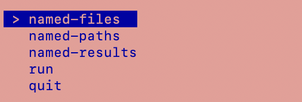<figcaption></figcaption></figure>

Select `named-files` and then `add named-file`. You'll be asked for a name. Give the name `test`. Then you will see options for an individual file, a JSON list of files, or adding a directory of files:

<figure>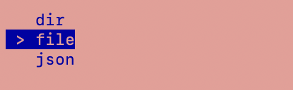<figcaption></figcaption></figure>

Select `file`. You will see a listing of your directory. Pick `test.csv`:

<figure>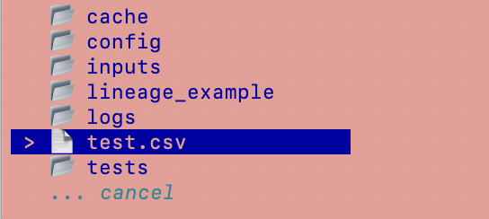<figcaption></figcaption></figure>

After CsvPath adds your input data file you go back to the top menu. This time select named-paths and then add named-paths. You should see:&#x20;

<figure>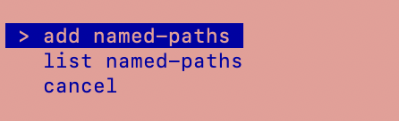<figcaption></figcaption></figure>

You'll be asked for a name. Give the name lineage\_example. You will again be asked if you are picking a file (of csvpaths), a directory, or a JSON file. Again pick file. You will be presented with your directory:&#x20;

<figure>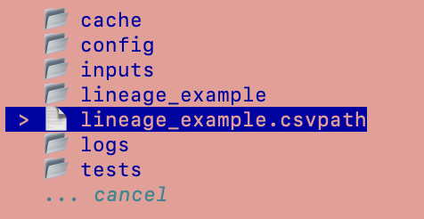<figcaption></figcaption></figure>

&#x20;Pick your `lineage_example.csvpath` file. And you're done with that part of the setup. Next let's modify the `config.ini` slightly.&#x20;

Open `./config/config.ini`. We want to make two changes. First we'll change the archive name. You don't really need to do this, but since your example isn't real work, why not separate it?

We also need to uncomment the `[listeners]` and `[marquez]` settings. When you've made those changes your config file should look like:&#x20;

<figure>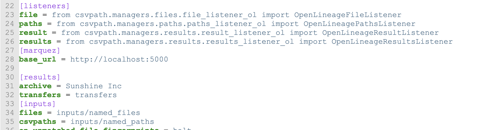<figcaption></figcaption></figure>

Notice we made the archive name `Sunshine Inc`.

Now we can run our csvpath. Restart your CLI so it has your config changes.

At the top level select run:

<figure>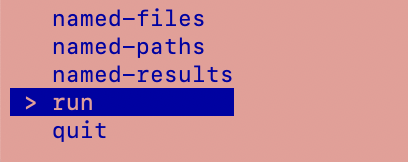<figcaption></figcaption></figure>

You will be asked to pick the file to run from a list. There is one option, so pick that.

<figure>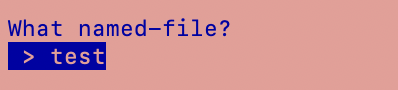<figcaption></figcaption></figure>

&#x20;Next you will be asked for the named-paths group. Again you'll have a list of one, so pick the one.

<figure><figcaption></figcaption></figure>

And finally you'll be asked to pick a run strategy by method name. If you've been doing other examples you'll know that collect keeps the matching rows and fast-forward does not. For our purposes it doesn't matter which we choose, but pick collect.

<figure>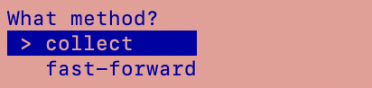<figcaption></figcaption></figure>

You should get a message indicating that your run completed:&#x20;

<figure>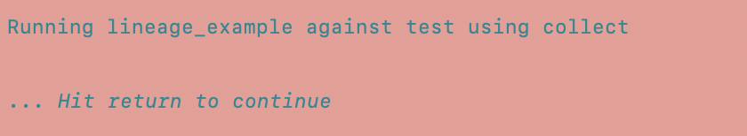<figcaption></figcaption></figure>

