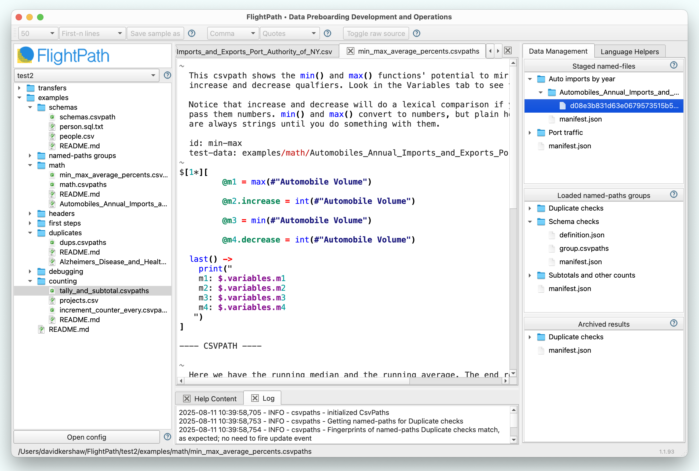

# Get the FlightPath Data app

<figure><figcaption></figcaption></figure>

[FlightPath Data](https://www.flightpathdata.com/) is a development and operations frontend to CsvPath Framework.&#x20;

* Makes CsvPath Language more agile and iterative. Wrangle CSV and Excel data better!
* Gives you data file finding and run results metadata tracing tools
* Enables quick, error-free forms-based configuration for dev and prod envs
* Supports you with a ton of in-context help and examples
* Is a window into your immutable data staging and publishing areas

FlightPath is a **free download** from the [Apple MacOS Store](https://apps.apple.com/us/app/flightpath-data/id6745823097) and the [Microsoft Store](https://apps.microsoft.com/detail/9p9pbpkz4jdf?hl=en-US\&gl=US). You can also get the code from [Github](https://github.com/dk107dk/flightpath/tree/main).


[FlightPath Server](https://www.flightpathdata.com/server.html) is bundled with FlightPath Data, giving you a complete automation architecture in an open and easy package.


<figure><figcaption></figcaption></figure>

Take FlightPath out for a trial run and let us know what you think!&#x20;
