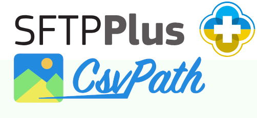
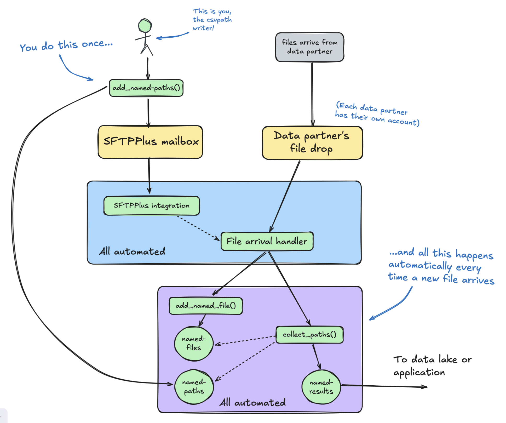
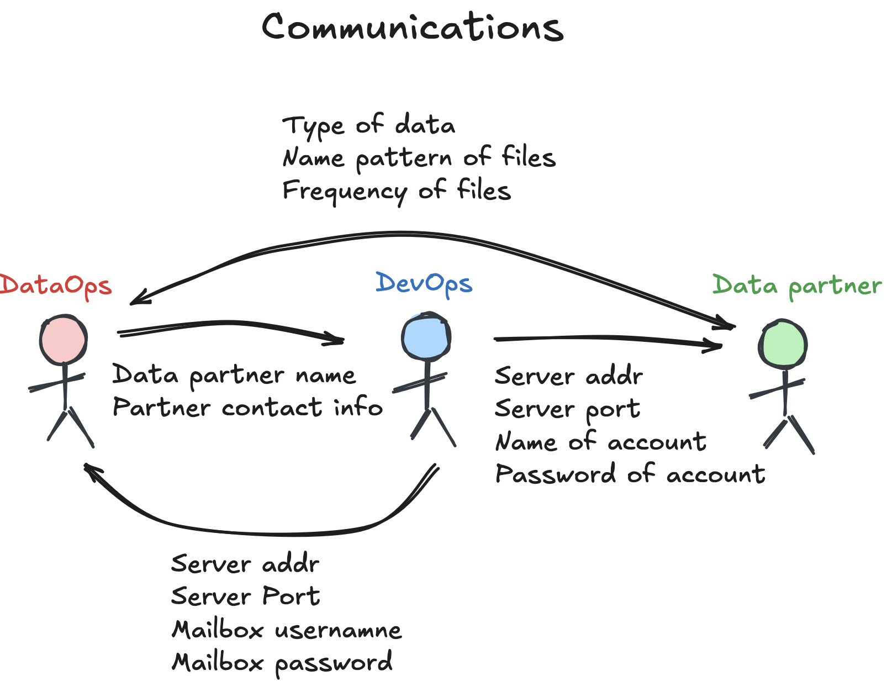
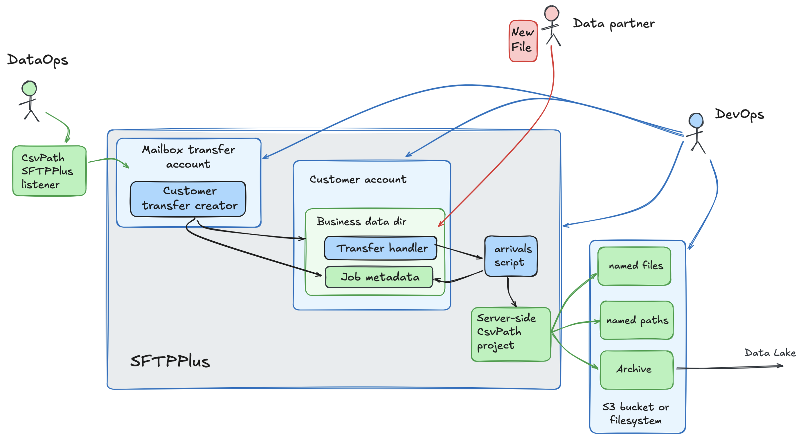
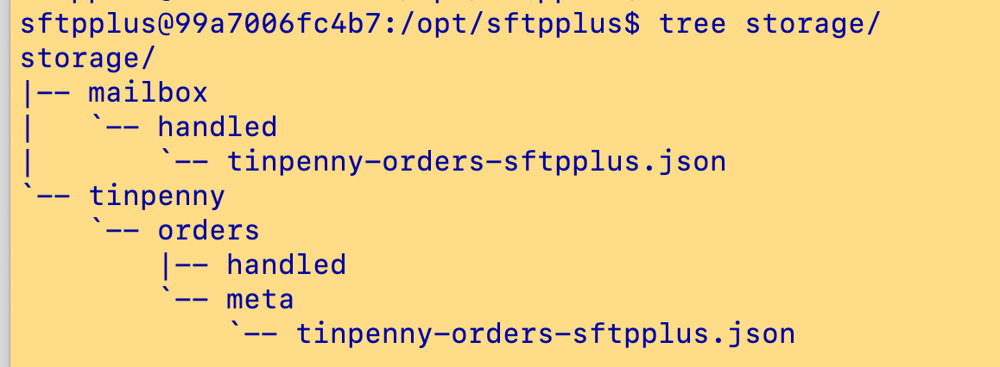

# Getting Started with CsvPath + SFTPPlus

<figure><figcaption></figcaption></figure>

CsvPath exists to close the gap between managed file transfer (MFT) and the data lake. SFTPPlus is a managed service that provides a secure route into the organization that is manageable at scale.&#x20;

Combining SFTPPlus and CsvPath enables you to land your data securely, automatically register its identity, check its validity, and canonicalize it, and stage it for efficient downstream use. Likewise, channeling the outbound flow through CsvPath into SFTPPlus and out to external data partners is a robust solution for effective data partnerships.&#x20;

Sounds great. How do we set it up? In fact, it's pretty simple. We'll work on the assumption you have an SFTPPlus server installed. (You can get a [trial here](https://www.sftpplus.com/#trial)). We'll also assume you or your SFTPPlus admin are comfortable with Python and can setup a CsvPath project using Poetry, Pip, or the like.&#x20;

## Requirements

The goal is to allow a CsvPath writer to create a landing zone for files from an external data partner. The requirements are:&#x20;

* The files are sent via SFTP to an account owned by the data partner who is sending them
* On landing, the files are staged in CsvPath for processing
* A named-paths group of csvpaths is applied to each file that arrives
* In this processing, the arriving files are
  * Given a durable identity
  * Checked for validity
  * Canonicalized as needed
  * Staged for ETL in the Archive, possibly with copies transferred via S3, SFTP, locally, etc.
* Do all this in an automated way mainly under the control of the csvpath writer with the minimum of setup help

That's what we're going for.

<figure><figcaption><p>Automated data onboarding made easy!</p></figcaption></figure>

## The Steps

Our steps are, for the most part, the same as for any CsvPath integration. However, in this case we are going to run two CsvPath projects. One is for the CsvPath user. The other is for the server automation.

On the csvpath writer's side the actions are:

* Add SFTPPath information to the user's config/config.ini file
* Add SFTPPath directives to the named-paths

And for the SFTPPlus admin, they will:

* Set up the data partner's account&#x20;
* Create a mailbox transfer to receive instructions from CsvPath
* Add information to the server-side CsvPath project's `config/config.ini` file
* Add trivial scripts ([download able from CsvPath's Github](https://github.com/csvpath/csvpath/tree/main/assets/integrations/sftpplus)) to connect the wires

In concept, this is all pretty straightforward. There are a lot of details, of course. We imagine that getting it working will take a morning and a couple cups of coffee.&#x20;

## Who Knows What?

There are several pieces of information that need to be shared. For example, the csvpath writer needs to know the type(s) of files they will be receiving from the data partner. And the data partner needs to know the server and account details from the SFTPPlus admin.&#x20;

To be clear, here are the communication flows:

<figure><figcaption><p>Good communication is the bedrock for long-term data partnerships</p></figcaption></figure>

To be sure, this information has to be exchanged by these same people regardless of if CsvPath and SFTPPlus are used. We're just putting it into specific places to facilitate an automated process.

## Who does what?

Setting up the SFTP integration is straightforward. You, as the DataOps driver, just add a few directives to your csvpath files. The DevOps team sets up the server-side of the integration. And the data partner starts dropping files in an FTP directory.&#x20;

Here's an image of who owns what. <mark style="color:green;">**Green**</mark> for you, the data person, control. <mark style="color:blue;">**Blue**</mark> for the DevOps ownership. And <mark style="color:red;">**red**</mark> for the data partner's contribution.&#x20;

And, just to be clear, these are setup steps. Once the SFTPPlus solution is in place any number of DataOps team members can work with any number of data partners without needing anything beyond account names and logins.&#x20;

<figure><figcaption><p><mark style="color:green;"><strong>Green</strong></mark> for the person using CsvPath. <mark style="color:blue;"><strong>Blue</strong></mark> for IT setup. <mark style="color:red;"><strong>Red</strong></mark> for the data partner sending data.</p></figcaption></figure>

## Setting Up the DataOps Side

This part is easy. You simply:

* Receive mailbox connection information
* Start adding SFTPPlus directives to your csvpaths

Let's assume you like Poetry as much as we do. Open a console and create a new Poetry project called sftpplus.&#x20;

```bash
poetry new sftpplus
```

Change into your new project and add CsvPath:

```bash
poetry add csvpath
```

Next fire up the CsvPath CLI just for a moment to allow CsvPath to create your config file.&#x20;

```bash
poetry run cli
```

<figure><figcaption></figcaption></figure>

When the CLI comes up just select `quit` and hit enter. CsvPath generated your `config.ini` so we're done with it for now.

Now, open `config/config.ini`. We're going to add some information about our SFTPPlus server. Look for `[sftpplus]`. Keep in mind that if you didn't just create this project you may need to update your csvpath version.&#x20;

<figure><figcaption></figcaption></figure>

Edit these four fields to have appropriate values, or if you don't see them in your `config.ini`, add them. The username and password in the screenshot are in ALL CAPS. That tells CsvPath's SFTPPlus integration that it should look in your environment variables for the values of those names. You don't have to use env vars but that is a better approach than having passwords in config files.

You're done in `config.ini`. Painless!&#x20;

Next, pick a csvpath from your named-paths group. It can be any of them. You're going to be running the whole group against every arriving named-file, but only the csvpaths you decorate with the SFTPPlus instructions are automated in SFTPPlus.&#x20;

The directives you can add are: &#x20;

* `sftpplus-active`
* `sftpplus-named-file-name`&#x20;
* `sftpplus-run-method`&#x20;
* `sftpplus-account-name`
* `sftpplus-execute-timeout`

`sftpplus-active` and `sftp-execute-timeout` are optional. The other three are mandatory, just as you would think.

<table><thead><tr><th width="245">Directive</th><th width="265">Values</th><th>Description</th></tr></thead><tbody><tr><td><code>sftpplus-active</code></td><td><code>yes</code> or <code>no</code> or <code>delete</code> to delete the SFTPPlus transfer automation</td><td><p>Each time you add your named-paths group your transfer in SFTPPlus will be updated to be active or inactive. Active is the default. </p><p></p><p>If you make the value <code>delete</code> the SFTPPlus transfer will be deleted so no new files will be automatically processed. Nothing else will be deleted; only the SFTPPlus config changes.</p></td></tr><tr><td><code>sftpplus-named-file-name</code></td><td>Any named-file name you like</td><td>This is the name your inbound files will be referenced by. The physical file names themselves will likely change, but your automation will always run the current named-file against the current named-paths.</td></tr><tr><td><code>sftpplus-run-method</code> </td><td><p>One of: </p><ul><li><code>collect_paths</code></li><li><code>collect_by_line</code></li><li><code>fast_forward_paths</code></li><li><code>fast_forward_by_line</code> </li></ul></td><td>These are the main methods to run a named-paths group against a named-file. (the <code>next_paths</code> and <code>next_by_line</code> methods are not an option because those are not intended for this kind of automation). </td></tr><tr><td><code>sftpplus-account-name</code></td><td>Any SFTP account name</td><td>This is the account the data partner, or their automation, will log into to send their files. </td></tr><tr><td><code>sftpplus-execute-timeout</code></td><td>An integer number of seconds. The default is <code>500</code></td><td>This is the timeout for running two methods: <code>add_named_file</code> and the method named in <code>sftplus-run-method</code>. If you are storing all files on the local server your run times will be very quick — depending on your file sizes, of course. But if you are configured to store files in S3, a remote filesystem or SFTP your timeout should be considerably longer.</td></tr></tbody></table>

Your csvpath should look something like this:

<figure><figcaption><p>These four lines automate file arrivals from a data partner</p></figcaption></figure>

## Setting up the DevOps infrastructure

On the DevOps side of things there are three main activities, assuming your SFTPPlus server is already installed:

* Create a Python CsvPath project on the server
* Create the mailbox account
* Create the data partner's account&#x20;

### Setting up the server-side CsvPath project

Creating the CsvPath project is quite easy. It requires a Python 3.11 or greater environment.&#x20;

First we add Pipx and Poetry. Pipx keeps Python applications from getting in each other's way. Poetry is our Python project tool. For the official SFTPPlus Ubuntu docker container, the commands are as follows. Otherwise, if you are installing on Windows you could use Scoop or on MacOS Homebrew.&#x20;

* apt-get --no-install-recommends install -y pipx&#x20;
* pipx ensurepath&#x20;
* pipx install poetry

Next you may need a higher Python version. (Check the version by doing `python3 --version`). If you do, follow these steps. (Windows and Mac users will obviously have slightly different steps).&#x20;

* apt install software-properties-common&#x20;
* add-apt-repository ppa:deadsnakes/ppa&#x20;
* apt update&#x20;
* apt install python3.12

Creating the CsvPath integration project is simple:&#x20;

* cd to the directory where you plan to put your scripts. e.g. `/opt/sftpplus/run` or `C:\sftp\run`&#x20;
* `poetry new transfers`  _(or whatever project name you prefer)_

If you need to raise your Python level, make that change as you create your project:&#x20;

* `cd` to project's desired parent directory. e.g. /opt/sftpplus/run&#x20;
* You may need to edit `pyproject.toml` to get the correct Python version for CsvPath and its dependencies. Change the `requires-python` line to: `requires-python = ">=3.10,<4.0"`&#x20;
* `poetry add csvpath`
* Download 4 simple scripts and drop them in the root directory of your new project

The  4 scripts [live in CsvPath's Github here](https://github.com/csvpath/csvpath/tree/main/assets/integrations/sftpplus). They are:&#x20;

* [handle\_auto\_arrival.py](https://github.com/csvpath/csvpath/blob/main/assets/integrations/sftpplus/handle_auto_arrival.py)
* [handle\_auto\_arrival.sh](https://github.com/csvpath/csvpath/blob/main/assets/integrations/sftpplus/handle_auto_arrival.sh) or [handle\_auto\_arrival.bat](https://github.com/csvpath/csvpath/blob/main/assets/integrations/sftpplus/handle_auto_arrival.bat)
* [handle\_mailbox\_arrival.py](https://github.com/csvpath/csvpath/blob/main/assets/integrations/sftpplus/handle_mailbox_arrival.py)
* [handle\_mailbox\_arrival.sh](https://github.com/csvpath/csvpath/blob/main/assets/integrations/sftpplus/handle_mailbox_arrival.sh) or [handle\_mailbox\_arrival.bat](https://github.com/csvpath/csvpath/blob/main/assets/integrations/sftpplus/handle_mailbox_arrival.bat)

_(The `.bat` files  are for Windows users. They are in the same location in GitHub)._

On Linux, `chmod` the shell scripts to make them executable. `chmod +x handle_auto_arrival.sh` and `chmod +x handle_mailbox_arrival.sh`.&#x20;

Update the paths in the scripts as needed. Check that the shell scripts run Poetry correctly by running them yourself. They will blow up because you won't be feeding them the right data, but you'll see if they run Poetry correctly.&#x20;

If the scripts don't run Poetry correctly you will need to update the scripts to point to Poetry. On Linux, do `which poetry` to see where poetry lives and update the .sh scripts with the right path.  E.g. on my laptop, the scripts need to use `/Users/sftpplus/.local/bin/poetry`, rather than just `poetry`. So my `handle_mailbox_arrival.sh` looks like:

`/Users/sftpplus/.local/bin/poetry install && /Users/sftpplus/.local/bin/poetry run python handle_mailbox_arrival.py "$1"`

### Setting up the mailbox and data partner accounts

The mailbox account is where the SFTPPlus integration sends instructions for creating automations. This activity is completely behind the scenes.

Open the SFTPPlus server admin console in your web browser. Create an account called `mailbox`. This account will be shared with all the csvpath writers.&#x20;

Then, if it doesn't already exist, create an account for your data partner.&#x20;

Make a storage folder for inbound content. In your storage area create the following directories:&#x20;

#### Mailbox

* ./mailbox
* ./mailbox/handled

#### Data partner

* ./<\<data-partner-name>>

You don't have to create any other directories, but you should know that the integration will create a directory for each named-file name and two more directories within.

* ./<\<data-partner-name>>/<\<named-file-name>>
* ./<\<data-partner-name>>/<\<named-file-name>>/handled
* ./<\<data-partner-name>>/<\<named-file-name>>/meta

Assign the root of these directories to the `mailbox` and _\<data partner>_  accounts as their respective storage areas. You do that in the SFTPPlus admin UI accounts page.

The final SFTPPlus step is to create a transfer for the `mailbox` account. CsvPath Framework users with the SFTPPath integration configured are connected to SFTPPlus. Behind the scenes the integration sends instructions to SFTPPlus when users load CsvPath Language files.&#x20;

The instructions CsvPath sends go into the `mailbox` account. The `mailbox` transfer runs the `handle_mailbox_arrival.sh` (or `handle_mailbox_arrival.bat)` script, and on success, will move the incoming instructions to its `handled` directory. Those instructions tell SFTPPlus how to handle incoming data partner files.

To set this up, create a transfer called `csvpath` (or whatever you like). Set it to check the `mailbox` frequently. It should move files from `./mailbox` to `./mailbox/handled`. Before it moves files make it run `handle_mailbox_arrival.sh`. Be sure to set `Overwriting rule` to `Overwrite existing file`.

At this point you should be able to sftp into the mailbox and data partner accounts.

<figure><figcaption></figcaption></figure>

## And you're done

Well, done but for testing, of course. The two tests you need to see working are:&#x20;

* Add one or more csvpaths to a named-group using the `PathsManager.add_named_path method` and see a transfer created for the data partner and a metadata file show up in the partner's `meta` directory.&#x20;
* Drop a file in the partner's account and see it processed into the `handled` directory and its results show up in the CsvPath archive.

You can use the CLI for the first test to make it quick and code-free. You can read an [example of how to do it here](your-first-validation-the-lazy-way.md). Assuming your accounts are on the local server, you should see something like the below. In this case `tinpenny` is the data partner, `orders` is the named-file-name, and `sftpplus` is the named-paths group name:

<figure><figcaption><p>After adding a named-paths group you should see something like this</p></figcaption></figure>

## Questions

* **Can multiple csvpath writers use the same inbound named-file for their separate named-paths group runs?**&#x20;

Yes, multiple DataOps people can use the same named-file with the SFTPPlus integration. You will see a separate JSON metadata file for each named-paths group that needs to run against an arriving file. The only constraint is that named-path group names must be unique within the namespace. (I.e. the combination of account + named-file name + named-paths name must be unique).

* **Are there other settings for the SFTPPlus server accounts and transfers?**

Yes, possibly. You can configure your accounts and transfers pretty much any ways that make common sense. You may change the configuration of the automatically created transfers that CsvPath creates, within reason.&#x20;

* **What information needs to be exchanged between the people setting this integration up?**

The csvpath writer needs to know how to fill in the directives they add to the comment section of their csvpaths. So, they need server name, mailbox credentials, etc.

The DevOps person needs to know the data partner's information so they can create that account.

* **As a CsvPath writer, how do I know everything is working?**

Great question. There are several ways to make sure things are going well.&#x20;

* [Add a Slack notification](../topics/how-tos/setup-notifications-to-slack.md) to your csvpath so that you can see the processing happen when files arrive
* Use [Marquez or another OpenLineage server](getting-started-with-csvpath-+-openlineage.md) to track file arrival events
* Use an observability tool like [Grafana, New Relic, or another OpenTelemetry](getting-started-with-csvpath-+-opentelemetry.md) enabled system to see the arrivals
* If you have access to the SFTPPlus event log you will see the transfer creation and all its activity
* SFTPPlus allows you to set up email alerts that can help you understand when server actions happen.
* Using an SFTP client you can easily watch the metadata file land in the mailbox and see the data partner's named-file directory, with its meta and handled subdirectories. Watching that progression and then sending a file and watching it be processed can take just a few seconds.
* The CsvPath log will give you a good understanding of the step-by-step. You can look in the CsvPath writer's log. If you have access to the server's CsvPath log you can see the automated side.

The first three bullets are available to CsvPath writers on a csvpath-by-csvpath basis, without DataOps support once the configuration values are available. In general, though, the initial setup of an automated transfer is something that the CsvPath writer, their DataOps support, and the data partner will have to work together on to make sure the automation is buttoned up.&#x20;

Once you have the automation in place you should consider using an observability tool to track when files arrive, if you are seeing the correct amount of data, and if the files process correctly. And if your file arrivals are routine, an observability tool will give you a way to get an alert if the expected processing didn't happen within a time period.

* **When do the handled files get deleted?**

That's up to you. Once a file lands in `./mailbox/handled` or `./<<partner>>/handled` it can be deleted. The instructions JSON files are copied to the `./<<partner>>/meta` directory and the inbound data files are copied into CsvPath's file storage area as part of file registration. (CsvPath's named-files area is configured in the server-side CsvPath project's `config/config.ini`). The original files are no longer needed.&#x20;

Leaving the inbound files for a relatively brief period of days just in case the World blows up would be prudent. But immediately on processing the inbound files, the source of truth becomes CsvPath's data storage area.&#x20;

* **Do we need a mailbox for every different data partner?**

No, your SFTPPlus just needs one `mailbox` account for CsvPath to use no matter how many data partners or inbound files you have.

* **The configuration feels like a lot, can I get help?**

Conceptually it's all pretty straightforward. But for sure there are lots of details. File and process permissions, in particular, can be a pain in the neck. We're happy to give help and advice — [use the contact form here](get-help.md). And if there's a bigger need that goes beyond the SFTPPath integration setup we can point you to partners.
