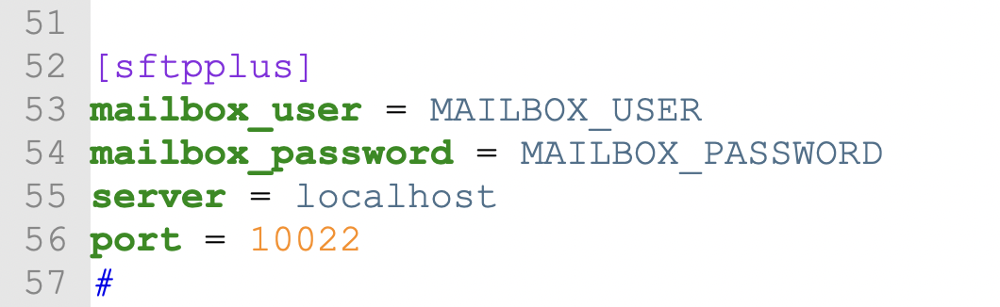

# Getting Started with CsvPath + SFTPPlus

<figure><figcaption></figcaption></figure>

CsvPath exists to close the gap between managed file transfer (MFT) and the data lake. SFTPPlus is a managed service that provides a secure route into the organization that is manageable at scale. Combining SFTPPlus and CsvPath enables you to land your data securely, automatically register its identity, check its validity, and canonicalize it, and stage it for efficient downstream use. Likewise, the channeling the outbound flow through CsvPath into SFTPPlus and out to external data partners is a robust solution for effective data partnerships.&#x20;

Sounds great. How do we set it up? In fact, it's pretty simple. We'll work on the assumption you have an SFTPPlus server installed. (You can get a [trial here](https://www.sftpplus.com/#trial)). We'll also assume you or your SFTPPlus admin are comfortable with Python and can setup a CsvPath project using Poetry, Pip, or the like.&#x20;

## Requirements

The goal is to allow a CsvPath writer to create a landing zone for files from an external data partner. The requirements are:&#x20;

* The files are sent via SFTP to an account owned by the data partner who is sending them
* On landing, the files are staged in CsvPath for processing
* A named-paths group of csvpaths is applied to each file that arrives
* In this processing, the arriving files are
  * Given a durable identity
  * Checked for validity
  * Canonicalized as needed
  * Staged for ETL in the Archive, possibly with copies transferred via S3, SFTP, locally, etc.
* Do all this in an automated way mainly under the control of the csvpath writer with the minimum of setup help

That's what we're going for.

<figure><figcaption><p>Automated data onboarding made easy!</p></figcaption></figure>

## The Steps

Our steps are, for the most part, the same as for any CsvPath integration. However, in this case we are going to run two CsvPath projects. One is for the CsvPath user. The other is for the server automation.

On the csvpath writer's side:

* Add SFTPPath information to the user's config/config.ini file
* Add SFTPPath directives to the named-paths

And for the SFTPPlus admin, they will:

* Set up the data partner's account&#x20;
* Create a mailbox transfer to receive instructions from CsvPath
* Add information to the server's CsvPath project's config/config.ini file
* Add a trivial script (download able from Github or this page) to connect the wires

This is not a big configuration job at all. There are several pieces of information that need to be shared, though. For example, the csvpath writer needs to know the type(s) of files they will be receiving from the data partner. And the data partner needs to know the server and account details from the SFTPPlus admin. So, to make the communication clear, here are the flows:

<figure><figcaption><p>Communication is the bedrock for good, long-term data partnerships</p></figcaption></figure>

To be sure, this information has to be exchanged by these same people regardless of if CsvPath and SFTPPlus are used. We're just putting it into specific files to facilitate an automated process.

## Setting Up the DataOps Side

This part is easy. You simply create a CsvPath project, update your config, and start adding SFTPPlus directives to your csvpaths.&#x20;

Let's assume you like Poetry as much as we do. Open a console and create a new Poetry project called sftpplus.&#x20;

```bash
poetry new sftpplus
```

Change into your new project and add CsvPath:

```bash
poetry add csvpath
```

Next fire up the CsvPath CLI just for a moment to allow CsvPath to create your config file.&#x20;

```bash
poetry run cli
```

When the CLI comes up just select `quit` and hit enter. We're done with it for now.

Now, open config/config.ini. We're going to add some information about our SFTPPlus server. Look for `[sftpplus]`. Keep in mind that if you didn't just create this project you may need to update your csvpath version.&#x20;

<figure><figcaption></figcaption></figure>

Edit these four fields to have appropriate values, or if you don't see them in your `config.ini`, add them. The username and password in the screenshot are in ALL CAPS. That tells CsvPath's SFTPPlus integration that it should look in your environment variables for the values of those names. You don't have to use env vars but that is a better approach than having passwords in config files.

You're done in config.ini. Painless! Now we need to pick a named-paths group to automate. Pick a csvpath from your named-paths group. It can be any of them. You're going to be running the whole group against every arriving named-file name you choose.&#x20;

The directives you can add are: &#x20;

* `sftpplus-active`
* `sftpplus-named-file-name`&#x20;
* `sftpplus-run-method`&#x20;
* `sftpplus-account-name`

Only `sftpplus-active` is optional. The other three are mandatory, as you would think.


<table><thead><tr><th width="245">Directive</th><th width="265">Values</th><th>Description</th></tr></thead><tbody><tr><td><code>sftpplus-active</code></td><td><code>yes</code> or <code>no</code></td><td>Each time you add your named-paths group your transfer in SFTPPlus will be updated to be active or inactive. Active is the default.</td></tr><tr><td><code>sftpplus-named-file-name</code></td><td>Any named-file name you like</td><td>This is the name your inbound files will be referenced by. The physical file names themselves will likely change, but your automation will always run the current named-file against the current named-paths.</td></tr><tr><td><code>sftpplus-run-method</code> </td><td><p>One of: </p><ul><li><code>collect_paths</code></li><li><code>collect_by_line</code></li><li><code>fast_forward_paths</code></li><li><code>fast_forward_by_line</code> </li></ul></td><td>These are the main methods to run a named-paths group against a named-file. (the <code>next_paths</code> and <code>next_by_line</code> methods are not an option because those are not intended for this kind of automation). </td></tr><tr><td><code>sftpplus-account-name</code></td><td>Any SFTP account name</td><td>This is the account the data partner, or their automation, will log into to send their files. </td></tr></tbody></table>

Your csvpath should look something like this:

<figure><figcaption><p>These four lines automate file arrivals from a data partner</p></figcaption></figure>


