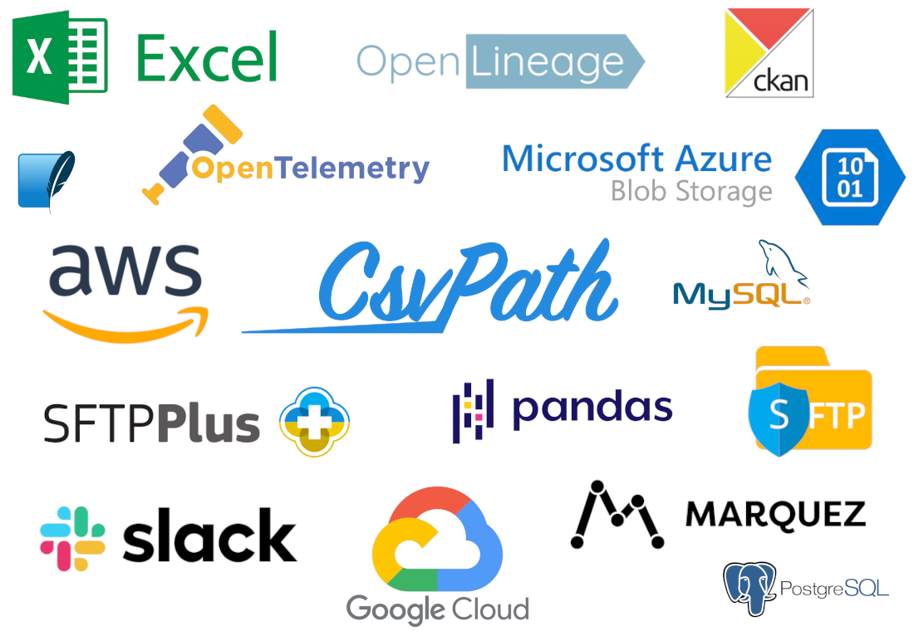

# DataOps Integrations

These pages and [the How-tos section](../../topics/how-tos/) are all about integrating CsvPath FileOps into your wider DataOps environment. And there are lots more use cases and how-tos in [the docs on https://www.flightpathdata.com](https://www.flightpathdata.com/flightpath.html).

<figure><figcaption></figcaption></figure>

CsvPath is growing its list of pre-integrated tools week-by-week. If you don't see the tool you need, [just ask](../a-helping-hand.md).

| Category                         | Tools                                                                                                                                                                                                                                                                                                                                                                                                                                                                                                    |
| -------------------------------- | -------------------------------------------------------------------------------------------------------------------------------------------------------------------------------------------------------------------------------------------------------------------------------------------------------------------------------------------------------------------------------------------------------------------------------------------------------------------------------------------------------- |
| **File Transfer**                | 

<ul><li><a href="../../topics/how-tos/storage-backends/aws-s3.md">AWS S3</a> and Transfer Family</li><li><a href="../../topics/how-tos/storage-backends/azure.md">Azure Blob Storage</a></li><li><a href="../../topics/how-tos/storage-backends/https.md">HTTP(S)</a>  <em>(read-only)</em></li><li><a href="../../topics/how-tos/storage-backends/google-cloud-storage.md">Google Cloud Storage</a></li><li><a href="../../topics/how-tos/sending-results-by-sftp.md">SFTP</a></li></ul>

  |
| **Lineage**                      | 

<ul><li><a href="../dataops-integrations/openlineage.md">OpenLineage</a></li><li><a href="https://peppy-sprite-186812.netlify.app/">Marquez</a></li></ul>

                                                                                                                                                                                                                                                                                                                                  |
| **Observability**                | 

<ul><li><a href="../dataops-integrations/opentelemetry.md">OpenTelemetry</a> </li></ul>
<em>(80+ monitoring and alerting venders support OpenTelemetry)</em> 
                                                                                                                                                                                                                                                                                                                               |
| **Data Formats**                 | 

<ul><li>CSV and any <em>X</em>SV</li><li>Excel</li><li>JSONL</li><li>Pandas dataframes</li><li>Embedded JSON and XML</li></ul>

                                                                                                                                                                                                                                                                                                                                       |
| **Notifications**                | 

<ul><li><a href="../../topics/how-tos/setup-notifications-to-slack.md">Slack</a></li><li>Any <a href="../dataops-integrations/opentelemetry.md">OpenTelemetry</a>-enabled monitoring platform </li><li>Any platform or app that offers <a href="../../topics/how-tos/call-a-webhook-at-the-end-of-a-run.md">webhooks</a>, including <a href="https://zapier.com/">Zapier</a>, <a href="https://ifttt.com/">IFTTT</a>, <a href="https://www.make.com/en">Make</a> and many others</li></ul>

 |
| **Data Publishing**              | 

<ul><li><a href="../../topics/how-tos/ckan/">CKAN</a></li></ul>

                                                                                                                                                                                                                                                                                                                                                                                                                            |
| **Metadata Databases**           | 

<ul><li><a href="../../topics/how-tos/send-events-to-mysql-or-postgres.md">MySQL</a></li><li><a href="../../topics/how-tos/send-events-to-mysql-or-postgres.md">Postgres</a></li><li><a href="../../topics/how-tos/send-run-events-to-sqlite.md">Sqlite</a></li></ul>

                                                                                                                                                                                                                      |
| **Object and Data Lake Storage** | 

<ul><li><a href="../../topics/how-tos/storage-backends/s3-sftp-google-cloud-or-azure.md">AWS S3</a></li><li><a href="../../topics/how-tos/storage-backends/s3-sftp-google-cloud-or-azure.md">Azure Blob Storage</a></li><li><a href="../../topics/how-tos/storage-backends/s3-sftp-google-cloud-or-azure.md">Google Cloud Storage</a></li></ul>

                                                                                                                                            |
| **Shell scripts**                | 

<ul><li>Any <a href="../../topics/how-tos/execute-a-script-at-the-end-of-a-run.md">command line shell</a> </li></ul>

                                                                                                                                                                                                                                                                                                                                                                       |
| **Data Processing**              | 

<ul><li>AWS <a href="../../topics/how-tos/csvpath-in-aws-lambda.md">Lambda</a></li><li>Apache <a href="https://github.com/flightpathdata/airflow-provider-flightpath">Airflow</a></li></ul>

                                                                                                                                                                                                                                                                                                |

