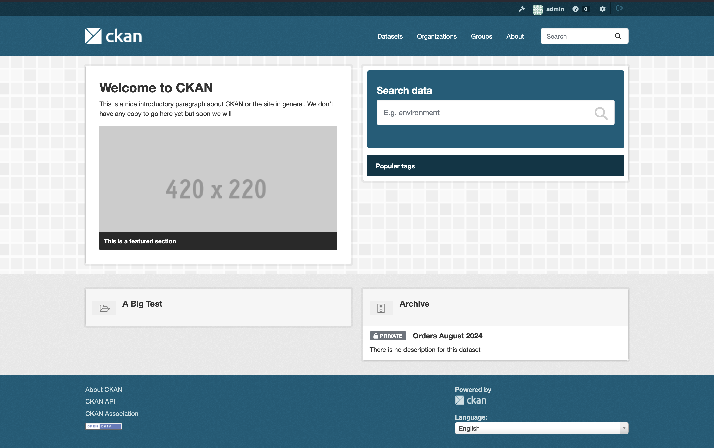

# Getting Started with CsvPath + CKAN

<figure><figcaption></figcaption></figure>

## What is CKAN?

[CKAN](https://ckan.org/) is the leading data portal. It powers massive data repositories, including the US, EU, and UK government's open data publishing, along with those of numerous other countries, provinces, cities, research centers, and NGOs. CKAN is used by private companies to host data assets internally for use across departments and divisions. Corporate data portal implementations include ones at LEGO, National Grid, Suncorp Bank, and many others.&#x20;

CKAN is a **data portal**. A data portal is a purpose-built catalog for data products in the form of downloadable data and metadata references to online or on-request sources. The goal of a data portal is to offer high-value, validated, versioned datasets with sufficient metadata to fully characterize their content and provenance. Data portals often provide known-good snapshots of datasets that support research, open government, AI development, BI development, and data mastering tools such as ontologies, reference datasets, and controlled vocabularies.&#x20;

## Steps to using CKAN + CsvPath

There are only a few steps to start using the CKAN integration:

* Create or get access to a CKAN instance
* Make two small changes to your CsvPath config.ini
* Add CKAN directives to a csvpath&#x20;
* Load your named-paths group and run it

The first one is the only heavy-lifting. If you have a CKAN instance you can skip it. The remaining three steps should take you about 15 minutes, using CsvPath's CLI and following the instructions below.&#x20;

First, a screenshot of CKAN + CsvPath and a word about why are we doing this.

## The gap between data lake and data portal

**High quality data is useless unless it is known and accessible to solve high-value problems. Likewise, a high-value data portal connecting consumers to producers is useless if the data produced is untrustworthy.** Most organizations have piles of data. Many organizations have some form of a data lake. Regardless of tooling and investment, most data lakes quickly become a collection of messy, lossy, inexplicable silos. How can the right data get to the data portal in a validated, known-good form for clear presentation to consumers?  CsvPath can help. &#x20;

Data products are an interface to a data operation. One of CsvPath's core use cases is in the automated validation, canonicalization, metadata management, and publishing of data products to data catalogs. It is the filter that guarantees that a known source presents known-good data in an expected form through a durable and explainable process. CsvPath does this by applying the [**Collect, Store, Validate Pattern**](../../topics/the-collect-store-validate-pattern.md) to the challenge of data departure. Collect, Store, Validate centralizes operations, makes processes highly consistent, keeps records in the form of immutable intermediate products and metadata, and verifies that data matches a schema and/or set of business validation rules.&#x20;

The details of how CsvPath does this are on every page of this site, so here we'll just focus on linking up CsvPath and CKAN. Our goal here is to get CsvPath to post valid data to CKAN. It will look something like this screenshot of files that came from running a named-paths group.

<figure><figcaption><p>The results of a CsvPath run in CKAN</p></figcaption></figure>

## Installing CKAN

This section isn't a step-by-step how-to for installing CKAN. The [instructions for setting up CKAN are here](https://docs.ckan.org/en/2.9/maintaining/installing/install-from-package.html). This page may help too, but rely on CKAN's docs first and foremost.

A CKAN implementation comprises: a Python web application, Python applications and APIs for data management, a Postgres database, and a Solr search engine. We used the package method CKAN's docs suggest. While we aren't Docker wizards, we can share a quickly-made dockerfile that helped us. No doubt you can improve on it!&#x20;


This is not a sophisticated solution, but feel free to use it as a getting started aid.


We installed CKAN on a Mac with Apple Silicon. That required this run command that accounts for the different architecture:

```bash
docker run --platform linux/amd64 -p 80:80 -it ckan_local:latest
```

The dockerfile uses this script to do some setup work that we didn't bother to automate for our dev and test instances. Obviously this isn't how you'd do it in a regular dev or production setting.



Remember to edit the ckan.ini file to have your server IPs and passwords. This file lives at: `/etc/ckan/default/ckan.ini`.

With that dockerfile we had a basic CKAN server up and running in just a few minutes. Raising the [Solr](https://solr.apache.org/) instance using CKAN's Solr docker image was even more of a snap.&#x20;

You should be able to login at [http://localhost](http://localhost). If all is well you will see the CKAN frontpage.

<figure><figcaption><p>You should see this page on http://localhost:80</p></figcaption></figure>

CKAN isn't ugly, but it does look plain just out of the box. To see for yourself how beautiful CKAN can be take a look at [the CKAN showcase sites](https://ckan.org/showcase).&#x20;

## Setting up CsvPath

Next let's set up CsvPath to talk to CKAN. This part should be a snap, partly because it's simple and partly because you've probably done it already from other examples on this site.

We'll use the example from [Another Example](../another-example-part-2.md). First create a Poetry project. You can use Pip or any tool you like, but we like Poetry. In the terminal do:

```bash
poetry new ckan
```

`cd` into the new `ckan` project directory. Then add CsvPath to your new project like this:&#x20;

```bash
>>  poetry add csvpath
Using version ^0.0.501 for csvpath

Updating dependencies
Resolving dependencies... (1.3s)

Package operations: 31 installs, 0 updates, 0 removals

  - Installing certifi (2024.12.14)
  - Installing charset-normalizer (3.4.1)
  - Installing idna (3.10)
  - Installing packaging (24.2)
  - Installing six (1.17.0)
  - Installing typing-extensions (4.12.2)
...
```

You'll see a few more dependencies installed than I'm pasting in here, but otherwise, that's it.

Now we'll copy the files from the [Another Example](../another-example-part-2.md) pages. The ones attached here are slightly updated so use them, even if you did the example and have your own.&#x20;

Put the csv file in: `assets/csvs` and the csvpaths in `assets/csvpaths`. You _can_ put these files anywhere within the project, really, because we are going to use CsvPath's CLI to import them, but for now, still with those directories. Put the JSON file in the project root directory; again, it _could_ go anywhere you like within the project.



















That makes:

* 7 csvpath files
* 1 csv file
* 1 json file

## Config file update

The integration works by adding a CKAN listener to `results` events. A `results` event is generated when a run starts or completes. To tell CsvPath to include the CKAN listener we need to make a small change to `config/config.ini`.

Since it's much simpler to have CsvPath create a default config file, let's fire up the CLI to give CsvPath a chance to generate it. In the terminal do:&#x20;

```
poetry run cli
```

If you aren't using poetry have a look in the pyproject.toml to see the command we're running so you can run it yourself. When the CLI comes up you should see:&#x20;

<figure><figcaption></figcaption></figure>

Check to make sure the config directory was created. If it was, select `quit`.

Next open `config/config.ini`. Check the CKAN listener configuration under the \[listeners] section. If it is commented out, remove the `#` comment marker. Then add ckan to the listener `groups`. Your file's `[listeners]` section should look like:&#x20;

<figure><figcaption></figcaption></figure>

Create an API token in CKAN in your profile page. It's [a quick task described here](https://docs.ckan.org/en/2.9/api/index.html?#authentication-and-api-tokens). Add your API token to the `api_token` key in the `[ckan]` section. If your CKAN server is at a different address, change the server key to point to it.

<figure><figcaption></figcaption></figure>

While you are in CKAN, create an organization called `Archive`. Click on the `Organizations` tab and then click the `Add Organization` button.&#x20;

<figure><figcaption></figcaption></figure>

CsvPath's `Archive` will map to CKAN's `Archive` organization. You can change the name of the archive to anything you like (the setting is in `config.ini`), but for now, stick with `Archive`.

Now CsvPath will send named-group run `results` events to the CKAN integration so that it can post metadata and files to CKAN using CKAN's API.

## Adding CKAN metadata directives

The last part of connecting CKAN and CsvPath is to add instructions for how the events should be handled. The instructions will be in the form of metadata directives, similar to CsvPath's [modes settings](../../topics/the-modes.md). Metadata directives are instructions you put in the external comments of a csvpath. They are special metadata fields that the CKAN integration looks for. Metadata fields are created by keywords followed by colons, like:&#x20;

```
description: this is a user defined metadata field named description.
lunch-menu: this is another user defined metadata field, it is named lunch-menu.
```

In this example `lunch-menu` starts a new metadata field because it has a colon. That means that the `description`-keyed metadata is: `this is a user defined metadata field named description.`

Metadata goes in external comments. An external comment is one that is outside the csvpath; above it or below.&#x20;

Here are the possible directives with possible values and/or examples. You can [learn more about CKAN directives here](../../topics/how-tos/sending-results-to-ckan.md).

* `ckan-publish`: `always` | `on-valid` | `on-all-valid` | `never`&#x20;
* `ckan-group`: `use-archive` | `use-named-results` | any alphanum string&#x20;
* `ckan-dataset-name`: `use-instance` | `use-named-results` | `var-value:name` | a literal&#x20;
* `ckan-dataset-title`: a metadata field name | `var-value:name`&#x20;
* `ckan-visibility`: `public` | `private`&#x20;
* `ckan-tags`: any alphanum | `instance-identity` | `instance-home` | `var-value:name`&#x20;
* `ckan-show-fields`: e.g. `line_number`, `identity`, `validation-mode`....&#x20;
* `ckan-send`: `all` | `printouts`, `data`, `metadata`, `unmatched`, `vars`, `errors`, `manifest`&#x20;
* `ckan-printouts-title`: e.g. `Background`&#x20;
* `ckan-data-title`: e.g. `Orders`&#x20;
* `ckan-unmatched-title`: e.g. `Orders`&#x20;
* `ckan-vars-title`: e.g. `Orders`&#x20;
* `ckan-meta-title`: e.g. `Orders`&#x20;
* `ckan-errors-title`: e.g. `Orders`&#x20;
* `ckan-split-printouts`: `split` | `no-split`

Yes, that's a lot! You won't use them all, and very likely you will come to appreciate the flexibility. When you are first getting started you may want to have the [docs page](../../topics/how-tos/sending-results-to-ckan.md) at hand.

Here's how we updated the `sku_upc.csvpath` file with CKAN directives. You don't have to use all of these, but it doesn't hurt to try them.

<figure><figcaption><p>That's a lot of CKAN instructions to apply to your csvpaths. Most likely you'll usually use fewer than this.</p></figcaption></figure>



## Let's see it working!

To see the CKAN integration in action we have to run a csvpath using a `CsvPaths` instance, of course.  The fastest way for us to do that is using CsvPath's minimalist CLI. Creating a small Python driver script is also super simple, but the CLI allows us to even skip that little bit of Python.

Fire up the CLI again using `poetry run cli`.  You will again see:&#x20;

<figure><figcaption></figcaption></figure>

We're going to stage our data file and load our csvpaths. That essentially means we're going to import those assets into the CsvPath Library's workspace so we can run our named-paths group. A named-path group is simply a collection of csvpaths that are run as a single group and known by a name.

Hit return with `named-paths` selected.

<figure><figcaption></figcaption></figure>

Then select `add named-paths`. Give your paths a name. Call them `Orders`.

<figure><figcaption></figcaption></figure>

Next we're going to tell the CsvPath Library where the csvpaths that will go into `Orders` are. We'll do that with our JSON file. Select JSON.

<figure><figcaption></figcaption></figure>

And pick your `orders.json` file that you downloaded a moment ago.

<figure><figcaption></figcaption></figure>

We're done setting up our named-paths group. Now let's stage our data as a named-file. The process is the same. Click on named-files.

<figure><figcaption></figcaption></figure>

Then click on add-named file.

<figure><figcaption></figcaption></figure>

Call your file `March-2024`.

<figure><figcaption></figcaption></figure>

We have our file handy and it's just the one we stuck in the assets directory, so let's just pick it specifically. Our other options would be a list of named files in a JSON or adding all the files in a directory named by their filenames. Select `file` and hit `return`. Follow along with the next three screenshots.

<figure><figcaption></figcaption></figure>

<figure><figcaption></figcaption></figure>

<figure><figcaption></figcaption></figure>

After selecting the CSV file it should import and take you back to the top menu. Now we're good. Time to run our named-paths group and see the results in the `Archive` directory and also automatically promoted into CKAN.

Running a named-paths group is easy. Select `run`.

<figure><figcaption></figcaption></figure>

The CLI asks you for a data file first. Pick the one you are offered. It's what we just staged.

<figure><figcaption></figcaption></figure>

Next we pick the named-paths group. In this case we have two choices because there were two groups in the JSON we used to define and load the groups. `top_matter_import` is used by `orders`. `orders` is the group we want to run. Select `orders` and hit `return.`

Lastly, the CLI wants to know what run strategy you want to take, `collect` or `fast-forward`. The `collect` approach captures all the lines that match your csvpaths' rules. `fast-forward` simply runs the csvpaths without capturing matches. Doing a `fast-forward` run gets you variables, errors, validations, etc. so it is quite useful, and also lightweight. But for our purposes here let's use `collect` to capture matches.

<figure><figcaption></figcaption></figure>

And away we go!

Your run will produce validation messages and informational printouts. We intentionally fed the csvpaths data with problems. And we created some output that is going to a separate `Printer` instance so we can see how multiple printouts can be created. What you see should look like:&#x20;

<figure><figcaption></figcaption></figure>

Your run produced lots of assets in your new archive directory. Let's have a look. Open the project's root directory and drill into the `archive` folder. The Archive is where the CsvPath Library stores results. You can name it anything you like — `archive` is just the default. This is what you should see:

<figure><figcaption><p>Your archive after one run of the orders named-paths group, as seen in the MacOS Finder</p></figcaption></figure>

In this image you're looking at the `order` group result flies for the `2024-12-25_04-46-55` run (in my case; your run identifier will be different, of course) in the results of the csvpath identified as `upc-sku`. These files are:

* The `data.csv` of matched lines
* The `unmatched.csv` of lines that did not match your csvpath's rules
* The `manifest.json` that gives metadata about the `upc_sku.csvpath` part of the named-paths run&#x20;
* `meta.json`, a file of any user-defined metadata and the runtime metadata and stats
* Our `printouts.txt` containing all the printed statements from the run
* The `vars.json` file that contains all the variables that were created during the run.

That's all standard CsvPath stuff. We haven't looked at anything specific to CKAN yet.&#x20;

Keep in mind that the files you see in the screenshot are for just one of the six csvpaths in the `orders` named-paths group. All six csvpaths were run against the input data file. Each has its own outputs. In this example we are only sending results to CKAN for the `upc-sku` csvpath.&#x20;

## The CKAN results

What should we see in CKAN?

Looking at our `upc_sku.csvpath`'s metadata you can see what we're asking for:&#x20;

* `ckan-group: A Big Test`. This says we want to have our results associated with a CKAN group. If the group doesn't exist, it will be created.
* `ckan-dataset-name: orders_march`. We're explicitly giving our CKAN dataset a name. The name will become a slug in the website and an identifier that can be used like an ID in some cases. The dataset will also have an autogenerated ID.
* `ckan-dataset-title: Orders March 2024`. Setting a title gives the dataset a prettier name than if we just used the actual name.
* `ckan-visibility: public`. As you would guess, we're making this dataset immediately visible to anyone with access.
* `ckan-send: data, printouts, unmatched`. This is the big one. Here we say what data we want to send to CKAN. In this case, we send three of the standard files CsvPath generates to CKAN.
* `ckan-split-printouts: split`. Printouts come from calling `print()` on `Printer` instances. Each printer is separate and handles print statements in its own way. The `upc_sku.csvpath` uses both the default printer and also a different named printer, called `Headers by line`, for some printouts.  In the `printouts.txt` the default and `Headers by line` printouts are separated by a delimiter so they can be easily extracted. With `ckan-split-printouts` we can split the printouts into one file per `Printer` instance. This makes it easy to create user-friendly focused reports that are delivered in CKAN in a way that is clear for report readers who don't know CsvPath. In this example, our default printouts are the validation errors. The `Headers by line` printouts report the headers in effect at each line in the file. In CKAN these reports will be separated into two files and given titles that make clear what each file contains. Because we have two sets of printouts and are splitting them we will send CKAN four files total, not three.
* The remaining CKAN directives assign more helpful names to the files we're sending to CKAN. Again, we don't want to assume that all CKAN users know what CsvPath's standard files contain. Our assumption is that CKAN users should not have to know the details of CsvPath Language or the CsvPath Library's workflow.

What we get is a dataset in the `Archive` organization associated with the `A Big Test` group titled `Orders March 2024`. When you open the new dataset it looks similar to this screenshot.&#x20;

<figure><figcaption></figcaption></figure>

Each time we rerun our named-paths group we will get new data and metadata files in a new run directory. And each run's events will be forwarded to CKAN. The result will be that this page is updated, new versions are captured, and the activity stream is updated

_(Side note: if for any reason you want to delete your group or dataset and start again, remember that you have to log in as admin and empty the trash at_ [_http://localhost/ckan-admin/trash_](http://localhost/ckan-admin/trash) _to hard delete your assets. CKAN uses soft deletes. Simply deleting as a regular user doesn't clear assets out of the CKAN system.)_

<figure><figcaption></figcaption></figure>

&#x20;Meanwhile, back in CsvPath, the archive and the inputs directories will capture each change of all your artifacts for every run, in perpetuity with clear identities and hash codes to help you pin down exactly what happened if you should ever be asked about the lineage or chain of custody. And should there be a validation failure, that problem will never get to CKAN — instead you'll be able to handle it at the source and only promote trustworthy data to CKAN and its data customers.

There's a lot going on in this integration. At a high-level it's quite simple. Of course, the configuration details and use cases will settle in gradually. Spend a bit of time exploring. You'll be impressed with what CKAN offers and how well its mission fits with CsvPath's. &#x20;
