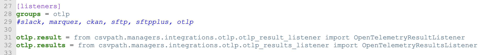
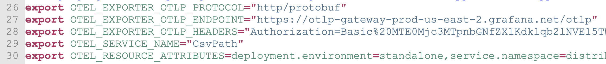

# Getting Started with CsvPath + OpenTelemetry

<figure><figcaption><p>CsvPath in Grafana</p></figcaption></figure>

DataOps success demands a good understanding of what is happening on multiple levels moment-to-moment. You can't agile what you don't observe.&#x20;

OpenTelemetry is the standard way to collect indicators from systems into an observability platform. Its OTLP protocol is supported by [more than 80 observability venders](https://opentelemetry.io/ecosystem/vendors/) and open source platforms, including Grafana, Splunk, Elastic, and more. And now CsvPath, too.&#x20;

Getting started with CsvPath + OpenTelemetry is drop-dead easy. Easier even than the other CsvPaths integrations, which are all pretty lightweight themselves. Here's what you do:&#x20;

<figure><figcaption></figcaption></figure>

1. Update to the latest point release
2. Open `config/config.ini` and add otlp to the `[listeners] groups` list
3. Set your OTLP platform environment variables

If your `config/config.ini` isn't generated new so it doesn't already have the OTLP class imports you see in the screenshot above, just paste these in:&#x20;

```ini
[listeners]
otlp.result = from csvpath.managers.integrations.otlp.otlp_result_listener import OpenTelemetryResultListener
otlp.results = from csvpath.managers.integrations.otlp.otlp_results_listener import OpenTelemetryResultsListener
```

The env vars values are vender specific. Here's a screenshot of my Grafana Cloud setup. Yours will be similar, but different values. Check your vender's docs.

<figure><figcaption><p>OTPL env vars. Don't use these, though! Your observability tool vender will provide your values for your own use</p></figcaption></figure>

Once you've done those three things you're done. Run some named-paths groups and see your metrics flowing into your observability tool. Simple!

There's more than just a couple of pretty graphs going on here. We'll talk about how adding observability to CsvPath is much more than the sum of its parts. It can change your DataOps mode of operations entirely.

Give OpenTelemetry a try and let us know what you'd like to see. There's much more we can do on OTLP.

