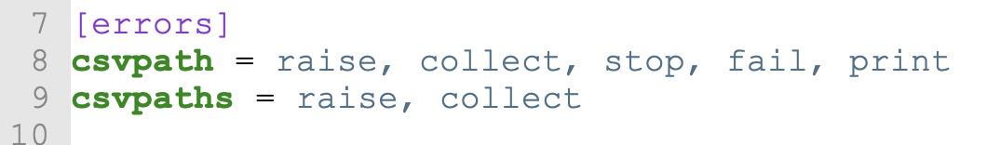
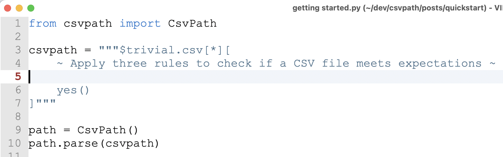
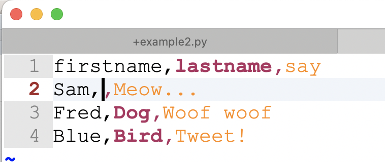
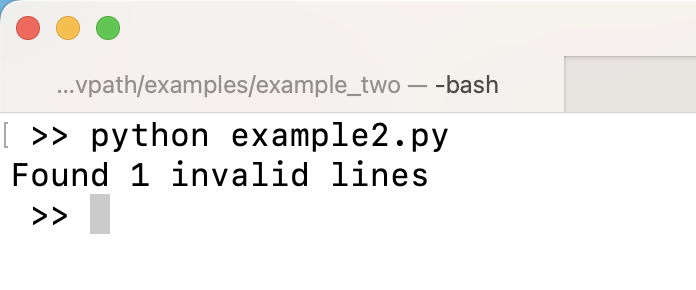
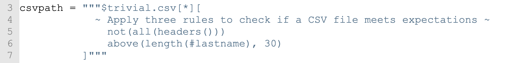
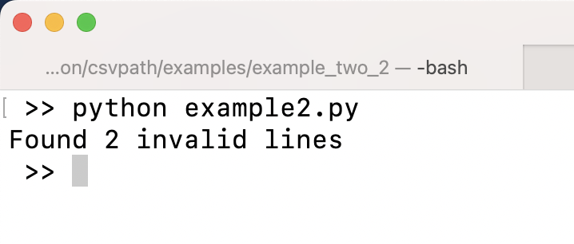
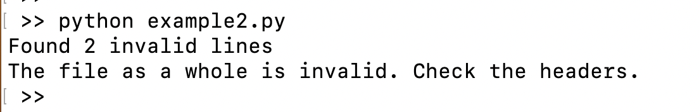

# Your First Validation, The Hard Way

As you saw in the Quickstart, CsvPath is easy to set up. And structural validation is also easy. But what greater value can CsvPath add?

CsvPath's rules-based validation of CSV and Excel files is a unique capability. In this version of the **Your First Validation** example we're going to first take a rules-based approach that will give you a sense of the CsvPath Language's power.&#x20;

## Our goal

Our mission is to write a csvpath that can keep some bad data from getting loaded into our data management systems. Our goals for the data are:

1. There cannot be blanks; every header must have data
2. The files' `lastname` header cannot have values greater than 30 characters
3. The first header must be `firstname`

Our strategy is to collect any lines that break these rules. The validity of the file as a whole will depend on there being no failing lines.

<figure><figcaption></figcaption></figure>

## To raise or call

By default, the CsvPath library config raises errors when it runs into problems. This can halt a run for a simple built-in validation error. For e.g. `add("five", 3)` does not equal `8` because "five" is not a number. Finding that error is good, but in some cases you might not want the validation run to stop with a big noisy error.&#x20;

To have your `CsvPath` instance neatly print errors, but not raise exceptions, you can make a quick change to the `config.ini` file. By default the config file is in `./config/config.ini`. Make the change to this line:&#x20;

<figure><figcaption></figcaption></figure>

As you can see, in my `config.ini` the `CsvPath` instance error policy is on line 8. Just remove the keyword `raise` from that line, save, and you're good to go. Now, for that incorrect addition above, you get a concise error message like this, rather than a big exception stack dump: `Line 3: Wrong value in match component 0: mismatch in add`

## Continue your Quickstart script.&#x20;

Paste this rule into the csvpath string. It goes in the matching part, after the scanning part. The scanning part of a csvpath is at the beginning. It looks like this: `[1*][`

`~ Apply three rules to check if a CSV file meets expectations ~`

Your file should now look something like:&#x20;

<figure><figcaption></figcaption></figure>

Csvpaths can include line breaks, so you can format your csvpath any way you like.

What did we just do? We added a comment saying what our csvpath does. That's all. Comments are completely optional, but they are useful.&#x20;

Here is the file so far.



Let's continue.

## Rule one: no blanks

Our csvpath's first rule is that valid files have data under every header. CsvPath looks at the 0th line to determine the file's headers. Of course, some files don't include headers. We'll see how to handle that later.

Add a test for blanks below the comment. Make it replace the `yes()` function:

```clike

            ~ Apply three rules to check if a CSV file meets expectations ~
              not(all(headers()))
 
```

What does this statement do?&#x20;

As we iterate through the CSV file line by line, the `all()` looks at values and returns `True` if all of them have data. We pass `all()` a `header()` function to direct it to look in all the headers.&#x20;

In our last script we used the `fast_forward()` method to run though the CSV file without interacting with  it. This time, let's collect the offending lines. To do that, we need to use `not()` to match any line that has blanks. We also have to switch from `fast_forward()` to `collect()`.

And one more change. Rather than using is\_valid, let's say that the count of invalid lines determines if our file is valid. `collect()` returns the lines. Let's just print out how many.&#x20;

When you've made these changes, your script should look like:&#x20;

```python
from csvpath import CsvPath

csvpath = """$trivial.csv[*][
            ~ Apply three rules to check if a CSV file meets expectations ~
              missing(headers())
          ]"""

path = CsvPath()
path.parse(csvpath)
lines = path.collect()

print(f"Found {len(lines)} invalid lines")

```

Try it out. You should see that our file is still valid. Here's our CSV file again.



To see that the script works, edit the CSV file to make a blank. Take Sam Cat's lastname out.

<figure><figcaption></figcaption></figure>

This time your script should tell you that there is one invalid line.

<figure><figcaption></figcaption></figure>

## Rule two: no long lastnames

Next let's create our rule about long lastnames. Our requirements said that lastnames cannot be longer than 30 characters.&#x20;

Add this line to your csvpath below the line about blanks.

```clike
above(length(#lastname), 30)
```

This line uses functions to check a particular header's length. We're saying that values under the `lastname` header must be less than 30 characters long. Csvpaths use `#` to indicate a header.

Your csvpath should now look like:&#x20;

<figure><figcaption></figcaption></figure>

```python
csvpath = """$trivial.csv[*][
            ~ Apply three rules to check if a CSV file meets expectations ~
              missing(headers())
              above(length(#lastname), 30)
          ]"""
```

Pretty straightforward, right? But wait! We can do better. Swap out the line you just added for:

```
too_long(#lastname, 30)
```

That's much better! There are more than 75 built-in functions so there is often a simpler way to do things. The [list of functions is on the Github repo](https://github.com/dk107dk/csvpath/blob/main/docs/functions.md).&#x20;

Here's what your file should be like now.

```python
from csvpath import CsvPath

csvpath = """$trivial.csv[*][
            ~ Apply three rules to check if a CSV file is invalid ~
                missing(headers())
                too_long(#lastname, 30)
          ]"""

path = CsvPath()
path.parse(csvpath)
lines = path.collect()

print(f"Found {len(lines)} invalid lines")

```

Now, we have a problem. The problem is that we are ANDing these two rules together. What's the problem? When we are ANDing, by default, we match a line if all the rules are true. In this case, though, we are expecting lines to match if only one of the two rules is true.&#x20;

What we need is an OR operation. That's easy! Just add this line right below where you created your CsvPath instance.&#x20;

```python
path.OR = True
```

&#x20;This change will make CsvPath match lines where any one or more rules are true. This way, we can call out the possible problems with the file and collect lines that match those problems without the rules interfering with each other.

Your script should now look like:&#x20;

```python
from csvpath import CsvPath

csvpath = """$trivial.csv[*][
            ~ Apply three rules to check if a CSV file is invalid ~
                missing(headers())
                too_long(#lastname, 30)
          ]"""

path = CsvPath()
path.OR = True
path.parse(csvpath)
lines = path.collect()

print(f"Found {len(lines)} invalid lines")
```

Try running it. You should still see that there is one invalid line. After you confirm that, try creating a very long lastname for Sam the Cat and no lastname for Fred the Dog. CsvPath should collect the two invalid lines.

<figure><figcaption></figcaption></figure>

## Rule three: first header

Our validation csvpath wants the first column to be called `firstname`. That seems like an easy rule to satisify, right? Just type it that way.&#x20;

We will of course do that. But consider if your csvpath is going to be validating files from a nightly batch job. Since we don't want to rock the keyboard at 3 a.m., we need a rule to check for us, even if it is just a simple rule.

Add this below the max length rule:

```python
not( header_name(0, "firstname") )
```

This rule says that the 0th header must be the `firstname` header. Headers can be accessed by their numeric position — their index. The index is 0-based, like a Python list. That means the first header is `#0`. In our rule, the function looks up the name of the header indicated by `0`. If it doesn't equal `"firstname"` we collect the invalid line.

Let's pause on an interesting point.

## Validation rule strategies&#x20;

CsvPath applies a csvpath to a CSV file line by line. It can collect each line that matches its rules. CsvPath is all about matching lines.

In our rule, the `column()` function will be called on every line, not just the header line. That means that if the first header is not `firstname`, our rule would collect every line in the file. For our purposes, that would indicate that all the lines were bad. In reality, in that case, we would consider the file as a whole invalid, not the individual lines.

What to do? Easy! Change the line you just added so that the rule looks like:

```
not.nocontrib( header_name(0, "firstname") ) -> fail()
```

Now the rule doesn't determine if individual lines match match the header name requirement. Instead it marks the file as invalid. This allows you to collect the lines with problems and also know if the file has problems that cut across the lines.&#x20;

## And you're done!

Your script should now look something like:&#x20;

```python
from csvpath import CsvPath

csvpath = """$trivial.csv[*][
            ~ Apply three rules to check if a CSV file is invalid ~
                missing(headers())
                too_long(#lastname, 30)
                not.nocontrib( header_name(0, "firstname") ) -> fail()
                
          ]"""

path = CsvPath()
path.OR = True
path.parse(csvpath)
lines = path.collect()

print(f"Found {len(lines)} invalid lines")

```

&#x20;There are a couple of new things here. First there is a qualifier, `nocontrib`, on the `not()` that wraps the `header_name()` function. Qualifiers modify the behavior of functions and other match components. You can [read all about qualifiers here](https://github.com/dk107dk/csvpath/blob/main/docs/qualifiers.md).

The `nocontrib` qualifier says that the function it is on should not determine if the line matches. It does not contribute. Again, we need this because every line will match on the header name problem.

The second new thing is the when/do. That's the `->` operator. When/do says that when the left hand side is `True` the right hand side happens. In this case, when there is a header name mismatch we fail the file using the `fail()`. If you are concerned that this when/do could be executed many times, you are right. But in this case that doesn't matter because calling `fail()` is cheap in performance terms and always has the same effect.

Now when you run your script you will see... nothing new. Let's add a print statement to let us know if the file overall is valid. Put this at the bottom of your script.

```python
if not path.is_valid:
    print(f"The file as a whole is invalid. Check the headers.")
```

Now you should see something like:&#x20;

<figure><figcaption></figcaption></figure>

You might wonder if we should really be saying that the file as a whole is invalid only if we find a problem with the headers. Isn't it a problem that two lines are invalid, as well? That is a very reasonable opinion. CsvPath cannot make assumption about if you are collecting invalid lines or valid ones. That is a decision about [your validation strategy](your-first-validation.md#validation-rule-strategies)—as we have said, there are always multiple ways to do things. &#x20;

However, we can easily mark the file invalid when we have lines failing. Just add this to the bottom of your csvpath string:&#x20;

```xquery
has_matches.nocontrib() -> fail()
```

And for consistency's sake, modify your error message:&#x20;

```python
print(f"The file is invalid")
```

Now our validation script is giving us complete and actionable information about our file. There's much more we could do, of course—we're just scratching the surface! We'll explore some of those options and improvements in the next example.

Here is the final state of the script to compare against your own.

```python
from csvpath import CsvPath

csvpath = """$trivial.csv[*][
            ~ Apply three rules to check if a CSV file is invalid ~
                missing(headers())
                too_long(#lastname, 30)
                not.nocontrib( header_name(0, "firstname") ) -> fail()
                has_matches.nocontrib() -> fail()
          ]"""

path = CsvPath()
path.OR = True
path.parse(csvpath)
lines = path.collect()

print(f"Found {len(lines)} invalid lines")
if not path.is_valid:
    print(f"The file is invalid")
```
