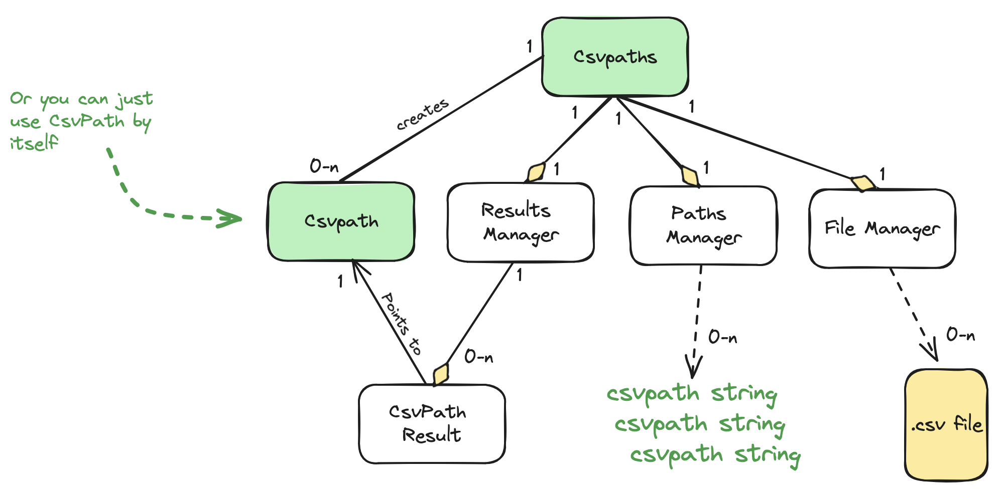
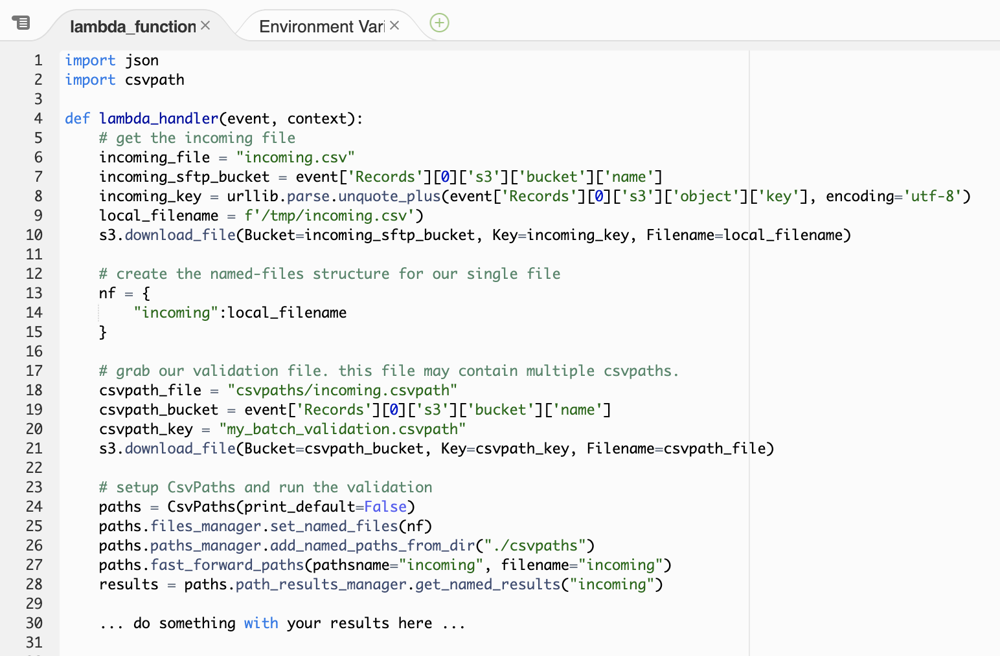

# Path To Production

As you saw in [Your First Validation](your-first-validation.md) and [Another Example Part 2](another-example-part-1.md), there are two ways to use the CsvPath library. 

* Single csvpath pointing to a single file, simple results
* Multi-csvpath

Both can work in a production setting. The latter is more flexible and offers more capabilities with little additional complexity. We'll focus on the multi-csvpath option.

The path to production starts with just getting the simplest possible thing working—a proof of concept. That's an easy first step we can quickly sketch out. 

As our starting point, here is a high-level view of everything you need to know about the library. (Setting aside how to write csvpaths using the built-in functions, for now).

<figure><figcaption></figcaption></figure>

Our goal is to create an automated CSV validation capability. Actually picking the right technologies that work for you and writing the implementation code is an exercise for you and [Claude](https://claude.ai/). A POC like what we are sketching should be pretty quick.

Imagine your CSV files are arriving by SFTP. You need a landing zone for your CSV files and csvpaths. Let's say you use AWS Transfer Family fronting S3. When a file arrives it triggers a Lambda that runs your csvpath validation. This scenario is [similar to this tutorial](https://aws.amazon.com/blogs/storage/customize-file-delivery-notifications-using-aws-transfer-family-managed-workflows/).

<figure><figcaption></figcaption></figure>

Your Lambda, where CsvPath runs, is pretty simple. (Remembering this is just a sketch to give you ideas). In pseudo-code it might look like:&#x20;

<figure><figcaption>
Pseudo-code for setting up CsvPaths in an AWS Lambda
</figcaption></figure>

And we can repurpose the multi-csvpath file from [Another Example, Part 2](another-example-part-2.md) to stand in for your inbound file validation rules.

<figure><figcaption></figcaption></figure>

