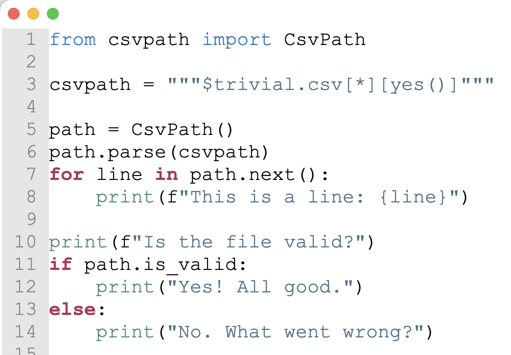
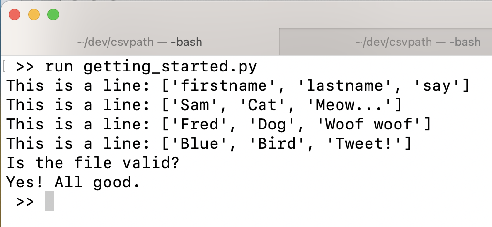

# Quickstart

This page gives you all the information you need to get started validating your CSVs with CsvPath. Happily, it's not a lot. You will want to go deeper on other pages later.


If you need help getting started with Python, try [Python.org's intros](https://www.python.org/about/gettingstarted/). Starting with a project tool like [Poetry](https://python-poetry.org/docs/basic-usage/) or [Jupyter Notebooks](https://jupyter-notebook-beginner-guide.readthedocs.io/en/latest/) can also help.


### PyPI and Github

The CsvPath library is available through [Py](https://pypi.org/project/csvpath/)PI as "csvpath". At this stage, pre 1.0, the project changes frequently. You should pin the version you use and update it methodically.&#x20;

You can check under the hood on [Github](https://github.com/dk107dk/csvpath). There are detailed docs that you can read in parallel or in addition to this site.

<div data-full-width="false">

<figure><figcaption></figcaption></figure>

</div>

### Let's run something!

The main class in CsvPath is unsurprisingly called CsvPath. For simple jobs, it is all you need.

To do a hello world path you'll need to import CsvPath, create an instance, and point it at a CSV file.

Create a script file and do the import:&#x20;

<figure><figcaption><p>Add CsvPath to your requirements.txt or dependency manger first, of course!</p></figcaption></figure>

Create a test CSV file. Save it as trivial.csv or whatever name you like.

<figure><figcaption></figcaption></figure>



Make a csvpath. Also a trivial one, just to keep it simple.

<figure><figcaption></figcaption></figure>

```python
csvpath = """$trivial.csv[*][yes()]"""
```

This path says: open trivial.csv, scan all the lines, match every one of them.

Next, run the csvpath against our CSV file.

<figure><figcaption></figcaption></figure>

What does this script do?

1. Line 1 imports CsvPath so we can use it
2. Line 3 is our csvpath that we'll use to validate our test file, trivial.csv
3. Line 5 creates a CsvPath instance that will do the validation
4. Line 6 is where CsvPath reads the csvpath string and understands how we describe valid lines. In this case _yes()_ means all lines match our csvpath rules. For the purposes of this trivial example, we're going to consider matching a line to be a good thing.&#x20;
5. Line 7 steps through each of the matching lines so we can print a message in line 8.
6. Line 11 checks if we consider the file valid. If our rules said that the file didn't meet expectations the csvpath would have declared the file invalid using the _fail()_ function. If that were to happen the if statement in line 11 would return _False_.

When you run your script you should see something close to this:

<figure><figcaption></figcaption></figure>

Now, I know that is truly unimpressive! Still, go with it. Small steps! You are now ready to dig in and see what CsvPath can really do.&#x20;
