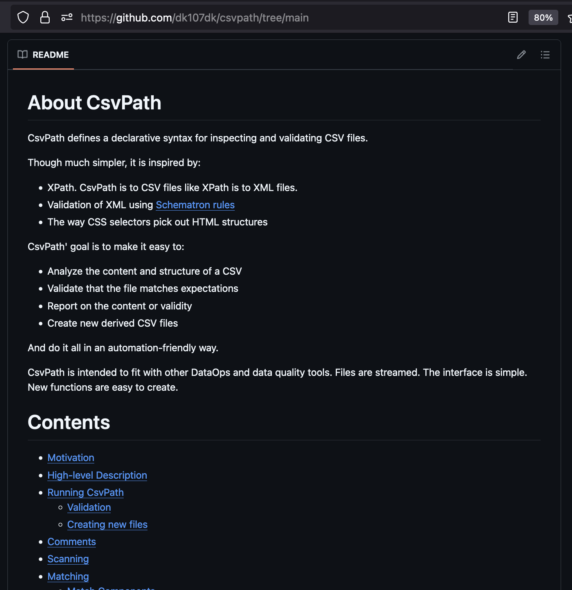
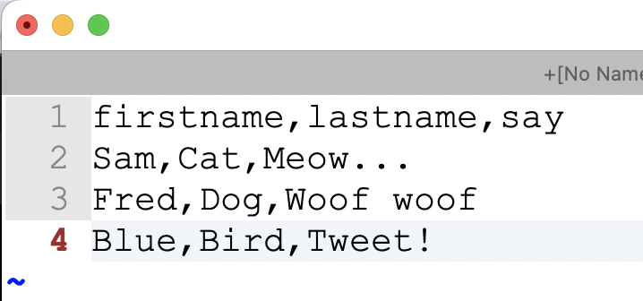
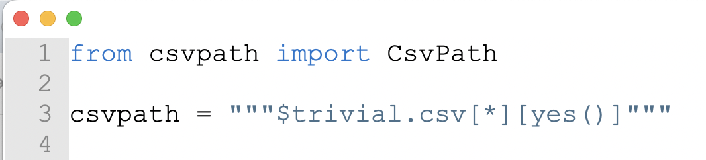
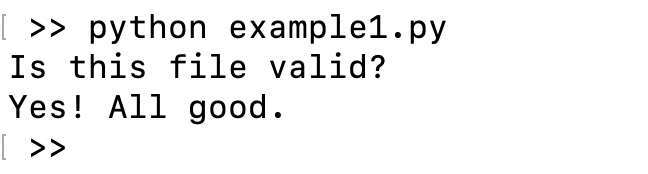

# Quickstart

This page gives you all the information you need to get started validating your CSVs with CsvPath. It is super high-level and quick. You will want to go deeper on other pages later. We're going to do a trivial validation of a CSV file. Validating an Excel file would be essentially the same.


If you need help getting started with Python, try [Python.org's intros](https://www.python.org/about/gettingstarted/). Starting with a project tool like [Poetry](https://python-poetry.org/docs/basic-usage/) or [Jupyter Notebooks](https://jupyter-notebook-beginner-guide.readthedocs.io/en/latest/) can also help.



<mark style="color:green;">Feel like skipping the Python?</mark> [Watch these videos](https://www.youtube.com/@atesta-analytics) <mark style="color:red;">🎥</mark> or [try this Python-free CLI example](csv-and-excel-validation/your-first-validation-the-lazy-way.md)**.**


### PyPI and Github

[The open source CsvPath Framework](https://github.com/csvpath/csvpath) is available through [PyPI](https://pypi.org/project/csvpath/) as `csvpath`. The project is quite active. You should pin the version you use but update it regularly.&#x20;

We use Poetry for our own development. If you choose Poetry, all you need to do is:&#x20;

```
poetry new <<your project name>>
cd <<your project name>>
poetry add csvpath
```

If you prefer Pip, install CsvPath Framework with:

```
pip install csvpath
```

Have a look at the [Github project](https://github.com/dk107dk/csvpath) for more details. You can read that site in parallel to this one.

<div data-full-width="false"><figure><figcaption></figcaption></figure></div>

### Let's run something!

The worker class in CsvPath is unsurprisingly called `CsvPath`. For simple validation, it is all you need. &#x20;


For more complex situations and DataOps automation we use the manager class `CsvPaths`. But we'll come back to that in later pages. For now just know that it exists, has essentially the same API, and is equally lightweight to use.


The quickest way to bootstrap a CsvPath Framework project is the command line interface (CLI). The CLI is a super simple tool that is great for fast no-code development. To try the CLI, skip over to [Your First Validation, The Lazy Way](csv-and-excel-validation/your-first-validation-the-lazy-way.md).&#x20;

To continue with the simplest possible Python, let's do a _hello world_.&#x20;

Create a script file and import CsvPath:&#x20;

<figure><figcaption><p>Add CsvPath to your requirements.txt or dependency manger first, of course!</p></figcaption></figure>

```python
from csvpath import CsvPath
```

Create a test CSV file. Save it as trivial.csv or whatever name you like.

<figure><figcaption></figcaption></figure>



Make a csvpath. Also a trivial one, just to keep it simple.

<figure><figcaption></figcaption></figure>

```python
csvpath = """$trivial.csv[*][yes()]"""
```

This path says:&#x20;

* Open `trivial.csv`
* Scan all the lines
* Match every one of them

<figure><figcaption></figcaption></figure>

Here's everything:


```python
from csvpath import CsvPath

path = """$trivial.csv[*][yes()]"""

cp = CsvPath()
cp.fast_forward(path)

if cp.is_valid:
    print("Totally valid!")
else:
    print("Not valid.")    
```


What does this script do?

* **Line 1:** imports CsvPath so we can use it
* **Line 3:** is our csvpath that we'll use to validate our test file, `trivial.csv`
* **Line 6:** fast-forwards though the CSV file's lines. We could also step through them one by one, if we wanted to.&#x20;
* **Line 8:** checks if we consider the file valid. If the file didn't meet expectations our csvpath would have declared the file invalid using the `fail()` function.&#x20;

When you run your script you should see something like:

<figure><figcaption></figcaption></figure>

Hello-world examples are never super impressive on their own. But you are now ready to dig in and see what CsvPath can really do.&#x20;

Next, try [Your First Validation, the Lazy Way](csv-and-excel-validation/your-first-validation-the-lazy-way.md). Also check out the [How-tos section](how-tos/) for more use cases and examples. If you'd like a helping hand, [contact us](a-helping-hand.md)!
