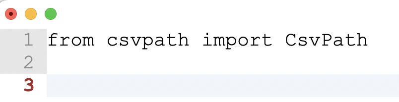

# Quickstart

This page gives you all the information you need to get started validating your CSVs with CsvPath. Happily, it's not a lot. You will want to go deeper on other pages later.


If you need help getting started with Python, try [Python.org's intros](https://www.python.org/about/gettingstarted/). Starting with a project tool like [Poetry](https://python-poetry.org/docs/basic-usage/) or [Jupyter Notebooks](https://jupyter-notebook-beginner-guide.readthedocs.io/en/latest/) can also help.



<mark style="color:green;">Feel like skipping the Python?</mark> [Watch these videos](https://www.youtube.com/@atesta-analytics) <mark style="color:red;">🎥</mark> or [try this Python-free CLI example](your-first-validation-the-lazy-way.md).


### PyPI and Github

The CsvPath library is available through [PyPI](https://pypi.org/project/csvpath/) as `csvpath`. At this stage, pre 1.0, the project changes frequently. You should pin the version you use but update it regularly.&#x20;

We mostly use Poetry for our projects, so we'll start with that. All you need to do is:&#x20;

```
poetry new <<your project name>>
cd <<your project name>>
poetry add csvpath
```

You'll see a bunch of output from Poetry, of course.&#x20;

If you are using Pip, install CsvPath with one of:

```
pip install csvpath
pip install csvpath[pandas]
```

The optional dependency adds a lot of bulk and platform considerations. Pandas is available for validating DataFrames. If you don't need to do that, don't bother installing with Pandas.  &#x20;

You can check under the hood on [Github](https://github.com/dk107dk/csvpath). There are detailed docs that you can read in parallel or in addition to this site.

<div data-full-width="false"><figure><figcaption></figcaption></figure></div>

### Let's run something!

The main class in CsvPath is unsurprisingly called CsvPath. For simple jobs, it is all you need. &#x20;

The quickest way to bootstrap a real CsvPath project is the command line interface (CLI). The CLI is a super simple tool for managing data files, CsvPath Language files, and results. It is barebones, but very productive. To try the CLI, skip over to [Your First Validation, The Lazy Way](your-first-validation-the-lazy-way.md). Or if you want to continue with the simplest possible Python, keep going.

To do a hello world you'll need to import CsvPath, create an instance, and point it at a CSV file.

Create a script file and do the import:&#x20;

<figure><figcaption><p>Add CsvPath to your requirements.txt or dependency manger first, of course!</p></figcaption></figure>

```python
from csvpath import CsvPath
```

Create a test CSV file. Save it as trivial.csv or whatever name you like.

<figure><figcaption></figcaption></figure>



Make a csvpath. Also a trivial one, just to keep it simple.

<figure><figcaption></figcaption></figure>

```python
csvpath = """$trivial.csv[*][yes()]"""
```

This path says: open trivial.csv, scan all the lines, and match every one of them.

<figure><figcaption></figcaption></figure>

Here's copy-and-paste Python:


```python
from csvpath import CsvPath

path = """$trivial.csv[*][yes()]"""

cp = CsvPath()
cp.fast_forward(path)

if cp.is_valid:
    print("Totally valid!")
else:
    print("Not valid.")    
```


What does this script do?

* Line 1 imports CsvPath so we can use it
* Line 3 is our csvpath that we'll use to validate our test file, `trivial.csv`
* Line 6 fast-forwards though the CSV file's lines. We could also step through them one by one, if we wanted to.&#x20;
* Line 8 checks if we consider the file valid. If the file didn't meet expectations our csvpath would have declared the file invalid using the `fail()` function.&#x20;

When you run your script you should see something like:

<figure><figcaption></figcaption></figure>

No question, that is far from impressive! Still, go with it. Small increments are good! You are now ready to dig in and see what CsvPath can really do.&#x20;

Next, try [Your First Validation, the Lazy Way](your-first-validation-the-lazy-way.md). Also check out the [How-tos section](../topics/how-tos/) for more use cases and examples. If you feel like there must be a pony in there somewhere, but you'd like a helping hand, [contact us](a-helping-hand.md)!
