# Your First Validation, The Lazy Way

This page gives one way to do the **Your First Validation** exercise. In the other approaches to our [super-simple first validation exercise](your-first-validation-simplified.md) the focus is on the CsvPath Language, but there was also a little Python to drive it. We can do it without the Python by using the CLI that comes with the CsvPath Library. Here's how.

We're going to use Poetry for our example project. You can [learn how to set Poetry up here](https://python-poetry.org/docs/).

Open the command line and type this:&#x20;

```bash
poetry new first_example
```

Change `first_example` to any project name you like. You should see this:

<figure>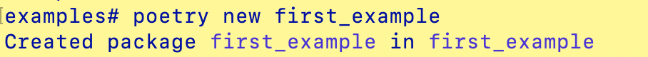<figcaption></figcaption></figure>

`cd` into your new project. Next, add csvpaths to your project with:&#x20;

```bash
poetry add csvpaths
```

You should see this:

<figure>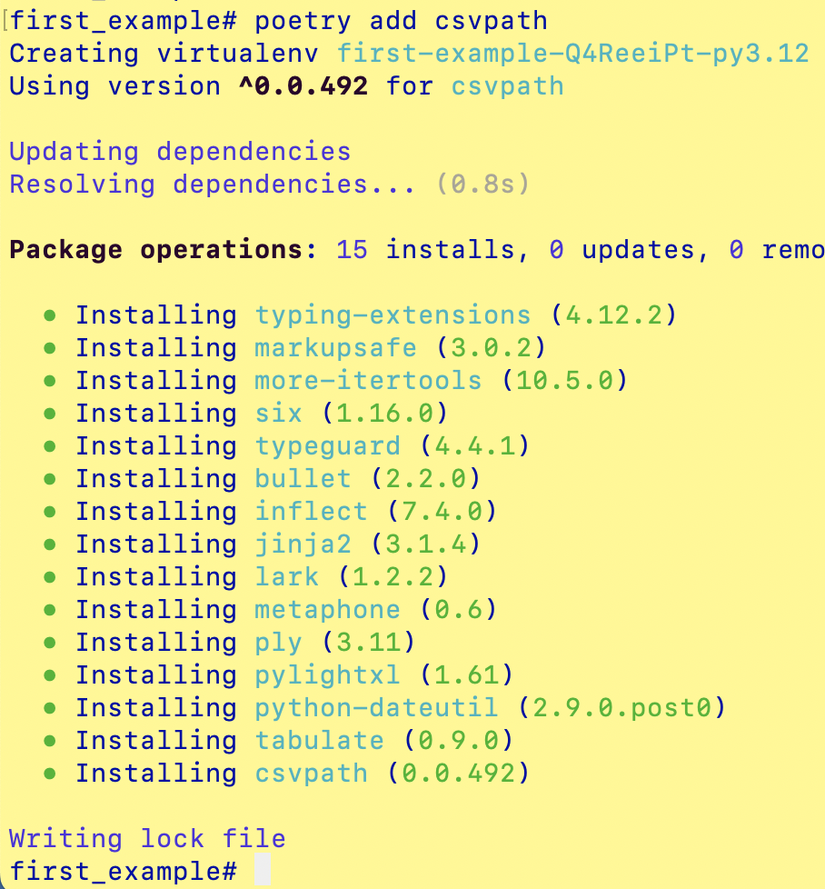<figcaption></figcaption></figure>

We can now run the CsvPath Library's CLI with:

```bash
poetry run cli
```

If you're not a Poetry user, what we're doing is running a script defined in the pyproject.toml.&#x20;

<figure><figcaption></figcaption></figure>

You can do the same with:&#x20;

```python
from csvpath.cli import Cli
Cli().loop()
```

The CsvPath CLI is bare-bones. Despite that, it is a useful way to do simple stuff fast. It is great for learning and basic CsvPath Language dev work.&#x20;

You should see this:&#x20;

<figure>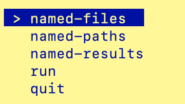<figcaption></figcaption></figure>

You can select `quit`, for now.

In your project dir, create a subdirectory called `assets`, or whatever name you like. We'll drop an example CSV file and your csvpath file there. Create a file called `first.csvpath`—or again, whatever name you like. Into it, paste the simplified version of the [First Validation Example](your-first-validation-simplified.md) csvpath statement:&#x20;

```xquery
    ~ 
     id: First Validation, Simplified!
     description: Check if a file is valid
     validation-mode: print, no-raise, fail 
    ~
    $[*][
    line(
        string.notnone("firstname"),
        string.notnone("lastname", 30),
        string("say")
    )
  ]
```

Add the example delimited data in example.csv to the assets dir. Use a trivial data set:

```csv
firstname,lastname,say
Sam,Cat,Meow...
Fred,Dog,Woof woof
Blue,Bird,Tweet!
```

Now we're ready to run the validation. Fire up the CLI again with `poetry run cli`. Select `named-files`. You should see this:

<figure>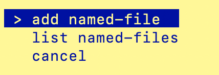<figcaption></figcaption></figure>

Hit return on `add named-file`. We're going to import your file into the `FileManager`'s files area. The file manager is used whenever one of your `CsvPaths` instances needs to run a validation. When you hit return the CLI should ask you for a name for the file you are going to import:

<figure><figcaption></figcaption></figure>

&#x20;Any name works. `example` would be a good choice. You should then see a selection of `dir`, `file`, or `json`.&#x20;

<figure>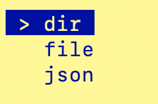<figcaption></figcaption></figure>

Pick `file`. Next you will select your file by drilling down into your `assets` directory. Select your file and hit return.

<figure>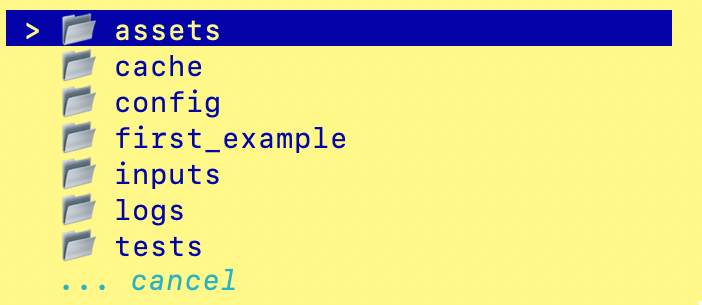<figcaption></figcaption></figure>

<figure><figcaption></figcaption></figure>

Once your file is added you go back to the top menu. This time select `named-paths`. And in the next submenu pick add named-paths.

<figure>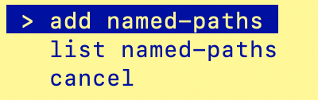<figcaption></figcaption></figure>

Again, you enter a name for the csvpaths you are adding. `first` would be a fine name. You next drill down to your `first.csvpaths` file in the assets dir. Select it and hit return. You'll be taken back to the top menu.

Now you're ready to run your example. Select `run` and hit return. You will be asked for the name of a file. Select your file's name, `example`.

<figure>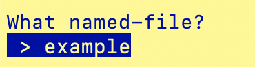<figcaption></figcaption></figure>

Next you'll be asked for the name of your csvpaths:&#x20;

<figure><figcaption></figcaption></figure>

You have just one named-paths name, `first`, so select that and hit return.

Now you get the question of what method you want to use to run your paths against your file. The options are **fast forward** or **collect**. As you may already know, fast-forward runs your validation, but doesn't collect the matching lines. Instead, it only collects variables, printouts, and errors. The collect method does collect the matching lines, in addition to variables, printouts, and errors.&#x20;

As an aside, the library also allows you to step through a CSV path as its being validated, line-by-line. However, the CLI does not offer that option. You can easily do it programmatically using a `CsvPaths` instance's `next_paths()` method in a `for line in csvpath.next_paths()` loop.

For our purposes, either method works. Pick `collect`.&#x20;

<figure>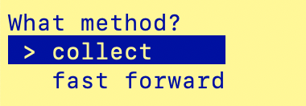<figcaption></figcaption></figure>

The CLI briefly tells you it is running. Then you're back at the top menu. You have successfully completed your first validation run. Congrats!

Now let's take a look at what resulted from our validation run. Select `named-results`.

<figure>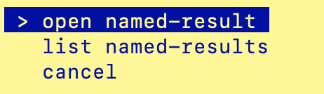<figcaption></figcaption></figure>

The CLI is so simple it can only open our results in your operating system's file browser. But that will do for learning and developing. Select `open named-result` and select `first`.  A new window opens to your runs of the `first` named-paths group runs. So far you have just one run. It should be timestamped for a minute ago.

Inside your `first` run you should see these files:&#x20;

<figure>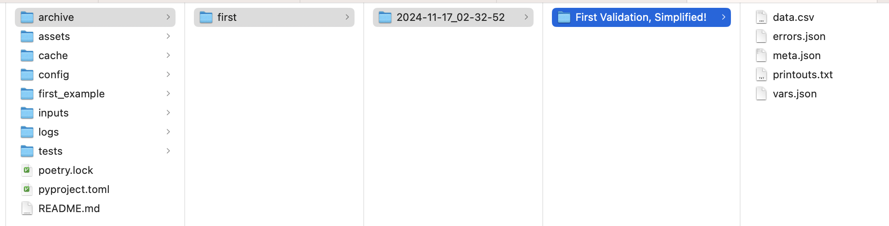<figcaption></figcaption></figure>

`data.csv` has all the lines from your `example.csv` file with no changes made. Our validation matched all the lines and we used the collect method (technically, `CsvPaths.collect_paths()`) so everything in the original file came through unchanged. `errors.json` is empty because there were no errors. We didn't set any variables, so `vars.json` is empty. And we didn't print anything as the run happened, so `printouts.txt` is also empty. Not a lot to see, here, but we were expecting that, so it is a good thing.&#x20;

There is a good amount of metadata in meta.json. If you open that file you should see something like this:

<figure>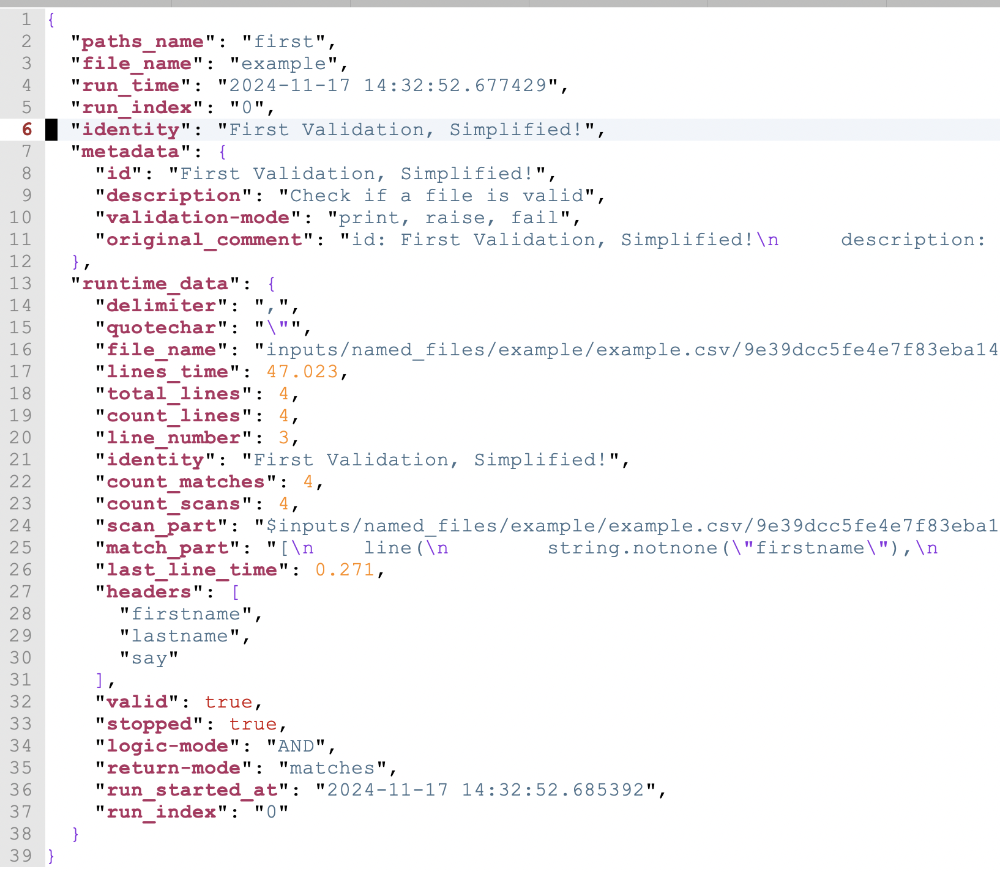<figcaption></figcaption></figure>

On line 16 you can see what file we used. It is the one you imported earlier. You can [learn more about how the CsvPath Library manages files here](../topics/file-management.md). And read this page for more information about [named-paths group validation results](../topics/where-do-i-find-results.md).

And that's it. Your first validation. Simplified and no Python code involved. Not bad!

