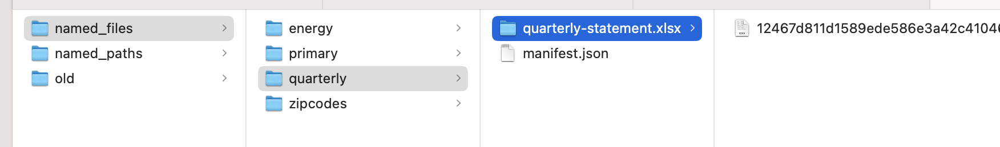
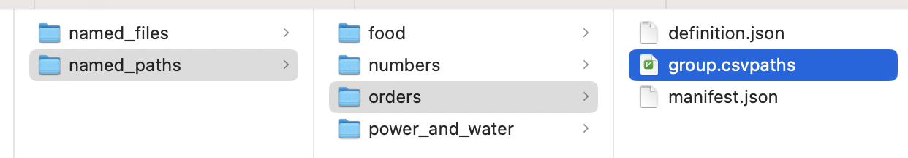

# File Management

CsvPath Framework is a DataOps infrastructure framework. Using it for just its delimited data validation language is totally reasonable for some use cases, but doing so leaves a lot of advantages on the table.&#x20;

Using the Framework as automation infrastructure requires only that you work with instances of the `CsvPaths` class, rather than just the `CsvPath` class. We use `CsvPath` instances directly only for one-off validations. If you haven't already been using `CsvPaths` instances, it is a small change that makes a big difference.&#x20;

`CsvPaths` applies csvpath statements to delimited files and stores the results for further use. This page explains how and where data and validation files are managed.

There are three file sets:&#x20;

* Delimited data files
* Csvpath validation files
* Results data and metadata

Each of these types is managed in a specific location in a structured way. `CsvPaths` allows you to put your files wherever you like, but when you register files for use they are imported into a structured environment.&#x20;

It is worth pointing out that while your `CsvPaths` instance's results files are created for your use, the data files and csvpath validation files areas are for the library's internal use, not yours. You should never need to touch these files. Nevertheless, it is good to know how your data and validation rules are being managed.&#x20;

## Data files

`CsvPaths`'s validation is applied to named-files. Named-files are just file paths that are referred to by simple names. E.g. you might have a file at&#x20;

`/my/data/files/quarterly-statement.xlsx`

You would present that file to CsvPaths's FileManager like this:&#x20;

```python
csvpaths = CsvPaths()
csvpaths.add_named_file("quarterly", "/my/data/files/quarterly-statement.xlsx")
```

When you run this code CsvPaths copies `/my/data/files/quarterly-statement.xlsx` into its named-files area. By default the named-files location is `./inputs/named_files`. Your file would live in the "home folder" for that name: `./inputs/named_files/quarterly`. Within that home folder you would see a directory called `quarterly-statement.xlsx`.&#x20;

Inside the `quarterly-statement.xlsx` directory you would find one or more `.xlsx` files with sha256 hash names. A `sha256` is an cryptographic algorthm that fingerprints data. Its fingerprints look like: `12467d811d1589ede586e3a42c41046641bedc1c73941f4c21e2fd2966f188b4`&#x20;

This mathematical fingerprint is unique to `quarterly-statement.xlsx`'s exact set of characters. When your `CsvPaths` instance imports your files it captures a version and names it with its fingerprint. If you update a file and reimport it you will see another hash-named file containing the new version. In this way `CsvPaths` keeps an exact identity for every file, version-by-version.

In your data file's home directory you will also see a `manifest.json` file. `manifest.json` contains the record of changes to the file. The contents look like:&#x20;

```json
[{
 "type": "csv",
 "file": "inputs/named_files/quarterly/quarterly-statement.xlsx/12467d811d1589ede586e3a42c41046641bedc1c73941f4c21e2fd2966f188b4.xlsx",
 "fingerprint": "12467d811d1589ede586e3a42c41046641bedc1c73941f4c21e2fd2966f188b4",
 "time": "2024-11-15 15:35:00.477177",
 "from": "tests/test_resources/named_files/quarterly-statement.xlsx"
 }]
```

Each time you make a change to `quarterly-statement.xlsx` and re-present it to `CsvPaths`'s file manager a new object will be added to this JSON structure with information about the new version. The JSON object's `file` key ultimately identifies the physical file used to run a validation, like this:&#x20;

```python
paths = CsvPaths()
paths.collect_paths(pathsname="validations", filename="quarterly")
```

Here is a screenshot of the structure:&#x20;

<figure><figcaption></figcaption></figure>

And again in text, the structure is like this:&#x20;

<figure><figcaption></figcaption></figure>

## Csvpath validation files

CsvPath Language validation files contain one or more csvpath validation statements separated by `---- CSVPATH ----` delimiters. You can create them as single files or single-csvpath files assembled by directory or JSON structure. However you do it, when you add your named-paths to a `CsvPaths` instance's `PathsManager`, your csvpath files are copied into a central area. By default `CsvPaths`'s named-paths live at `./inputs/named_paths`.&#x20;

The named-paths structure is a bit simpler than named-files. Your paths changes are noted, but the files are not versioned. And all named-paths files under one name are stored as a single file called `group.csvpaths`.  Like in named-files, a manifest.json lives in each name's home directory. manifest.json keeps track of file changes using this JSON structure:&#x20;

```json
[{
 "file": "inputs/named_paths/orders/group.csvpaths",
 "fingerprint": "262161605f8ad39d3a30cc2f9bb75f688ecad66e9b66cb9a3c9c928f7c899cb7",
 "time": "2024-11-15 15:34:35.130181"
}]
```

Each time you re-add your csvpaths under a named-paths name your CsvPaths instance will add another JSON object tracking the file fingerprint and time. The contents of the csvpath's scanning and matching parts is captured in each run's metadata. The date of the run can be easily compared to the dates the csvpaths were changed. We expect that your real version control will be done using Git or another configuration management system, as you would do with any other development assets.

You may also notice other JSON files called `definition.json` in the named-paths home directories. `definition.json` is captured when you use JSON to define your named-paths group(s). It is just a stright capture of the JSON copied and renamed `definition.json`, with no other modifications. That means if you have a JSON file that defines three named-paths groups each of the named-paths group home directories will have that same JSON file copied in as `definition.json`, and each copy will have the complete JSON for all three named-paths groups.&#x20;

For example, a JSON named-paths definition from the [Another Example](../how-tos/another-example-part-2.md) how-to article looked like:&#x20;

```json
{
    "orders": [
        "tests/examples/example_2_2/csvpaths/metadata.csvpath",
        "tests/examples/example_2_2/csvpaths/file_length.csvpath",
        "tests/examples/example_2_2/csvpaths/reset.csvpath",
        "tests/examples/example_2_2/csvpaths/categories.csvpath",
        "tests/examples/example_2_2/csvpaths/prices.csvpath",
        "tests/examples/example_2_2/csvpaths/sku_upc.csvpath"
    ],
    "top_matter_import": [
        "tests/examples/example_2_2/csvpaths/top_matter_import.csvpath"
    ]
}
```

Both the `orders` and the `top_matter_import` named-paths home directories received their own identical copy of the above JSON in a `definition.json`.

Here is the structure of the named-paths area:&#x20;

<figure><figcaption></figcaption></figure>

&#x20;And in text form, the structure is:&#x20;

<figure><figcaption></figcaption></figure>

## The results files

The files created as the results of running named-paths against a named-file are super important. And there are more of them with more choices and opportunities for your work approach. [Read all about results files here](where-do-i-find-results.md).
