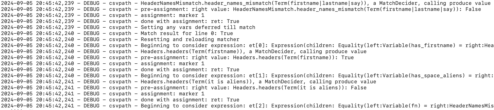

# Debugging Your CsvPaths

CsvPaths is a declarative rules-based path language. As such, creating csvpaths can be drop-dead easy for easy things. For more complex situations you will undoubtedly sooner or later come to a head-scratcher. You can of course run CsvPath in an IDE debugger. But what other options are there for gaining an understanding of what your csvpath is doing?&#x20;

Here are some ideas.

* [Logging Levels](debugging.md#logging-levels)&#x20;
* [Error Policy](debugging.md#error-policy)
* [Emit JSON](debugging.md#emit-json)&#x20;
* [Stop Early](debugging.md#stop-early)
* [Create a Simple Test Csvpath](debugging.md#create-a-simple-test-csvpath)&#x20;
* [More Advice](debugging.md#more-advice)
* [The Source Code](debugging.md#the-source-code)

## Logging Levels

The obvious place to start is with the log. By default CsvPath logs to ./logs. That will probably not be ideal for production. You can easily reset it by changing config.ini. You also have the option to reset the path to config.ini when you create your instance. You could even populate the csvpath.util.config.CsvPathConfig instance programmatically. (You probably shouldn't, but you can!)&#x20;

Here's an example of the config showing all the log-related options.

<figure><figcaption></figcaption></figure>

As you can see you have logging and error options for CsvPath and CsvPaths. If you use CsvPaths you still use the settings for CsvPath for those instances that CsvPaths is managing.

The logging is, today, heavily focused on matching. That's where most of the complexity creeps in. You can see when matching starts, what the match structure is, how the match components behave and what their focus is — meaning are they value producers, match deciders, or side-effects. Lots of information.

<figure><figcaption></figcaption></figure>

### debug()

You may also want to try the `debug()` function. As a csvpath function you can use it within your csvpath to control how much logging happens at any particular point. It isn't a precision tool. Your use of `debug()` is only effective at the line level, meaning you can't adjust the log level match component by match component. Still, `debug()` helps you cut down the log noise considerably so you can focus on the logging that is most important to you.

### vote\_stack()

The vote\_stack() function is another potentially helpful debugging match component. Its job is to tell you how the match components voted on a given line. The best way to use vote\_stack() is to push it:

```xquery
push("votes", vote_stack())
```

This will populate your `votes` variable with a list of `True` / `False` votes for each of the match components. That can help you understand why a match happened, or didn't, in more complex csvpaths.

## Error Policy

CsvPaths and CsvPath have a multi-setting error policy. If you need more information, or more or less run protection, you should have a look. The options are:&#x20;

* `raise` — reraises exception, at the risk of interrupting production processes
* `collect` — collects Error objects with the associated Exception&#x20;
* `stop` — stops the run, as if your csvpath called the `stop()` function. Keep in mind you are only stopping the CsvPath the error occurred in. If you are working in the context of a CsvPaths instance, CsvPaths will either:&#x20;
  * Continue by starting the next CsvPath, if any, if you are processing serially, or
  * If processing breadth-first, continue with the next CsvPath in the list of CsvPaths considering each line until the run completes or all CsvPaths enter the stopped state
* `fail` — indicate that the CSV file is invalid. This does not stop the run.
* `quiet` — handles the error quietly with minimal additional noise in the log, low information availability, and no threat to the continuance of the production runtime

You can activate multiple of these options at once. `quiet` and `raise` obviously don't go together.

Keep in mind that your errors are collected by default, but if you remove `collect` from the error policy your error collector will not keep them. `quiet` without `collect` is a recipe for losing information.&#x20;

## Emit JSON

The Matcher instance held by a CsvPath can output JSON for its match components. The match components are held as Expression instances in a list of expressions in the Matcher. To produce JSON you'll want to do something like:&#x20;

```python
csvpath.matcher.dump_all_expressions_to_json()
```

You can also explore the expressions like this:&#x20;

```python
for i, e in enumerate(csvpath.matcher.expressions):
    json = csvpath.matcher.to_json(e[0])
    print(f"JSON for expression[{i}] is {json}")
```

## Stop Early

You have a lot of control over how many lines and which lines CsvPath sees, as well as when to stop processing. Remember that you can have the scanner pick out just one line with something like:

```
$my_test.csv[7][ print("what the heck?") ]
```

Sometimes that's the simplifying condition that helps you see what's going on.  Likewise, `stop()`ing early can act as a kind of breakpoint leaving you with access to the variables, match components, etc.

## Create a Simple Test Csvpath

This may seem like obvious advice. CsvPath provides good options for breaking down sizable validation into smaller steps with good separation but still runnable as a unit. When you hit a hard problem, try to isolate it in its own csvpath. You can run it with other csvpaths in CsvPaths or you can `import()` it into another csvpath like a component.&#x20;

Running simple paths together in CsvPaths has the added benefit of allowing you to easily separate out the problem csvpath's print statements and errors — they are held separately in each csvpath's Printer and CsvPathErrorCollector instances.

## More Advice

* `print()` is your friend — if you've been leaning on debuggers rather than print statements lately you may feel like the debugger is the better way to go. Try print as well. It is simpler than learning the CsvPath internals and provides access to [a large amount of metadata](the\_reference\_data\_types.md).&#x20;
* Use the $.csvpaths.headers field — headers change mid-file because CSV. You can dump the current headers using the headers reference in a print statement. You can dump the line to compare to the headers using the `print_line()` function. Keep in mind that while the CSV file's headers may change, your csvpath's headers do not change unless you use `reset_headers()`.
* `push()` line-by-line indicators — consider using `push()` to push indicators, variables, headers, etc., into a stack variable, line by line. This can be a handy way of seeing how state progresses over a run.
* Check counts vs. numbers — one of the CSV file things you wouldn't think would be hard turns out to be harder than expected: counts vs. references. When you refer to a line or a header you are pointing to an item in a 0-based list. When you count something you are indicating how many times you've seen it; implying a 1-based counter. When we talk about match counts and line numbers, or even line counts and line numbers, we are talking about different kinds of things. Then there's the distinction between "physical" lines and "data" lines. The former are essentially a count of line feed characters in a series of bytes. The latter is a series of line feeds plus the content between them. And finally, there is the problem of lines that have whitespace but no delimiters, as well as lines with too few or too many delimiters. Lines with a single space look blank to us. Technically they are a single header line containing whitespace. CsvPath takes pity on us and treats those as blanks, meaning non-data lines. You can inspect all these numbers in the line monitor. For a quick understanding, do: `print(f"{csvpath.line_montor}")` &#x20;
* Were the variables frozen? CsvPath always calls any `last()` functions on the last line scanned or the end of the file. However, if the csvpath is not activated for that line because the line is empty and would usually be skipped, the `last()` functions still run, but in a restricted context. Their variables are frozen, including stacks and tracking values. That is usually not a problem — `last()` not running would be a much bigger issue — but it has the potential to be mysterious in some corner cases.
* Value Producers, Match Deciders, and Side-effects — remember that different match components have different focuses. This primarily goes for functions. A function can be a producer, a decider, or a side-effect. Where this becomes interesting is when producers match or deciders give values. Typically the behavior is what you would expect. E.g. a match decider producing a value will return True or False. However, you could run into one of two gotchas. A match decider that is being assigned provides its value, which in a small number of cases may be different from its match decision.&#x20;


**An example recently seen**&#x20;

An `any()` with `onmatch` was being assigned to a variable. `any()` is a match decider. But an assignment always receives the value of the component, not its match contribution. Usually, these are the same.

Because the `any()` was contributing only `onmatch`, its value was `None` on lines that didn't match. On those same lines, as a non-contributor, its match defaults to `True`.&#x20;

Then that same `any()` was wrapped in a `not().` This was the second gotcha: _assignment is not transitive_. Meaning that the `any(),` now `not(any.onmatch()),` was no longer being assigned. The `not()` was. That meant the `any()` reverted to its more typical result, its match decision.&#x20;

These are rare gotchas!  But of course, people may see them. Once you know the logic, the behavior makes sense. &#x20;


* Access the variables and metadata programmatically — there are several places to look for indicators if you want to do it programmatically:&#x20;
  * **CsvPath**
    * csvpath.metadata
    * csvpath.headers
    * csvpath.variables
    * csvpath.line\_monitor
    * csvpath.matcher
    * csvpath.scanner
    * csvpath.printers
  * **CsvPaths** — in CsvPaths the main place to look is the results manager and its named sets of CsvPathResult objects. Remember that results are named for the csvpath sets that created them. That means your named-paths name is the same as your named-results name.
    * csvpaths.results\_manager

## The Source Code

Finally, if nothing else gives you the information you need, [the source is available here](https://github.com/dk107dk/csvpath/tree/main). While I wouldn't suggest diving into the library code as your first resort, CsvPath is a pretty small library and should be pretty accessible.&#x20;
