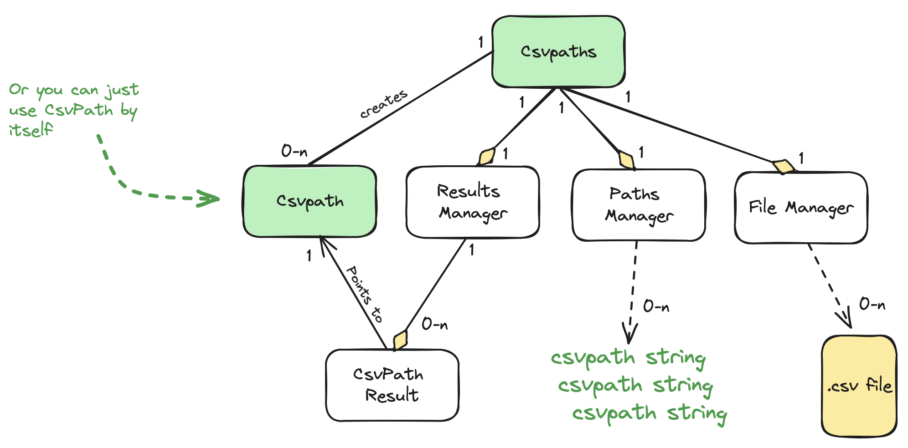
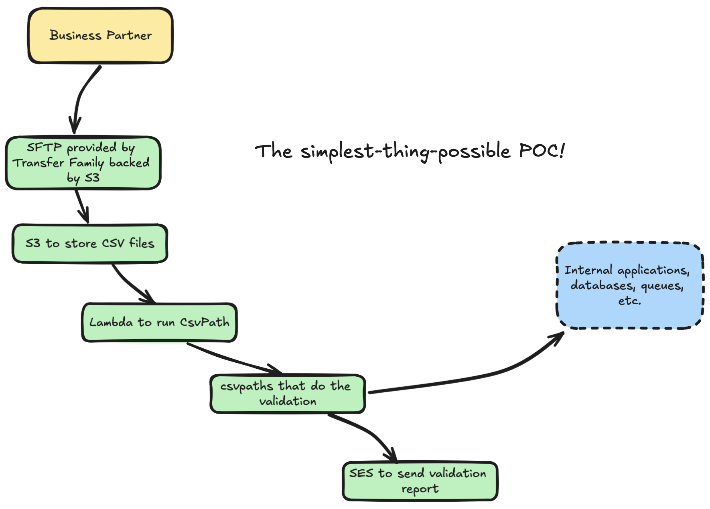
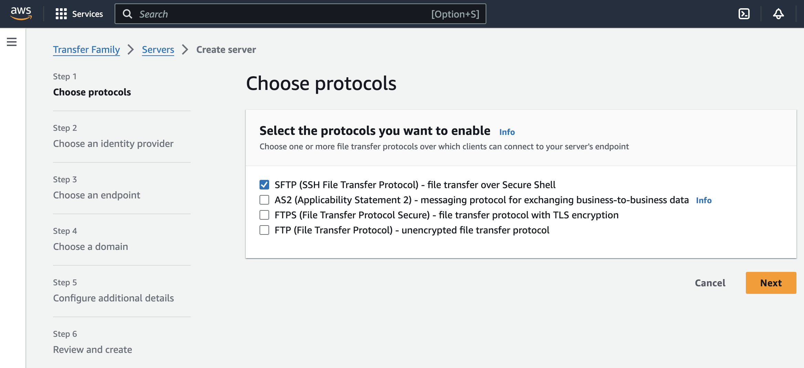
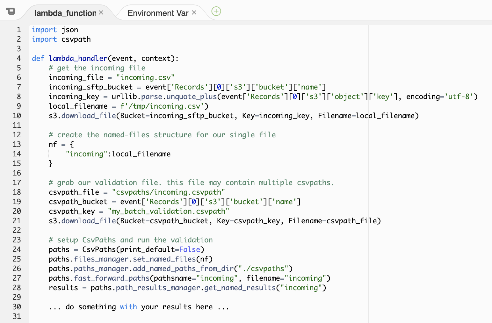
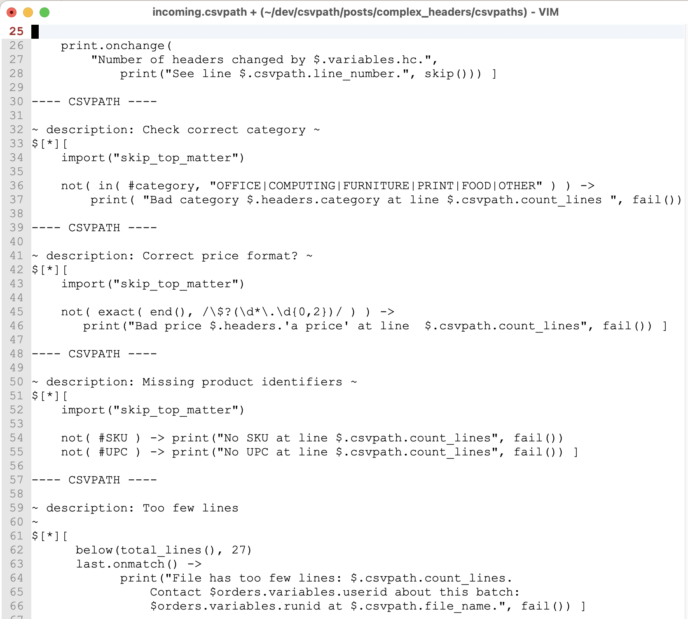
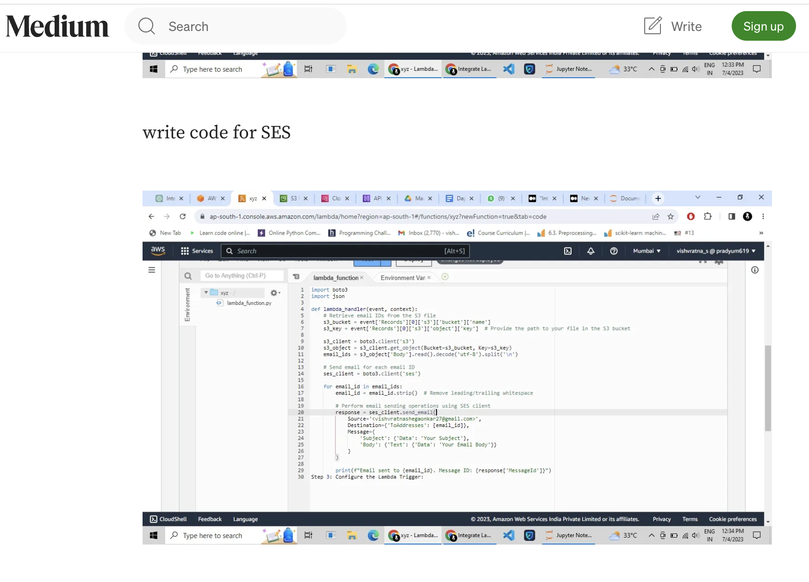

# Paths To Production

<figure><figcaption></figcaption></figure>

As you saw in [Your First Validation](../../getting-started/csv-and-excel-validation/your-first-validation.md) and [Another Example Part 2](../../getting-started/how-tos/another-longer-example/another-example-part-1.md), there are two ways to use the CsvPath library.&#x20;

* Single csvpath pointing to a single file, simple results
* Multi-csvpath

Both can work in a production setting. The latter is more flexible and offers more capabilities with little additional complexity. We'll focus on the multi-csvpath option.&#x20;

The path to production starts with just getting the simplest possible thing working—a proof of concept. We can quickly sketch that out.&#x20;

As our starting point, here is a high-level view of everything you need to know about the library. (Setting aside how to write csvpaths using the built-in functions, for now).

<figure><figcaption></figcaption></figure>

Our goal is to create an automated CSV validation capability. We're not actually picking the right technologies that work for your specific situation, obviously! Writing the minimal implementation code for this is an exercise for you and [Claude](https://claude.ai/). A POC like what we are sketching should be pretty quick.

Here's what we think the simplest-possible thing might be, at least for some companies. _(Apologies to non-AWS users)._ Could you do something simpler? Probably. Is reality more complicated. For sure!

<figure><figcaption></figcaption></figure>

Imagine your CSV files are arriving by SFTP. You need a landing zone for your CSV files and csvpaths. Let's say you use AWS Transfer Family fronting S3. When a file arrives it triggers a Lambda that runs your csvpath validation. This scenario is [similar to this tutorial](https://aws.amazon.com/blogs/storage/customize-file-delivery-notifications-using-aws-transfer-family-managed-workflows/).

<figure><figcaption></figcaption></figure>

Your Lambda, where CsvPath runs, is pretty simple. (Remembering this is just a sketch to give you ideas). In mostly accurate pseudo-code, it might look like:&#x20;

<figure><figcaption>
Pseudo-code for setting up CsvPaths in an AWS Lambda
</figcaption></figure>

And we can repurpose the multi-csvpath file from [Another Example, Part 2](../../getting-started/how-tos/another-longer-example/another-example-part-2.md) to stand in for your inbound file validation rules.

<figure><figcaption></figcaption></figure>

Adding a simple email giving validation results using SES is an easy add-on. The Web is littered with SES email examples.&#x20;

<figure><figcaption></figcaption></figure>

Likewise, pushing metadata or lines from the Results object into a database would be a straightforward database insert—at least if we're sticking with the [simplest-thing-that-could-possibly-work ethic](https://ronjeffries.com/xprog/articles/practices/pracsimplest/).&#x20;

And that's pretty much all of it. Obviously, some assembly required. As they say, an exercise for the reader.&#x20;
