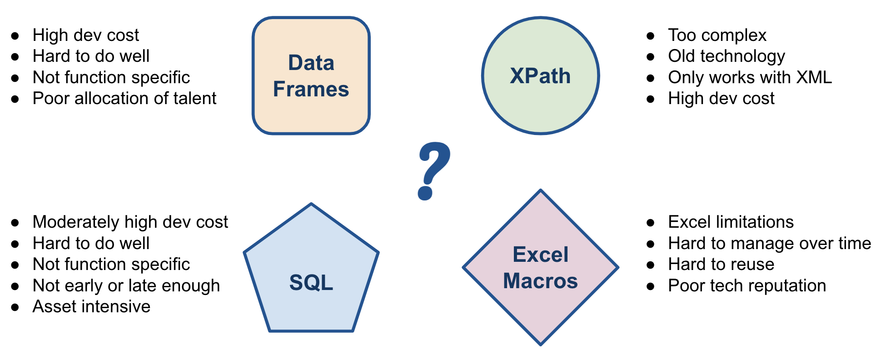

# Why CsvPath?

CsvPath has the benefit of being simple and quick enough for technically savvy non-developers, as well for as developers who would rather spend their time on other things. Because CsvPath is purpose-built for CSV validation, it is not hard to use well and doesn't tempt you to treat it as a Swiss Army knife.&#x20;

Beyond that, there are the comparisons. If the alternative is not validating your CSV, using CsvPath is a nobrainer. If you are looking at the four nearest alternatives, there are some more specific arguments in favor of CsvPath.

### Comparisons

The nearest alternatives are Python data frames libraries, XPath in the form of Schematron, SQL, and Excel functions and macros. Each has a number of drawbacks or gaps. Let's go through them. Then we'll recap out why you should consider CsvPath.

<figure><figcaption>
There are probably dozens of ways to do CSV validation. These are four of the leading contenders.
</figcaption></figure>

### Data Frames

Pandas, Polars, et. al. are great for data science and data engineering. They are fast and rich. The downsides of using data frames tools for CSV validation are:

* The cost is essentially the cost of building your own validation software
* Many Python developers who know data frames, or want to, would prefer not to be using it for simple validation. Developers who don't know data frames face a steep learning curve.
* Over time, Python scripts will drift and grow barnacles. That's the nature of using a general purpose programming language for simple tasks with a long life and typically too little ownership. A built-for-task validation framework is more likely to stay on point and be reasonably well organized over the long term as maintainers come and go.

### XPath and Schematron

Schematron is a terrific tool, still. When it was new it was a fresh idea that was simple — an _a-ha!_ at first sight. Many years and three ISO-standard versions later, Schematron is still a great idea, but not looking so simple or World-fire-setting. Part of that is XPath. Never an easy technology, it has only gotten more challenging as it has grown.

For the comparison with CsvPath, though, the important thing is that Schematron does not do CSV. If it did, we'd use it!  Instead, you would have to get your CSV into XML first. Now, it is true that CSV generally has to be transformed into something. But XML is not the most common target. If you are targeting XML, there's your answer. But if you're targeting a SQL database, APIs, Excel or something similar, converting to XML first would be a development, infrastructure, and people expense that carries its own QA concerns. Not the ideal path.

### SQL

SQL is probably the answer to beat. (Apologies to the Pandas and Polars crowd). Most often your CSV data is going to end up in a SQL database, anyway. We think data validation and QC during ETL/ELT and in the database is a great idea. Everyone should be doing it! However, there is room for a function-specific validation tool that sits up front of the ETL and downstream of the database.&#x20;

You want to check your data as early and as late as possible. On the inbound side, keeping your data lake clean and your business processes and business partner relationships as simple as possible means checking validity ASAP. And on the downstream side, you know your data better than any one of your business partners, so you can be more through in your QC and do it in the last mile, just before you hand off your data. In short, SQL isn't the answer to beat, CsvPath is SQL's +1.

### Excel Functions and Macros

The World has a love / hate relationship with Excel. It is everywhere and comfortable for most people. But it is also slow, quirky and arcane, hard to manage, and, [according to data science researchers who cared enough to look](https://link.springer.com/article/10.1007/s11704-023-2384-6), very very likely to result in an ever growing pile of ungoverned spreadsheets with bugs. What's not to love? Most of it.

The two biggest problems with using Excel for validating CSVs are:&#x20;

* Excel struggles with large files
* Most Excel-based QC is human-driven and couldn't be easily automated within Excel&#x20;

Unreliable, expensive, human-centered processes are at the core of what what CsvPath is trying to fix. Even when Excel can open and be productive with a file, there is the basic problems of QC based on human inspection. Instead you want to get the process externalized from Excel—ideally having nothing to do with Excel—and manage it in a controlled and automated way, same as you would for any devops or dataops process. While it is a change and change is hard, it always ends up being easier and less costly. And using a purpose-built CSV validation tool is a key part of how that quality goes up while costs come down.

### Once More, Why CsvPath?

It's simple. You want to automate quality to get expensive and fallible humans out of the loop. You want to apply QC as early in the data intake process as possible. You also need to apply QC as late as possible, just before your data files go out the door. Doing that requires a purpose-built technology that makes validation assets simple and maintainable. And lowering costs requires enabling a wide range of participants to help craft validation rules, rather than relying on a small number of power users who are probably needed on other things.

You can use a range of tools for CSV validation, of course! But sometimes when you are holding a hammer the thing you're looking at is actually a nail.&#x20;

