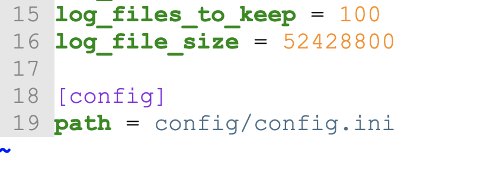

# config.ini

```
from csvpath import CsvPath
path = CsvPath()
```

CsvPath will create a config directory. The config directory will have the default config.ini file. The default config file has sensible defaults.&#x20;

If you want to move your config to another location, simply add the other location to the default config file as path.

<figure><figcaption></figcaption></figure>

Once you do that, you can clear out any other configuration values. Or you can leave them. Either is fine.&#x20;

When you start CsvPath it will check to see if it should load your config from another location. It will find the location in an env variable or in the path key in the default config.ini.

<figure><figcaption></figcaption></figure>

## The Defaults

When you start a new CsvPath project in an empty directory, the first time you run a `CsvPaths` or `CsvPath` instance `Config` will create default assets for you:

* The `config` directory and a default `config.ini`
* An empty `log` directory
* An empty `cache` directory
* And, when you use a `CsvPaths` instance, an `archive` directory to hold serialized results

The `log` directory will be empty until your first run. The `cache` directory will be empty until your first `CsvPaths` instance run. `CsvPath` does not cache.&#x20;
