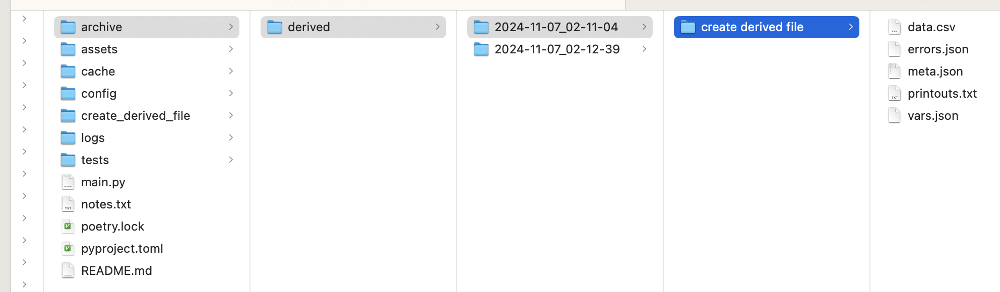
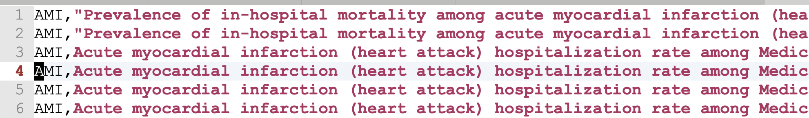

# Creating a derived file

How would you create a new CSV file from an existing CSV file? Easy!&#x20;

* First set up a project&#x20;
* Create a `CsvPaths`
* Load the file manager and paths manager with the original file and your csvpath
* Create a simple csvpath, like the one below (or not so simple, if needs be)
* Run your csvpath
* Check the `archive` folder to see your results

Here is the Python side of things:&#x20;

```python
from csvpath import CsvPaths

if __name__=="__main__":
    paths = CsvPaths()
    paths.paths_manager.add_named_paths_from_file(name="derived",
                                                  file_path="assets/derived.csvpath")
    paths.file_manager.add_named_file(name="data", 
                                      path="assets/Medicare_Claims_data-550.csv")

    paths.collect_paths(pathsname="derived", filename="data")
```

As usual, we create a `CsvPaths` instance and feed it a data file and a csvpath file. Then we call `collect_paths`, passing the named-file and named-paths we used.

Here's a simple csvpath we could run on some Medicare data. It limits the data collected, adds a column, replaces some text, and creates the new file. It's obviously not the absolute simplest example, but the extra feature-use gives a sense for the possibilities.


```xquery
~
  name: create derived file
  description: we're going to create a new csv file that has
               only the lines and headers we want. :
~
$[1*][
    #Question 
    append("Day", now() )
    regex(/Acute Myocardial Infarction/, #Topic) -> replace("Topic", "AMI")
    collect("Topic", "Question", "Day")
]
```


Let's break this down. Line's 1-5 are just comments. There are two metadata fields. The name field sets the identity of this csvpath. The identity would help us trace validation and syntax errors if we had multiple csvpaths. Since we don't have multiple csvpaths it is really just documentation.

Line 6 says we are going to skip the header row. We will of course use the headers, we just don't want to treat them as data.

Line 7 is an existence test for values in the header we name. Only lines that have values in `Question` will be collected. Remember that we're ANDing all the match components together to figure out which lines to collect.

On line 8 we append a new header that always has the `datetime` value given by `now()`. This line has no effect on matching.

Line 11 does a replacement in the `#Topic` header. It changes `Acute Myocardial Infarction` into `AMI`. We're using a when/do expression. The left-hand side of a when/do impacts matching, unless you explicitly say it shouldn't using a `nocontrib` qualifier. Since we didn't use `nocontrib`, line 11 limits our results to lines where the topic header includes the words `Acute Myocardial Infarction`.

Finally line 12 limits collection to only the named headers. Those will go into our output data file.

This is what your project and results would look like:&#x20;

<figure><figcaption></figcaption></figure>

The derived file you created is `data.csv`. And your new data would look like this:&#x20;

<figure><figcaption></figcaption></figure>
