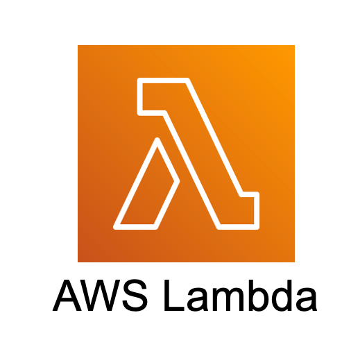

# CsvPath in AWS Lambda

<figure><figcaption></figcaption></figure>

AWS's parts bin may be the ultimate for DIY MFT. The components include:

* Transfer Family for secure transfer
* IAM and Identity Center for authentication
* S3 for storage, aging, retention, etc.
* Lambda for processing &#x20;

Of course there are many other services that might also come into play. AWS has more than everything you need. That said, some assembly is required and batteries are not included.&#x20;

We can make setting up data onboarding a bit easier by showing how an automatically triggered lambda can enable CsvPath to pick up a newly arrived file for registration, validation, canonicalization, and publishing. When you have finished this page you will have a fully automated a file onboarding process. What we do on this page builds on the [description of CsvPath's S3 capabilities here](inputs-and-or-outputs-in-aws-s3.md).

## The steps we are about to take

The steps are straightforward:&#x20;

* Create two S3 buckets
* Create the lambda
* Create a CsvPath lambda layer
* Load your named-paths group
* Drop a data file to test

Before we start, caveats abound. Primarily, most of these steps are deep topics and this isn't a complete tutorial on setting up infrastructure in AWS. We can get you close to the beach, but you are definitely going to have to get your feet wet. If that is not what you're looking for, try one of CsvPath's other integrations that might be quicker. SFTP and SFTPPlus are worth a look. Another caveat, we're focused on the simplest automated thing that could possibly work. This is not typically how you would go about setting up a production environment. If you haven't already, check out [Terraform](https://www.terraform.io/) and/or CloudFormation.

## Create the buckets

We will use two buckets. One for inbound files and one for CsvPath assets. Our assets bucket will hold the results archive and the two inputs directories for files and csvpaths.&#x20;

1. Log into AWS and navigate to S3
2. Create two buckets with default settings. Make one have a name that tells you the bucket is for inbound data. The second bucket's name should indicate that it holds a CsvPath assets.&#x20;

Our requirements are basic. For all S3's innumerable options, the buckets should be a snap.

## Create the lambda

<figure><figcaption></figcaption></figure>

1. Open the Lambda service and click the `Create function` button
2. Use a name that tells you this lambda is for inbound data processing
3. Allow AWS to create a new role for the lambda
4. Pick Python as the platform. Either AMD or ARM works.
5. Link the inbound bucket to the lambda. Click `Add a trigger`. In the `Trigger Configuration` page select S3 as your source. Pick your inbound bucket. All object create events should be selected. Acknowledge the warning about using one bucket for inputs and outputs. A write-event-driven lambda-bucket pair that reads and writes to the same bucket cause endless loops. There are some safeguards, but it is a problem you definitely want to avoid. We have two buckets, one for arrivals and one for CsvPath's own use. The arrivals bucket triggers the lambda and the lambda writes to the CsvPath framework's bucket. No loops.
6. In the `Configuration` tab, select `General configuration` and click `Edit`. Change the `Timeout` field from 3 seconds to 3 minutes. The way we are setting up CsvPaths for this example our runs will need more than 3 seconds.

We're done with the core of creating the lambda. Before we configure our lambda, let's create the lambda layer that provides the dependencies we need.

## Create a lambda layer

Lambda layers make it easy to setup your dependencies and share them across lambdas. You can [read about lambda layers here](https://docs.aws.amazon.com/lambda/latest/dg/chapter-layers.html). Creating a lambda layer is pretty straightforward. While our way works, we're no experts and cannot guarantee there isn't a better way to do it.&#x20;

As elsewhere on this site we'll use Poetry for our Python projects. If you prefer another way, by all means do that.

We'll create a Poetry project to create the lambda layer. Typically the project would be a home for our lambda, but in this case we'll just use the Lambda service's `Code Source` tab to write the actual lambda.&#x20;

Instead, this project will give us an empty wheel that defines all its dependencies. We'll then install the wheel, along with its dependencies, and zip up the directory as our layer.&#x20;

1. Create a Poetry project: `poetry new tin_penny_toys_orders`
2. `cd` into your new project
3. Add the `csvpath` library: `poetry add csvpath`
4. Do a Poetry build with: `poetry build`
5. `cd` into the `dist` directory and run these commands:

```bash
mkdir layer
poetry run pip install --upgrade -t layer/python ./*.whl
cd layer ; zip -r ../lambda_layer.zip python -x '*.pyc'
```

You should see a `lambda_layer.zip` containing your dependencies. This is the artifact we upload to make the lambda layer.&#x20;

1. Back in the Lambda service, in the left column nav click on `Layers`
2. &#x20;At the top right, click on `Create layer`
3. Give your layer a name that you'll remember and upload your `lambda_layer.zip` file
4. Click the `Create` button at the bottom right
5. When the create succeeds you will be in the new layer's page. Look at the `Versions` table. There is one version. Copy its ARN.
6. In the left-hand nav, click on `Functions` and open the inbound function you created a few moments ago.
7. At the bottom of the `Code` tab is a table of layers. Click the `Add layer` button at the bottom right.&#x20;
8. In the `Add layer` form's `Choose a layer` box, select `Specify an ARN`. Paste your new layer's ARN in the field below.

We're doing well. Just a few more steps! Some code and then some permissions.

## Code the lambda

The lambda code and configuration is pretty minimal.  Here's the Python part:&#x20;


```python
import json
import os
import traceback
import logging
import boto3
from csvpath import CsvPaths
from csvpath.util.box import Box

client = boto3.client('s3')

def lambda_handler(event, context):
    with Box() as b:
        b.add("boto_client", client)
        logger = logging.getLogger()
        logger.setLevel(logging.INFO)

        paths = CsvPaths()
        namedfile = os.environ['file']
        namedpaths = os.environ['paths']
        newfile = f"s3://{event['Records'][0]['s3']['bucket']['name']}/{event['Records'][0]['s3']['object']['key']}"

        paths.file_manager.add_named_file(name=namedfile, path=newfile)
        paths.collect_paths(filename=namedfile, pathsname=namedpaths)

        return {
            'statusCode': 200,
            'body': json.dumps('Success! Check the archive.')
        }
```


Here's what's going on:

* Line 9: we get a `client` that we'll use to interact with S3. We get it up here and share it below through the `Box` to provide access to all the components that need to use it.
* Line 17: `paths` is the core of our Lambda. It coordinates all the configuration and runs the named-paths group.
* Line 18, 19: `namedfile` and `namedpaths` name our assets in S3. We're getting the values from the environment. We haven't set the environment up yet.
* Line 20: `newfile` is the S3 URL of our arriving file. It is coming from the event that S3 called our lambda with.
* Line 22: we have a new file so we need to register it under the name we use for Tin Penny Toys's orders. We'll configure the name when we setup env vars.
* Line 23: this is where the run happens. We apply our named-paths to this new orders file.

## Config, Config

There are two sets of configuration to do. We need to add our `config.ini` and we need to set up env vars.

Jump back to the Code source tab.

1. Right click in the explorer and add a file. Call it `config.ini`
2. Paste in the configuration below, changing it to match your names and URLs.  (This is pretty stock, but if you want to generate your own default just run the CLI to give CsvPath a chance to create one. We do this below in a moment).


```ini
[csvpath_files]
extensions = txt, csvpath, csvpaths

[csv_files]
extensions = txt, csv, tsv, dat, tab, psv, ssv

[errors]
csvpath = collect, fail, print
csvpaths = raise, collect

[logging]
csvpath = debug
csvpaths = debug
log_file = /tmp/csvpath.log
log_files_to_keep = 100
log_file_size = 52428800

[config]
path = config.ini

[cache]
path = .
use_cache = no

[functions]
imports = functions.imports

[listeners]
groups =
#slack, marquez, ckan, sftp, sftpplus

# add slack to the list of groups above for alerts to slack webhooks
slack.file = from csvpath.managers.integrations.slack.sender import SlackSender
slack.result = from csvpath.managers.integrations.slack.sender import SlackSender
slack.results = from csvpath.managers.integrations.slack.sender import SlackSender

[slack]
# add your main webhook here. to set webhooks on a csvpath-by-csvpath basis add
# on-valid-slack: webhook-minus-'https://' and/or
# on-invalid-slack: webhook-minus-'https://'
webhook_url =

[results]
archive = s3://csvpath-order-management-archive/archive

[inputs]
files = s3://csvpath-order-management-archive/inputs/named_files
csvpaths = s3://csvpath-order-management-archive/inputs/named_paths
on_unmatched_file_fingerprints = halt
```


Here are the important things:&#x20;

* **Lines 44, 47, 48**: make these point to your CsvPath S3 buckets. Your arriving files come into the other bucket. When you stage a newly arrived file it will be copied into the inputs/named\_files directory.
* Lambda has a read-only file system. The only locally writable space is `/tmp`. We need to make changes to adapt to that.&#x20;
* **Line 23**: turn off caching. We could point the cache to `/tmp/cache`, but in this case we're setting up a completely automated production system where we don't anticipate starting runs iteratively and watching them run, as we would do in development. Given that, the cache doesn't help us.
* **Line 19**: make the config file live at the root of the lambda, just where it is.
* **Line 14**: point the log to `/tmp`
* **Lines 8, 9**: remember to change your error handling setting to match what you're looking for. In production we often don't `raise` errors because we don't want to halt processing. Likewise, we may not want to `stop` on error.

And that's it. Your `config.ini` should be all set. Now let's do the env vars. Click on the `Configuration` tab, Select `Environment variables` in the left-hand nav, and click `Edit`. We need to add three vars:&#x20;

* `CSVPATH_CONFIG_PATH` = `config.ini`
* `file` = `orders`
* `paths` = `orders`

The first, `CSVPATH_CONFIG_PATH`, is needed to tell the `CsvPaths` instance where to find config.ini. If we didn't provide it, `CsvPaths` would look at the default location, `config/config.ini`, which doesn't work for a lambda.

The other two vars are giving the logical name of our inbound files and the named-paths group name that identifies the set of csvpaths we want to run on each new orders file.

<figure><figcaption></figcaption></figure>

That's it. Our lambda configuration is done. But we still need to setup the right permissions for the Lambda service to access S3.

## Setup the permissions

Still in Lambda, click into the `Configuration` tab, if you're not already there. Select `Permissions` in the left-hand nav. You can see the role your lambda is using on the right-hand side. In the `Resource Summary` you can see it has permission to work with CloudWatch already. We need it to also have permission to work with S3.

Click the role name to open the role in IAM. In the `Permissions policies` box you can see a narrowly defined permission for the role to work with logs. We're going to allow the role to also work with S3. Because this is a quick example, we're not going to be careful to provide least privledge. Instead we're just going to make it work. You should of course be more careful in general, and definitely more thoughtful in production.

* Click Add permissions, Attach policies
* Type `s3f` in the `Other permissions policies` search and you should see `AmazonS3FullAccess`. Check that policy and click `Add permissions`.

You should get a message that the policy was attached to the role and you should see the two policies the role has listed.&#x20;

<figure><figcaption></figcaption></figure>

Now let's set up our named-paths.

## Create and load the named-paths

Back in your local Python project let's setup our named-paths. If you have named-paths already loaded you can use those. But supposing we don't have any already loaded? Let's see what to do.

First fire up the CLI to make sure we have `config.ini` and other assets created. Do:&#x20;

```
poetry run CLI
```

<figure><figcaption></figcaption></figure>

Select `quit`. We just needed to give CsvPath the chance to generate a config file.

Open `config/config.ini` and make one change. Set `[inputs] csvpaths` equal to your named-paths location in your CsvPath assets bucket. It will be the same path as you used in `[inputs] csvpaths` in your lambda's `config.ini`. It might look like:&#x20;

```ini
[inputs]
csvpaths = s3://csvpath-order-management-archive/inputs/named_paths
```

Everything else is fine as-is. Remember to make sure you have your secret key and access key environment variables setup. AWS looks for `AWS_ACCESS_KEY_ID` and `AWS_SECRET_ACCESS_KEY`.&#x20;

Now create a simple csvpath called `orders.csvpath`. Put it in a `named_paths` directory at the root of your project. Since the point here is to wire up AWS let's just go super trivial on the CsvPath Language.  Create the file with:&#x20;

```xquery
~
 id: hello-world
~
$[*][
    print("hello world!")
]
```

This path will be named `hello-world` and it will print `hello world!` once for every line of every file it sees.

Now fire up the CLI again and let's push the named-paths to S3. Do `poetry run cli` again.

1. Select `named-paths`
2. Select `add named-paths`
3. Type in `orders` as the name of the named-paths group
4. Pick `file`
5. Drill down to select `./named_paths/orders.csvpath`

<figure><figcaption></figcaption></figure>

<figure><figcaption></figcaption></figure>

<figure><figcaption></figcaption></figure>

<figure><figcaption></figcaption></figure>

<figure><figcaption></figcaption></figure>

There should be a brief pause as your file uploads. Then you should be able to see it in S3 under the `named_paths` directory.

Now we're ready to test an inbound file arrival.

## Try it out!

Testing this setup is easy. Just navigate to your S3 bucket and upload a file.

You should see a log begin spooling in the lambda's `Monitor` tab. And you can watch your results bucket to see that you successfully staged your named-file and created the named-paths group results.

There are many ways to optimize this setup. What you have is the quick-get-something-working version. Now that you can see CsvPath basically working, you can think about how to iteratively improve your solution.
