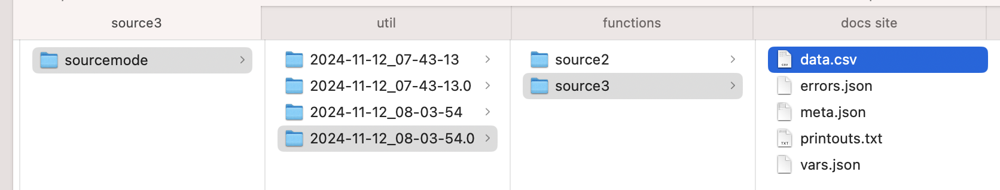

# Doing rewind / replay, part 1

In [Replay Using References](replay-using-references.md) we looked at how to start a run based off an intermediate state of a past run. Let's take a look at an example. This will be very artificial, but it will give you a more concrete understanding that you can bring to more real-world situations.



There is a [CLI version of this how-to here](doing-rewind-replay-part-2.md). No Python required. And there is a video of the CLI at the bottom as a bonus.


Implementing the rewind concept is build up from parts:

* Named-paths groups&#x20;
* Csvpath identities
* Collected data
* `source-mode: preceding`
* References

In brief: we rewind back csvpath steps in a named-paths group of csvpaths. Each of the csvpaths create an intermediate output by selecting lines and, optionally, changing or adding data. Source-mode preceding pipes intermediate form data from one csvpath to the next. And references give us a way to point to the intermediate data and pull it into a csvpath from the named-paths group to create a new run.

We'll start with a simple three csvpath named-paths group. Each csvpath is unimaginatively named: `source1`, `source2`, `source3`. The csvpaths pipe their output from one into the next. We run the csvpaths in the group serially. After the first run we find something to improve in the second csvpath. We want to run the group again after our improvements. But ideally we would skip the first csvpath because that one is time consuming. What to do?

<figure><figcaption></figcaption></figure>

For more background on how results are stored please read: [Where Do I Find Results?](../../higher-level-topics/data-validation-files-and-storage/where-do-i-find-results.md)

Our named-paths group, called "sourcemode", looks like this:&#x20;

```xquery
~ name: source1 ~
$[*][
    firstline() -> print("this is $.csvpath.identity at line $.csvpath.line_number working on data from $.csvpath.file_name with headers $.csvpath.headers")
    #firstname #lastname
    append("count", count(), yes())
    collect("firstname", "lastname", "count")
]

---- CSVPATH ----
~ id: source2
  source-mode: preceding ~
$[*][
    firstline() -> print("this is $.csvpath.identity working on data from $.csvpath.file_name with headers: $.csvpath.headers")
    gt(#count, 4)
    append("working", random(0,5), yes() )
    collect("firstname", "lastname", "working", "count")
]

---- CSVPATH ----
~ id: source3
  source-mode: preceding ~
$[*][
    firstline() -> print("this is $.csvpath.identity working on data from $.csvpath.file_name")
    print("$.headers.firstname, $.headers.lastname, $.headers.working")
    collect("firstname", "lastname", "working")
]
```

You can run this group using this Python:&#x20;

```python
paths = CsvPaths()
paths.file_manager.add_named_file(name="sourcemode", path="test.csv")
paths.paths_manager.add_named_paths_from_file(
    name="sourcemode", file_path="source_mode.csvpaths",
)
paths.collect_paths(filename="sourcemode", pathsname="sourcemode")
```

As usual, we create a `CsvPaths` instance and register our delimited file with a simple name. Likewise with our named-paths group. In this case we're putting all three csvpaths in one file, so that's all we have to tell our `CsvPaths` instance about.&#x20;

After running this super simple setup, this is what we get.&#x20;

<figure><figcaption></figcaption></figure>

The structure is:&#x20;

<figure><figcaption></figcaption></figure>

The key result file for us for this example is data.csv. Every csvpath that is used to collect lines from a delimited file by a CsvPath instance sends its collected data to a data.csv file. (You can choose to not store the data on disk and of course you can also just not collect it).

You can see that these csvpaths each did their modifications to the data in a way that impacts the final results coming out of `source3`.

* `source1` added a `count` header and limited the lines collected to only those with both firstname and lastname
* `source2` appended a `working` header  with a random number from 0 to 5, and limited the lines collected to only those where `count` is greater than 4&#x20;
* And, finally, `source3` removed the `count` header

The result is this:

<figure><figcaption></figcaption></figure>

That's all well and good. But let's make a change in `source2` and set ourselves up to use the output of the first run of `source1` as our input. To keep it simple, just change `working` to `thinking`.

<figure><figcaption></figcaption></figure>

Great! Now, because we want to save bytes and watts we're going to rewind to `source2` using `source1`'s data.csv in our new run. Here's the Python:&#x20;

```python
paths.collect_paths(
    filename="$sourcemode.results.202:last.source1",
    pathsname="$sourcemode.csvpaths.source2:from",
)
results = paths.results_manager.get_named_results("sourcemode")
```

I can hear you muttering _that's it?!_&#x20;

Yeah, that's it. In fact, the last line is a complete add-on, you may or may not want to inspect the results programmatically. Basically, rewind is a one-liner.&#x20;

The two references are pretty straightforward. The datatypes are important:&#x20;

* `results` indicates that we're looking at the data resulting from running our named-paths
* `csvpaths` is the datatype that represents the named-paths group we're working with

The only other things to pay attention to are the tokens embedded in the references. There are four tokens you can use in references. They start with a colon:&#x20;

* For the date-stamps of runs:&#x20;
  * `:last`
  * `:first`&#x20;
* For the position of csvpaths in their named-paths group:
  * `:from`&#x20;
  * `:to`&#x20;

As you would guess, they do exactly what you'd expect. The `:first` and `:last` tokens replace the right-hand side of run date-stamps to make them easier to remember and manipulate programmatically. The `:from` and `:to` tokens are appended to csvpath identities to indicate that we don't want just the csvpath identified, but also want its predecessors or successors.&#x20;

The result after `source3` is exactly what we were looking for. Which isn't much, in this trivial example, but still.&#x20;

<figure><figcaption></figcaption></figure>

How do we know that we successfully did a rewind?  Well, a couple of things. The biggest tell is that we don't have a results directory for `source1`.

<figure><figcaption></figcaption></figure>

You can also look at the `source2` `meta.json` from the rewind run to see what the settings and inputs were. In a full automated DataOps Collect, Store, Validate pattern this is where the rubber hits the road. Or at least one place.&#x20;

<figure><figcaption></figcaption></figure>

You can see on line 3 that we're sourcing data from `source1`. On line 16 you can see that our configuration calls for us to grab the `data.csv` output of the last csvpath.&#x20;

Here is the same `source2` `meta.json` information from the first run. Because we did the runs in one script they ended up in adjacent directories: the first in `2024-11-12_08-03-54` and the second in `2024-11-12_08-03-54.0`. Notice that in the metadata shown above and below both times we pull `source2`'s data from `2024-11-12_08-03-54`, not from the second run `2024-11-12_08-03-54.0`.

<figure><figcaption></figcaption></figure>

You can see that we are pulling data from the named-file `sourcemode`, not a physical file path. And you can see that we captured a `source-mode-source` metadata key to identify how we swapped in `source1`'s `data.csv` instead of using the `sourcemode` file. &#x20;

And that's about it. Rewind and replay are not hard. In fact, pretty darned easy, right?
