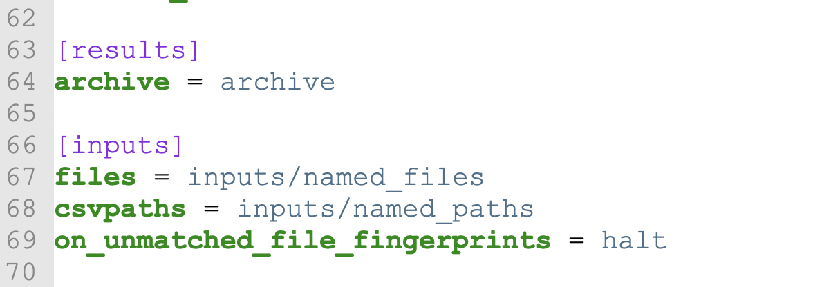

# Inputs and/or outputs in AWS S3

<figure><figcaption></figcaption></figure>

There are three places CsvPath keeps files:&#x20;

* The Archive — the place where results live
* Inputs:
  * Named files — all the source Excel and CSV data files
  * Named paths — your named groups of csvpaths

Each of these can be independently placed. By default Archive is the folder at `./archive`. Named-files and named-paths default to:

* `./inputs/named_files`
* `./inputs/named_paths`

All of these locations and names can be changed. Keep in mind that the Archive takes its name from the last part of its path. That means that if you put your archive at `./this/is/my/stuff` your archive will be named `stuff`. In most cases that doesn't matter, but when we're using integrations, such as the CKAN integration, the archive name may be more meaningful.

How do you set up the three file storage locations? Easy. There are three settings in `config.ini`. By default config.ini is in `./config/config.ini`. The settings you need are in the `[results]` and `[inputs]` sections. Archive is set under `[results]` with the archive key. Named-files and named-paths are set under `[inputs]` using the `files` and `csvpaths` keys, respectively.

<figure><figcaption></figcaption></figure>

If you'd like your results to go to an archive in S3 all you need to do is set the `archive` key to an S3 URI like:&#x20;

```ini
archive = s3://csvpath-example-1/archive
```

&#x20;Using this setting would send all results to the `csvpath-example-1` bucket with paths beginning with `archive`. (S3 doesn't truly have directories, but in effect, everything goes into the `archive` directory).

Likewise, to store your source data in S3 you would set a key like:&#x20;

```ini
files = s3://csvpath-example-1/inputs/named_files
```

Bear in mind that as soon as you separate your data and compute you incur a network latency cost, as well as actual dollars and cents costs. There are ways to mitigate the latency and moving your compute to AWS along with your data is likely to be a big help. All-in-all, using S3 is sweet, but as with any work you do using CsvPath, try, test, automate, and iterate.
