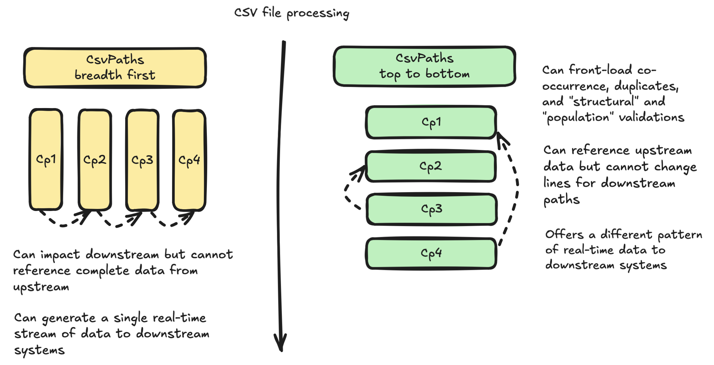

# In Serial Or Breadth-first?

Using CsvPaths, you have a choice to run multiple csvpaths against a file serially or line-by-line. What is the difference? Why would we choose one over the other?

## The methods

On CsvPaths look for these lines for serial runs:&#x20;

* `collect_paths()`
* `fast_forward_paths()`
* `next_paths()`

Using these methods, CsvPaths runs a csvpath through every line in the CSV file before it moves to the next csvpath and restarts the file from the first line.

For "breadth-first" runs, look for these CsvPaths methods. They have every csvpath in the run examine each line before CsvPaths moves forward to the next line:&#x20;

* `collect_by_line()`
* `fast_forward_by_line()`
* `next_by_line()`

## How to choose

Usually, top-to-bottom serially vs side-to-side breadth-first is not a big decision. In the usual case it just doesn't matter. However, as your use of CsvPath expands and your needs grow there are reasons why sometimes the choice becomes important.

A breadth-first run has as its most important consideration that it allows one csvpath to modify the inputs to the next csvpath. This is because all the csvpaths are working on the same data in memory.&#x20;

A a simple example, this output came from a property inventory CSV made available by the City Of Boston. The top run is a serial run of two csvpaths. The bottom run is a parallel run of the same two csvpaths. Notice the change in capitalization in the #4 and #6 headers in the bottom, parallel run:&#x20;

<figure><figcaption></figcaption></figure>

Here is the Python code that generated those results:&#x20;


```python
from csvpath import CsvPaths

paths = CsvPaths()
paths.files_manager.add_named_file( name="property", path="csvs/fy2024-property-assessment-data_1_5_2024.csv")

paths.paths_manager.add_named_paths_from_file(
        file_path="csvpaths/downstream/property.csvpath",
        name="downstream")
paths.paths_manager.add_named_paths_from_file(
        file_path="csvpaths/downstream/property2.csvpath",
        name="downstream")

print("\n============= ONE: paths ================")
paths.fast_forward_paths(pathsname="downstream", filename="property")

print("\n============= TWO: by line ================")
paths.fast_forward_by_line(pathsname="downstream", filename="property")

```


* Line 3: we create our `CsvPaths` runner
* Line 4: pick a CSV file
* Lines 6 and 9: there are two simple csvpaths that we will run in serial and in parallel
* Line 14: the serial run
* Line 17: the breadth-first run

And here are the two cvspaths. The top, first csvpath:


```xquery
$[10][
    row_table(4,6)
    replace("CITY", lower(#CITY))
    replace(4, upper(#4))
]
```


And the second, bottom csvpath:&#x20;

```xquery
$[10][ row_table(4, 6) ]
```

The file is \~80 Mb but we're only looking at line 10 and the match components are simple so this is a quick test.  It prints out the tables in the screenshot above.&#x20;

You can see that in lines 3 and 4 of the first csvpath we changed the city and street name headers by lower-casing and upper-casing them. In the serial execution that had no effect on the second csvpath. Whereas, in the breadth-first run you can see that what we did in property.csvpath had an impact on what property2.csvpath received.

Here is a visual the highlights the main considerations of serial vs. parallel runs. There aren't many. However, when they become important, they are very important.

<figure><figcaption></figcaption></figure>

