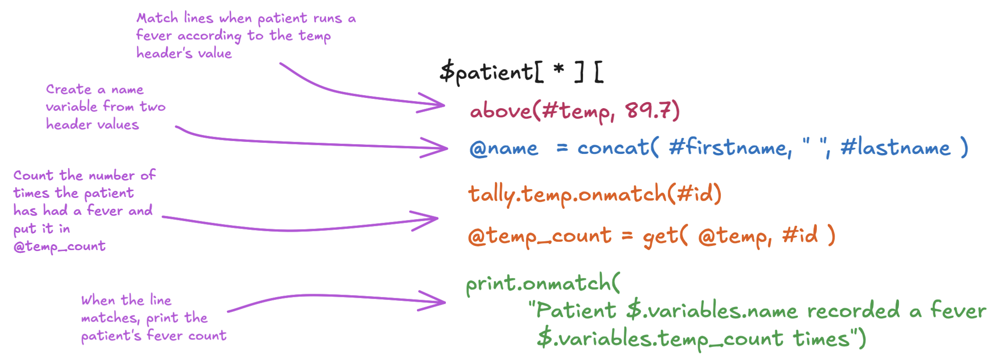

# Language Basics

The CsvPath language is simple, declarative, and purpose-built. Here is a quick introduction. As well as in these pages, there is [more information and more examples on Github](https://github.com/dk107dk/csvpath/tree/main).

* [Root, Scanning, and Matching](language.md#root-scanning-and-matching)
* [File References and Match Components](language.md#file-references-and-match-components)
* [Scanning Expressions and Variables](language.md#scanning-expressions-and-variables)
* [Comments and Linebreaks](language.md#comments-and-linebreaks)
* [When/Do Expressions and References](language.md#when-do-expressions-and-references)
* [Multiple Validation Rules](language.md#multiple-validation-rules)
* [A Complex Validation Rule](language.md#a-complex-validation-rule)

## Root, Scanning, and Matching

<figure><figcaption></figcaption></figure>

## File References and Match Components

<figure><figcaption></figcaption></figure>

## Scanning Expressions and Variables

<figure><figcaption></figcaption></figure>

## Comments and Linebreaks

<figure><figcaption></figcaption></figure>

## When/Do Expressions and References

<figure><figcaption></figcaption></figure>

## Multiple Validation Rules

<figure><figcaption></figcaption></figure>

## A Complex Validation Rule

<figure><figcaption></figcaption></figure>
