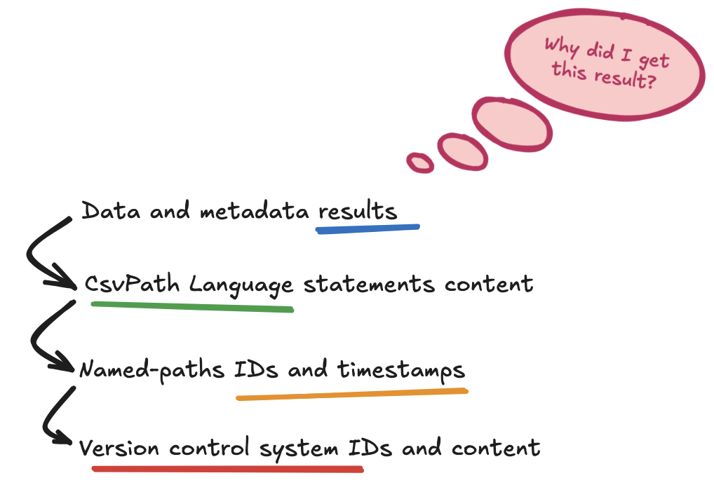
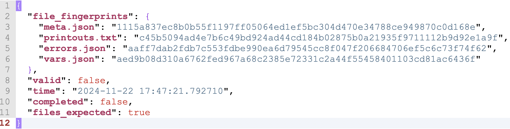
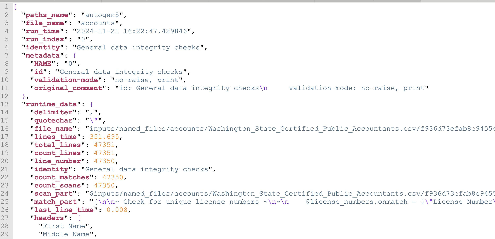

# Manifests and Metadata

As you may have read in [File Management ](data-validation-files-and-storage/file-management.md)and [Where Do I Find Results](data-validation-files-and-storage/where-do-i-find-results.md), the CsvPath Library generates a lot of metadata. The goal is to provide a high-trust environment to do Collect, Store, Validate Pattern processing. When you are dealing with delimited data in file-based data flows you have the potential for control problems due to both low-structure data and low-structure data flow. The Collect, Store, Validate pattern captures complete lineage and action records and limits the degrees of flexibility in the overall process architecture to counteract the risks and enable fast remediation.&#x20;

Let's look at where the data is. The CsvPath Library keeps files in:

* `inputs/named_paths` for CsvPath Language validation files
* `inputs/named_files` for source data files
* `archive` for results of running named-paths against named-files

&#x20; Each area has its own strategy for files and data management. At the highest level, the common feature is a `manifest.json` file.

## inputs/named\_paths

Named-paths are captured in a single file that contains all the csvpaths that you create for the same group, regardless of if you put them in one file, a single directory, itemize them in a JSON file, or pass them in programmatically as a list of csvpath strings. The single file is always named `group.csvpaths`.&#x20;

Named-paths also have up to two JSON files a `manifest.json` and a copy of any JSON file that identified the csvpath statement members of the group. The latter is always named `definition.json`, regardless of what the original JSON file was named. `definition.json` includes the entire original JSON file contents, not just the definition of that named-paths group. If you didn't use a JSON file to create the named-paths group there will naturally be no `definition.json`.

manifest.json is where we get into controls. The CsvPath Library expects CsvPath Language controls from two directions:

* Before you add your CsvPath Language files you manage them in a revision control system of some kind. Git is the standard-bearer. You don't have to follow this practice, but the Library assumes that you do.
* After you add a file containing one or more csvpaths, the Library tracks changes to the content of the named-paths group in the manifest.json.&#x20;

The named-paths manifest is the simplest of the manifest types used by the Library. It contains:&#x20;

* **`file`**: the full path to your `group.csvpaths` file
* **`fingerprint`**: a [SHA 256](https://en.wikipedia.org/wiki/SHA-2) hash of the content of `group.csvpath` at the time it was last added or updated giving a unique exact ID to the content of the file
* **`time`**: the timestamp of the most recent add or update of `group.csvpath`

We don't need a lot more information in this file area. The version control you do with your CsvPath Language files gives you version security. The metadata the Library captures when you run a named-paths group gives you the content of the action-based change. All that manifest.json needs to do for the named-paths group is allow you to connect those dots so that you can go from:&#x20;

* results of executed validation statements at a point in time
* to the version IDs registered with the Library at a point in time&#x20;
* to the versions in your version control system&#x20;

<figure><figcaption></figcaption></figure>

Keep in mind that you also have `logs/csvpath.log`. The log is on `WARN` by default, but you can get lots more information by putting it on `INFO` or even `DEBUG`. Experiment with that setting in [config/config.ini](../getting-started/how-tos/config-setup.md).  And, of course, you have control of if the Library and CsvPath Language team up to complete your run, or stop early, using the `validation-mode` [settings in your csvpath](the-modes.md) statements and error policies in `config.ini`.&#x20;

## inputs/named\_files

There's more going on in the named-files metadata and control structures. Named-files are stored in directories under `inputs/named_files`. Each directory name is the name of the file it contains. Each directory has a directory within named for the original file. And that directory has one or more files named by the SHA 256 hash of the contents of the original file each time it changes. The named-file directory also contains a `manifest.json`.&#x20;

In the case of named-files, the CsvPath Library doesn't make assumptions about any external version control system. Instead it captures each version of the source file you present to it permanently, tracking it with that hash. While a system like Git is much more sophisticated, the Collect, Store, Validate pattern doesn't really require all the things Git can do. It mainly requires a way to identify versions, trace where they are used, and inspect them or reuse them when needed.&#x20;

Named-file manifests are a list of states of the file they track. Each state has this information:&#x20;

* **`type`**: the file type, as identified by the extension&#x20;
* **`file`**: the file path to the version of the file at this point in time
* **`fingerprint`**: the SHA 256 has of the contents of the file at this point in time
* **`time`**: the time the version of the file was registered with the CsvPaths Library
* **`from`**: the file system location of the version that was copied into the CsvPaths Library under this name

There are a couple of things to remember.&#x20;

* CsvPath Library checks if the fingerprint of the most recent version is the same as the fingerprint of the content about to be run. If those fingerprints differ, and if `config/config.ini`'s `[inputs]` section has a `on_unmatched_file_fingerprints = halt` (which is the default) the Library will throw an exception. This is so that people don't make changes to the files that have been registered with the Library.
* A reference to a named-file looks to the results of another named-paths run. Read [more about how that works here](../getting-started/how-tos/file-references-and-rewind-replay-how-tos/replay-using-references.md). The point here is that when you do that you are using a file that has no fingerprint or bytes in the named-files area. This doesn't completely eliminate your ability to trace down how a result came to be. But it does may the linage path very different and tracing have a few more steps.&#x20;
* `source-mode: prededing` will also result in fingerprint mismatches. Recall that `source-mode` determines if your csvpaths all work off the same file, or if they work off the file resulting from the csvpath preceding them. When `source-mode` is `preceding` the data input is `data.csv` from the path directly prior, not the named-file; therefore, there is no fingerprint to match. And again, controls are still robust, but it takes a bit more effort to trace because of the multiple locations.

## archive

The `archive` holds what we call named-results. A named-result is a set of results named for its named-paths group. Your results are called by the same name as the group of scripts that created them. The `archive` directory has:

* One `manifest.json` for all results in the archive&#x20;
* In each named-results directory there are time-stamped run directories, each containing a `manifest.json`
* Within each run directory there is a directory for each csvpath in the named-paths group, each with files of data results, data exhaust, report output, and metadata files, including a `manifest.json`

First the top-level `manifest.json`. The file is a flat list of runs of individual csvpaths by the CsvPaths Library in the order they happened without grouping. Each csvpath is run by a `CsvPath` instance that is managed by a single `CsvPaths` instance. The run bookeeping is sequential in run-by-run order and, within runs, cvspath-by-csvpath. Each looks like:&#x20;

```json
  {
    "file_path": "inputs/named_files/accounts/Washington_State_Certified_Public_Accountants.csv/f936d73efab8e94554eae80020b328a8924482536969c513e541412a9d080435.csv",
    "file_size": 4918741,
    "file_last_change": "Thu Nov 21 16:22:47 2024",
    "fingerprint_provided": "f936d73efab8e94554eae80020b328a8924482536969c513e541412a9d080435",
    "fingerprint_found": "f936d73efab8e94554eae80020b328a8924482536969c513e541412a9d080435",
    "time": "2024-11-21 16:22:47.478917",
    "target": "archive/autogen5/2024-11-21_04-22-47",
    "identity": "General data integrity checks"
  },

```

The results metadata in `manifest.json` is entered at the beginning of the run. The contents of the named-result instance files are spooled out as the run happens or written at the end.&#x20;

A run instance is a directory under the named-results that has a date stamp name like `2024-11-21_04-26-41`. Each time-stamped directory contains the results of a single run of the named-paths group. The timestamp is, of course, an important piece of metadata. Beyond that, there's a lot more.&#x20;

Directly within the run directory there is a manifest.json that gives:&#x20;

* **`all_completed`**: `true` if all `CsvPath` instances finished running their delimited data file through their csvpath&#x20;
* **`all_valid`**: `true` if all `CsvPath` instances report that they ended up in the valid state&#x20;
* **`error_count`**: a count of all the errors collected by the `CsvPath` instances involved in the run. Note that this error count doesn't count any `CsvPaths` instance errors that might happen during setup or tear-down of the run.
* **`all_expected_files`**: `true` if all files expected to be generated according to the `file-mode` setting (or default when there is no explicit `file-mode` setting) were in fact generated&#x20;
* **`time`**: the time the manifest was generated

Within each instance directory there are directories named for the individual csvpath scripts in the named-paths group.  When you run a csvpath using the CsvPath Library it has an identity. If you use a CsvPath Language comment to give your csvpath a `name` or `id`, that is its identity. Otherwise, the identity is the csvpath's index in the run sequence.&#x20;

<figure><figcaption></figcaption></figure>

The files included in the named results instance directory are:&#x20;

* **`data.csv`**: the data generated by the csvpath. This can be matched lines (typically) or the unmatched lines
* **`unmatched.csv`**: optionally, whichever set of lines is not captured in `data.csv` may be captured in this file
* **`meta.json`**: the metadata from the runtime `CsvPath` instance, along with any user-defined metadata and comments
* **`errors.json`**: the output collected at the point of any exceptions, regardless of if they are raised or suppressed
* **`printouts.txt`**: the output of printers, with each `Printer` instance having its own segment of the file
* **`vars.json`**: the variables created by this csvpath
* **`manifest.json`**: the summary report of the csvpath's outcome

data.csv, unmatched.csv, and printouts.txt may be absent if their contents was not generated. The others are created even if they are empty. The theory is that errors, variables, etc. are sufficiently interesting even when there aren't any that we should see an empty json array or dictionary.

The manifest isn't large, but it has some key data. It looks like this:

<figure><figcaption></figcaption></figure>

There are three important summations.  `completed`, `files_expected`, and `file_fingerprints` are unique to this file. `valid` and `time` are available elsewhere as well.

* **`completed`**: this boolean indicates if the data file was fully considered, or if some lines were not seen due to an error or early stopping. You can calculate this value from line counts in meta.json, but this is the more authoritative value because there are several types of line counts (1-based, 0-based, scans, physical, etc.) in meta.json that might lead you astray.&#x20;
* **`files_expected`**: the file-mode setting allows you to specify what files you expect to be generated. Valid choices are `all` for all files expected, `data` or `no-data`, `unmatched` or `no-unmatched`, `printouts` or `no-printouts`, or blank for any of these files not of concern one way or the other
* **`file_fingerprints`**: these are the SHA 256 hashes of the contents of the generated files. You can verify that the files haven't be changed at any time by regenerating the hashes and comparing to these values.

Now, our purpose here is mainly the metadata that helps you control your data operations. The core of that is in `meta.json`. Here is a typical `meta.json`:

<figure><figcaption></figcaption></figure>

You can see several threads you could trace back upstream:

* `paths_name` is a pointer to the named-paths group's home directory, in this case: `inputs/named_paths/autogen5`
* Likewise, `file_name` is a pointer to `inputs/named_files/accounts`
* `run_time` is a precise timestamp for the run. This can be cross checked against the `manifest.json` timestamps in `inputs/named_files`, `inputs/named_paths`, and `archive`.
* In the user-defined metadata you can see a `NAME` and an `id`. `NAME` is the least of the six possible identity keys (`id`, `Id`, `ID`, `name`, `Name`, `NAME`), so it always holds the csvpath's index as a fallback. This csvpath was the first to run, so `0`. The `id` holds the user-defined `id` key that you can see embedded in the `original_comment` key. The identity can help you check that you are looking at the right csvpath. In addition, `errors.json`, the log, and the built-in validation output (e.g. the human-friendly error message you would see if you were to try to use `"five"` as a number) contain the identity to help you track down the source of what you are seeing.
* Lower down `file_name` is the fully qualified path to the registered named-file version used for the run. Or, in the case of a `source-mode: preceding` or use of a reference, to the actual data file used in the run, wherever in the `archive` it was found.
* The `scan_part` and `match_part` are the two halves of the CsvPath Language statement that we're running here. These tell you exactly what was run. With the date stamp here and the date stamp and fingerprint in `inputs/named_paths` you should be able to verify that your csvpath file's content was what you expected, given the state of the files you imported into the CsvPath Library.&#x20;

There is more below the fold, but that gives you a good starting idea of how the data fits together. When you are working in `source-mode: preceding` or using references you have more steps. But the basics remain the same: look at the identifiers in `meta.json` and work your way backward, whether through another named-result or directly back to `inputs/named_files` and `inputs/named_paths`.&#x20;

