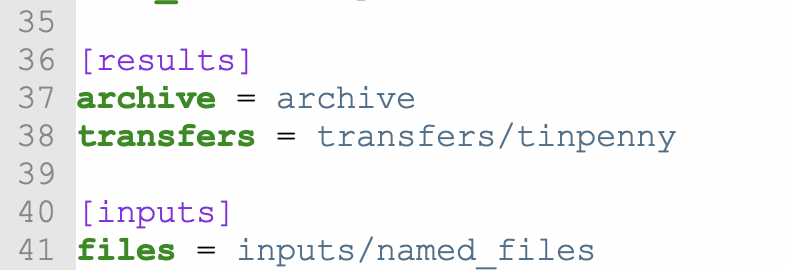
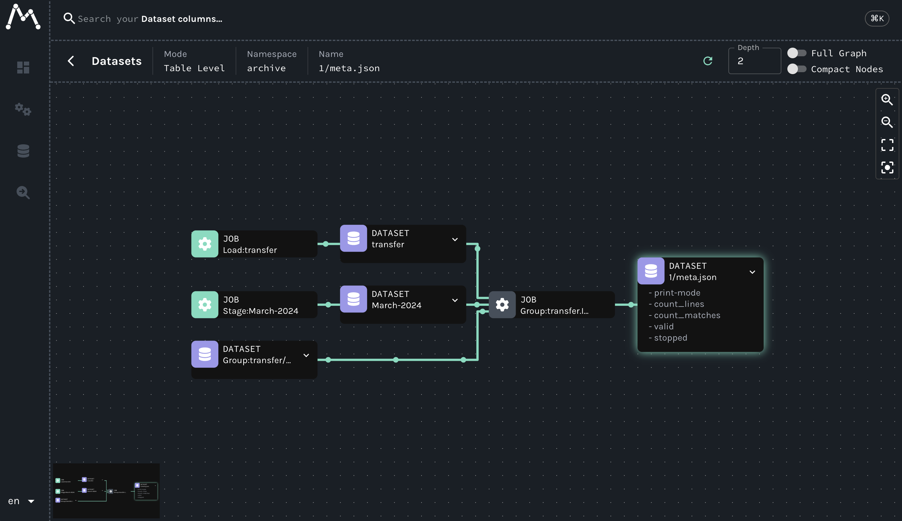
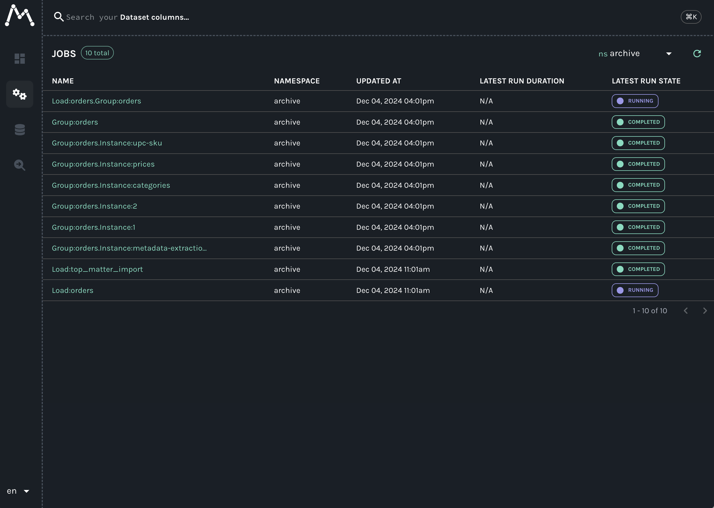
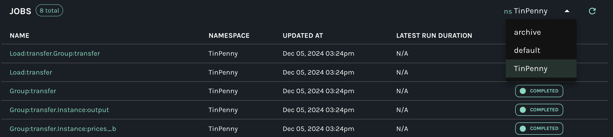

# Namespacing With the Archive

The archive is concept you will first meet as a top-level directory. It is where your results end up when you use `CsvPaths` instances to run your csvpaths. By default the archive is at `./archive`.

You can set the archive location in your `config.ini` file. Your config file is, again by default, at `./config/config.ini`. In it, look for the `[results]` section and `archive` key. In a newly generated config.ini it will look like this:&#x20;

<figure><figcaption></figcaption></figure>

You can of course make the archive live anywhere and be called anything. What is more important is understanding the two main things the archive offers:&#x20;

* Long-term immutable storage for versioned releases -- basically, being an archive!
* A means of namespacing results

The first role—that of archiving results—[is covered here](../higher-level-topics/data-validation-files-and-storage/where-do-i-find-results.md). The role of namespacing is also extremely important, at least for larger CsvPath implementations.&#x20;

One of the decisions you will need to make in setting up CsvPath is how closely coupled you want your operations to be across data sources and destinations. There's no right or wrong answer. If you keep all your data partner assets together in the same install you have all the same core benefits of the Collect Store Validate Pattern as you would if  you created one install per data partner.&#x20;

But at the margin, multiple installs, one per data partner, can make things easier to operate. Creating a new installation is super easy. pick a location, use Pip, Poetry or another Python tool to setup a project. Generally it's a one-liner like `poetry new my_project`. The new project has an archive directory, or will after your first `CsvPaths` instance run. By naming that archive uniquely you create a namespace specific to a certain data operation.

So it's easy to namespace your work with different data partners. But is it really helpful? In many cases, it is nether good nor bad. If all your data partners' results go in the same archive you will have more directories in one place. That typically means more directories on one physical drive or in one object store bucket. But what else?&#x20;

Well, if you're using [OpenLineage](https://openlineage.io/) and [Marquez](https://github.com/MarquezProject/marquez), it means that all your events are namespaced the same way. That's not a bad thing, really, because Marquez's search is terrific. But it is a lot of information to wade through when you are browsing or checking regular runs. Keep in mind that your CsvPath lineage data includes:&#x20;

* A job for data staging (`add_named_file`)
* A job for csvpath loading (`add_named_paths`)
* A job for running a named-paths group (e.g. `collect_by_line`)
* One job for every csvpath in the named-paths group
* And events for the states all of these pass through as the operate on data

Visually and in terms of listed events, that's a lot of information. Well structured, highly consistent information, for sure, but still a lot. Here is a simple run in Marquez. The information presented would be similar for any OpenLineage server.

<figure><figcaption></figcaption></figure>

But remember, the second box from the right, labeled `Group:transfer.Instance:1`, represents just one of any number of csvpaths in the named-group named `transfer`. And each of those csvpaths has up to six standard output files (`data.csv`, `unmatched.csv`, `errors.json`, `vars.json`, `printouts.txt`, `meta.json`), a `manifest.json`, and any number of ad hoc transfer destinations. All of which will be viewable in the UI. Even in a list view, it can be a lot.

<figure><figcaption>
A list view of the "Another Example" csvpaths
</figcaption></figure>

To make it easier to narrow down your view, for reasons of good compartmentalization (narrow the "blast radius") or load-sharing between teams or any other need, you can use separate archives to partition your data partners' assets. The result is multiple archive folders and, in Marquez, a drop-down selection like this on in the top left corner:

<figure><figcaption></figcaption></figure>

Here you can see that the `TinPenny` namespace contains our assets. The other two namespaces shown, `archive` and `default`, presumably have other assets that are unrelated to `TinPenny`'s. This narrower scope is much easier to work with. And using Marquez's date-windowing and search makes things even more straightforward.&#x20;

You can reset your archive directory in `config.ini` at any time. Go ahead, give it a try.
