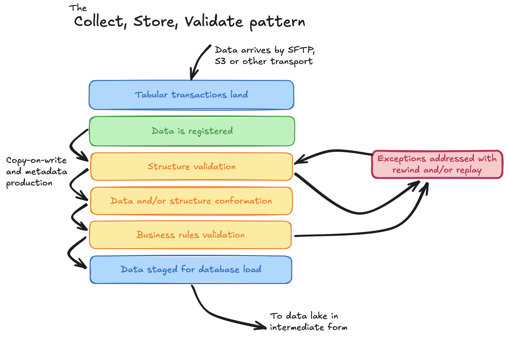

# The Collect, Store, Validate Pattern

CsvPath is first and foremost a declarative validation language. It provides strong validation for delimited tabular data using structural schemas and data validation rules. As the most capable and advanced such tool, it is very focused to-task.&#x20;

The CsvPath Library implements the CsvPath Language, and goes beyond it to provide a framework for onboarding and offboarding flat files with confidence. You could use the CsvPath Language in all sorts of ways. The Library is, however, opinionated. It nudges you in the direction of the Collect, Store, Validate Pattern.

## What Is Collect, Store, Validate?

Design patterns make it easy to reuse proven approaches and communicate about designs. The Collect, Store, Validate Pattern is a narrowly focused architecture for landing and distributing flat files with tabular data. CsvPath Language validation is core to the pattern, but there is much more.

Onboarding flat files may feel like a simple thing, too simple to focus on and pattern. That would be a mistake. Flat files are widespread, drive large-scale revenue and value-delivered, and are trickier and more expensive than you might think. 4 of my last 6 companies derived more half a billion a year in revenue based on flat file data exchanges. The 5th provided tools that, in part, enabled companies to do billions of dollars more of flat-file-dependent business. The 6th exchanged vital research data, a substantial amount in flat-files, that impacts essentially everyone alive on the planet. These were all lead-edge companies. Flat files may be ugly and old, but they are complex and vital and a win/lose component of economic activity.

So, back to Collect, Store, Validate.  The CSV Pattern structures the interstitial space where files enter the organization. It is also applicable to where and how flat-files leave the organization, but let's set that slightly simpler problem aside for now. The space between where a file stops being data in-flight in an on-the-wire protocol and where it is loaded into a data lake is the CSV Pattern's focus. There can be a soft-focus distinction between CSV and data lake, but let's set that gray area aside for the moment as well.

## Interstitial Activities and Decisions

The activities within the interstitial space that any pattern would need to address are:&#x20;

* File landing
* File and data registration
* Preliminary validation
* Data shaping
* Business rules validation
* State tracking
* Archiving
* File presentment or loading

Each of these has needs, decisions, and strategies. Let's break them down.

### File landing

How are files received and initially stored.&#x20;

* What protocol(s) do they arrive on?
* Are all files kept together or separated?
* What are the file naming conventions?&#x20;

### File and data registration

Files and their data require a clear identity, filecycle, and point on the lifecycle. A birth certificate and a social security number.  This is the beginning of the data's lineage. It is the first step towards the file's and the data's respective senescence. &#x20;

* How are files identified?
* How do we know what data a file contains?
* For any given source, what is the unit of data within a file or files?
* What lifecycle is the file on?
* How can a user see the lifecycle states a file has been in?
* How can another system ask for the file?
* When is the file no longer important?

### Preliminary validation

This stage is the recognition and fitness test.

* Can we recognize that this file and its data are a certain type of file and data, regardless of its ultimate correctness? (Is it well-formed, from an identifiable namespace, in a charset expected, etc.)
* Does the data conform to a structure we determine in advance?

### Data shaping

The data needs to be adjusted to eliminate any minor issues and conformed to broad-brush expectations.

* Are there variations loose upstream requirements that can be automatically corrected to upgrade fidelity?
* Do we need to add timestamps, IDs, or other metadata?
* Are there modest adjustments that would harmonize different sources?

### Business rules validation

Detailed rules exist in any organization. They come in both precise and/or technical form and impressionistic or statistical heuristics. Some of these constraints can be captured as structure. Many of them must be declared in terms of logical rules.&#x20;

* Does the data fit or map to a structural definition
* Are there co-ocurances, statistical tests, precedence relationships, arithmetical limits, or other requirements?&#x20;

### State tracking

Validation and shaping are best done in small increments. Small increments save development time, are more provably correct, and enable rewind/replay and forensic inspection. Managing small increments increases the importance of state tracking.

* How do we know what state a unit of data is in?&#x20;
* Can we go back to a known-good state and push a unit of data through the remaining lifecycle steps again?
* Is it easy to inspect data in each state it evolves into?

### Archiving

Files are part of a business process record. As such they are controlled by data retention rules, explicit or in-practice, and cannot be deleted or handled in a way that obscures the part they play.&#x20;

* How long are files kept?
* Where are they stored long-term and in what format?
* Are the intermediate state files kept after processing completes or only the final-form version?
* How can we find and inspect files potentially years after the fact?

### File presentment or loading

Presentment or loading is the step of getting data into a data lake or other data system for the post CSV Pattern stages of its lifecycle.

* Are files pushed, pulled, or both?
* How do we identify data to downstream systems?
* What happens if data is rejected by downstream?

## How Does the CSV Pattern Answer These Questions?

The Collect, Store, Validate Pattern answers most of the questions above. There is, of course, flexibility in any pattern-based design that allows for variability. At a high level, the CSV Pattern looks like this picture.&#x20;

<figure><figcaption></figcaption></figure>

The main thrust answers are these:

* Capture data as files and maintain as files **until they are known-valid data in a conformed format** ready for downstream cataloging and/or loading
* Process files in a **strictly linear** CSV-only lifecycle&#x20;
* **Define processing steps narrowly**—more steps is better than fewer, all else being equal
* **Separate the types of validations**—file format, data structure, and business rules—as much as practical&#x20;
* Follow **a level-of-engagement progression**: format check -> structure check -> fidelity-upgrade -> business rules check
* Progress the file lifecycle with **copy-on-write semantics** so that data is never lost, confused, or untrace-backable
* Enable **lifecycle rewind and stage replay** to allow for data fixes without rerunning from scratch
* Err on the side of over-capturing **stage metadata for lineage control** and understanding point-in-time goodness &#x20;
* End the CSV Pattern lifecycle in **a clear presentment state followed by a longer-term, low-accessibility archive state**
* **Automate** all of the above stages, decision points, and integrations&#x20;

If you read this and think: _how else would you do it?_ that is good. In practice, though, in many companies the pattern is not this clear and intentional. In fact, in many companies the pattern isn't consistently apparent across the operation(s). And in a few more technically savvy companies there are other approaches with their own merits. Those approaches may be API oriented, user-self-service oriented, focused on streaming parallel processes, something else, or combinations of any or all of these. That is fine too. No pattern can cover every possible situation. We believe the CSV Pattern covers the majority of trasaction-oriented, many-party, tabular data loose-integration situations—particularly those where one or more of the parties is technically weak for any reason.&#x20;

