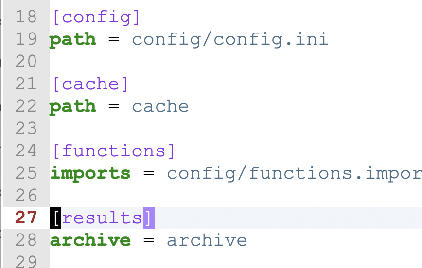
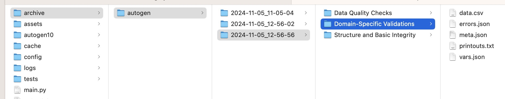
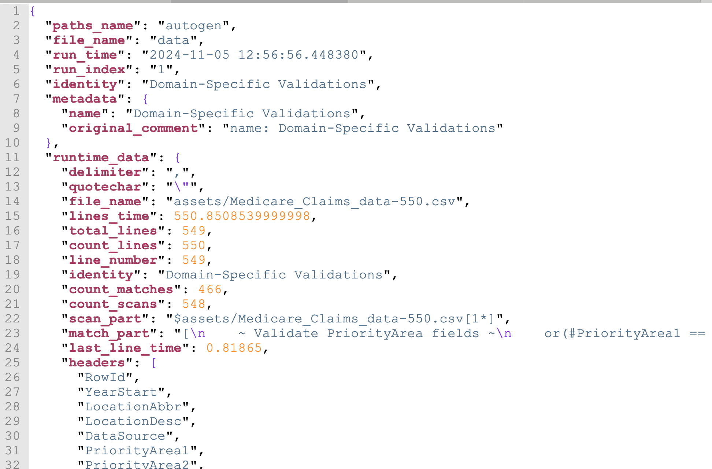
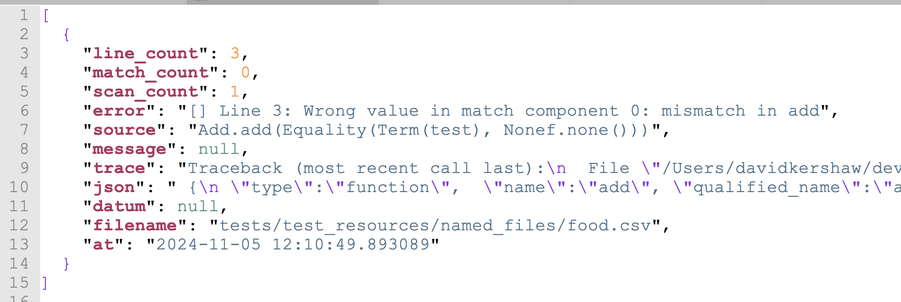

# Where Do I Find Results?

When you run a `CsvPaths` instance, your results are stored in several files in an `archive` directory. The results are the serialized version of all the run data that is accessible through the `CsvPaths` instance `ResultsManager`. If your config does not include an archive pointer the folder `./archive` will be created, if needed, and used.

<figure><figcaption></figcaption></figure>

CsvPaths's results manager makes results of named-paths runs available under the named-paths name. A named-paths name identifies a set of csvpaths that are run as a unit. You request the results of a run like this:&#x20;

```python
paths = CsvPaths()
paths.paths_manager.add_named_paths_from_file( name="autogen", file_path="assets/response.csvpath")
paths.file_manager.add_named_file(name="data", path="assets/Medicare_Claims_data-550.csv")
paths.collect_by_line(pathsname="autogen", filename="data")
results = paths.results_manager.get_named_results('autogen')
```

What you get back is a list of `Result`, one result for each of the `CsvPath` instances that ran one of the csvpaths in the named-paths group. The results each hold the following information:

### Directory structure and files

<table><thead><tr><th width="166">Data</th><th width="137">File</th><th>Description</th></tr></thead><tbody><tr><td>CSV Data</td><td>data.csv</td><td>This file contains all the lines matched or the lines that did not match, depending on if you set <code>return-mode</code> to <code>match</code> (the default) or <code>no-match</code>. If you use the <code>fast_forward</code>, <code>fast_forward_paths</code>, or <code>fast_forward_by_line</code> methods this file will be empty.</td></tr><tr><td>Metadata</td><td>meta.json</td><td>The metadata is the user defined metadata plus the modes and the csvpath identity. By default the csvpath identity is the index of the csvpath in the named-paths group. The metadata also has the full original external comments in one field, including the other metadata fields that were broken out individually.</td></tr><tr><td>Runtime data</td><td>meta.json</td><td>The runtime fields are the data available under the <code>csvpath</code> data type accessed in print <a href="the_reference_data_types.md">references</a>. For e.g. <code>$.csvpath.line_number</code>. </td></tr><tr><td>Printouts</td><td>printouts.txt</td><td><p>Print statements and validation messages go in this file. <code>printouts.txt</code> contains all the <code>Printer</code>s' output. If you have multiple <code>Printer</code> instance you can print to one of them specifically; otherwise, by default the print string will go to all <code>Printer</code>s. In <code>printouts.txt</code> each Printer's content is prefixed by a separator line like:</p><p> <code>---- PRINTOUT: my_printer_name</code></p></td></tr><tr><td>Variables</td><td>vars.json</td><td>Variables is a dictionary of all the variables captured during the csvpath run. They are only from the specific csvpath this <code>Result</code> represents. If needed, the <code>ResultsManager</code> can provide a dictionary collected as a union of all the <code>Result</code> variables of every csvpath in the named-paths group.</td></tr><tr><td>Errors</td><td>errors.json</td><td>These are the errors collected, if any. Errors are collected by default; however, you can turn off error collection in the error policy in <code>config.ini</code>. Unlike <code>raise</code>, <code>print</code>, <code>stop</code>, and <code>fail</code>, there is no mode setting to override <code>config.ini</code>'s error collection setting. The assumption is that in the usual case you don't want to drop errors, and that if you do it is an operational consideration, not a csvpath writer's choice. </td></tr><tr><td>Unmatched lines</td><td>unmatched.csv</td><td>If <code>unmatched-mode</code> is set to <code>keep</code>, a file named <code>unmatched.csv</code> created to provide access to all the lines that were not returned during the run.</td></tr></tbody></table>

Your archive directory will look like this.&#x20;

<figure><figcaption><p>An example of the archive directory structure</p></figcaption></figure>

In this case, we are using an [autogenerated csvpath](https://autogen.csvpath.org/f/generate/new). We ran it three times from a file called `main.py` using the default `archive` directory. The `.csvpath` file had three csvpaths in it. You can see their identities in the names of the directories in the fourth column. Each csvpath has its own results files, visible in the last column.&#x20;

The directory structure is:&#x20;

<figure><figcaption></figcaption></figure>

### meta.json

The metadata file looks like this:

<figure><figcaption></figcaption></figure>

Notice the metadata key and the runtime\_data key. This file holds both of those data sets.

### errors.json

Errors.json has this structure.

<figure><figcaption></figcaption></figure>

In this case, the error message is a clear tell that this is a built-in validation error. When your own rules fail, most often you want those messages in the main printout stream.&#x20;
